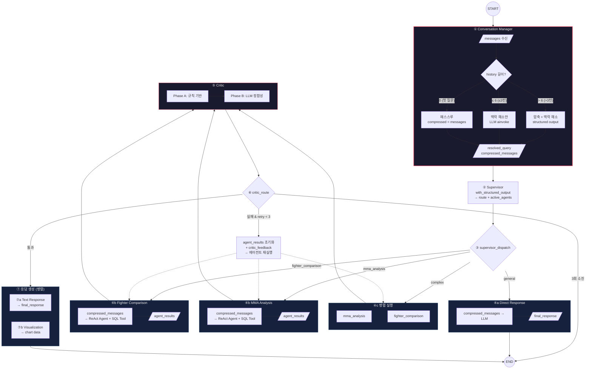
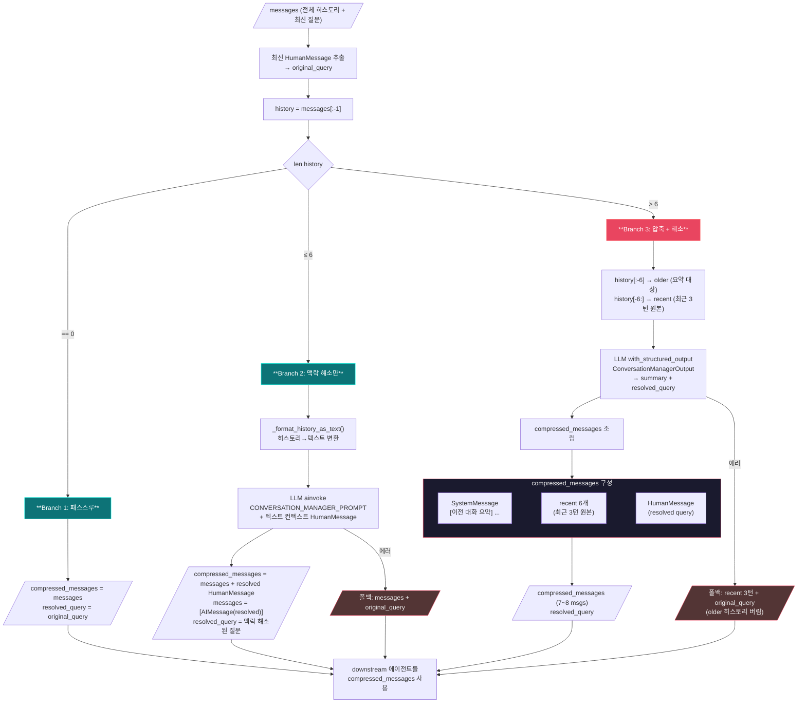
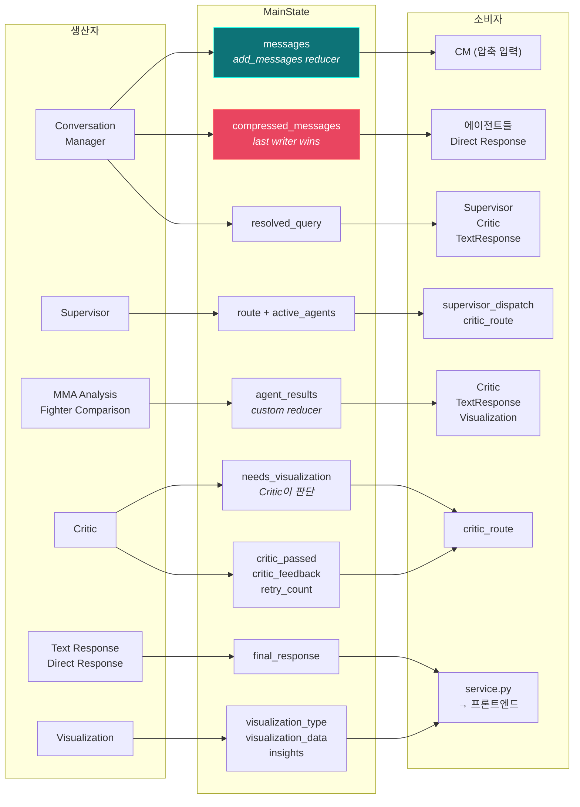

# 데이터 처리 흐름 (Backend Function Reference)

사용자의 질문이 응답으로 변환되는 전체 과정을 백엔드 함수명 기반으로 정리한 문서입니다.

## Mermaid 다이어그램

### StateGraph 전체 흐름



### Conversation Manager 히스토리 압축 상세



### State 필드 흐름 (생산자 → 소비자)



## 전체 흐름도

```
사용자 WebSocket 메시지 수신
│
▼
┌─────────────────────────────────────────────────────────┐
│ ConnectionManager.handle_user_message()                 │  manager.py:203
│  ├── _validate_user_connection()                        │  :232  연결 검증
│  ├── _check_usage_limit()                               │  :245  일일 사용량 확인
│  ├── _validate_message_data()                           │  :277  빈 메시지 검증
│  ├── _send_typing_indicator()                           │  :292  typing=True 전송
│  └── _process_llm_streaming_response()                  │  :321  ▼ 아래로
└─────────────────────────────────────────────────────────┘
         │
         ▼
┌─────────────────────────────────────────────────────────┐
│ _process_llm_streaming_response()                       │  manager.py:321
│  ├── _ensure_llm_service() → get_graph_service()        │  :334  서비스 싱글턴 초기화
│  ├── _load_chat_history() (conversation_id 있을 때)     │  :342  DB에서 히스토리 로드
│  └── llm_service.generate_streaming_chat_response()     │  :345  ▼ 아래로
└─────────────────────────────────────────────────────────┘
         │
         ▼
┌─────────────────────────────────────────────────────────┐
│ MMAGraphService.generate_streaming_chat_response()      │  service.py:79
│  ├── initialize()                                       │  :30   LLM + 그래프 최초 1회 빌드
│  │    ├── MAIN_MODEL+SUB_MODEL 설정 시:                 │
│  │    │    get_main_model() + get_sub_model()           │         듀얼 LLM 생성
│  │    │    build_mma_graph(main_llm, sub_llm)           │         멀티에이전트 그래프 컴파일
│  │    └── 미설정 시 (하위 호환):                          │
│  │         create_llm_with_callbacks()                  │         단일 LLM 생성
│  │         build_mma_graph(llm)                         │         단일 모델 그래프 컴파일
│  ├── build_messages_from_history(chat_history)           │  :54   DB 메시지 → LangChain 변환
│  │    └── 100턴 상한 적용 (슬라이딩 윈도우는 CM이 처리)  │         극단적 상황 방지
│  └── _compiled_graph.ainvoke(state)                     │  :113  ▼ 그래프 실행 (60초 타임아웃)
└─────────────────────────────────────────────────────────┘
         │
         ▼
┌═════════════════════════════════════════════════════════════════════════┐
║ Multi-Agent StateGraph 실행 (graph_builder.py)                         ║
║                                                                        ║
║  ① conversation_manager_node(state, llm=SUB)                10초 제한  ║
║     ├── 3분기 로직:                                                     ║
║     │    ├── history=0  → 패스스루 (compressed_messages = messages)     ║
║     │    ├── history≤6  → 맥락 해소만 (_format_history_as_text 텍스트)  ║
║     │    └── history>6  → LLM 압축 + 맥락 해소 (structured output)     ║
║     ├── 압축 시: older → 요약 SystemMessage, recent 3턴 원본 유지       ║
║     ├── 출력: resolved_query + compressed_messages + messages(AIMessage)║
║     └── 에러 시: 최근 3턴 + 원본 질문 폴백 (이전 히스토리 버림)          ║
║                                                                        ║
║  ② supervisor_node(state, llm=SUB)                          10초 제한  ║
║     ├── llm.with_structured_output(SupervisorRouting)                  ║
║     ├── 출력: route + active_agents                                    ║
║     └── 에러 시: route="mma_analysis" 폴백                              ║
║                                                                        ║
║  ③ supervisor_dispatch(state) ── Send() 동적 fan-out ──               ║
║     │                                                                  ║
║     ├─ route="general"                                                 ║
║     │   └─ Send("direct_response") ·················→ 경로 A          ║
║     │                                                                  ║
║     ├─ route="mma_analysis" / active_agents=["mma_analysis"]          ║
║     │   └─ Send("mma_analysis") ····················→ 경로 B          ║
║     │                                                                  ║
║     ├─ route="fighter_comparison" / active_agents=["fighter_comparison"]║
║     │   └─ Send("fighter_comparison") ··············→ 경로 B          ║
║     │                                                                  ║
║     └─ route="complex" / active_agents=["mma_analysis","fighter_..."] ║
║        └─ Send("mma_analysis") + Send("fighter_comparison") → 경로 C  ║
║                                                                        ║
╠════════════════════════════════════════════════════════════════════════╣
║                                                                        ║
║  ─── 경로 A: General Fast Path ────────────────────────────────────── ║
║                                                                        ║
║  ④a direct_response_node(state, llm=SUB)                              ║
║      ├── compressed_messages를 LLM에 전달 → 직접 응답 생성              ║
║      ├── 출력: final_response, visualization_type="text_summary"       ║
║      └── → END                                                        ║
║                                                                        ║
║  ─── 경로 B: 단일 에이전트 ────────────────────────────────────────── ║
║                                                                        ║
║  ④b mma_analysis_node(state, llm=MAIN)            30초/재귀10회 제한  ║
║      ├── compressed_messages 우선 사용 (폴백: messages)                ║
║      ├── create_react_agent + SQL 도구 (execute_sql_query_async)      ║
║      ├── critic_feedback 존재 시 피드백 포함하여 재시도                   ║
║      ├── 출력: agent_results=[AgentResult] (reducer로 합산)            ║
║      │    └── {agent_name, query, data, columns, row_count,           ║
║      │         needs_visualization, reasoning}                        ║
║      └── 에러 시: _error_agent_result 반환 → Critic이 실패 판정        ║
║                                                                        ║
║      또는                                                              ║
║                                                                        ║
║  ④b fighter_comparison_node(state, llm=MAIN)      30초/재귀10회 제한  ║
║      └── (mma_analysis와 동일 구조, compressed_messages 사용)          ║
║                                                                        ║
║  ─── 경로 C: 복합 질문 (병렬) ─────────────────────────────────────── ║
║                                                                        ║
║  ④c mma_analysis_node ──┐                                             ║
║                          ├── 병렬 실행 → reduce_agent_results로 합산   ║
║  ④c fighter_comparison ─┘     agent_results = [result_1, result_2]    ║
║                                                                        ║
╠════════════════════════════════════════════════════════════════════════╣
║                                                                        ║
║  ─── 경로 B·C 공통: 검증 → 응답 ──────────────────────────────────── ║
║                                                                        ║
║  ⑤ critic_node(state, llm=SUB)                          15초 제한    ║
║     ├── Phase A (규칙 기반, LLM 불필요):                               ║
║     │    ├── SQL 구문 유효성 검사                                       ║
║     │    ├── 빈 결과 감지 (row_count == 0)                             ║
║     │    ├── 값 범위 검증 (0~100%, 음수 체크)                           ║
║     │    └── 에러 AgentResult 감지                                     ║
║     ├── Phase B (LLM 기반, Phase A 통과 시에만):                       ║
║     │    ├── 질문-결과 정합성 검증 (structured output)                  ║
║     │    └── 시각화 필요 여부 판단 (needs_visualization)                ║
║     ├── 출력: critic_passed, critic_feedback, retry_count,             ║
║     │         needs_visualization                                     ║
║     └── Phase B LLM 실패 시: Phase A만 통과 → needs_visualization=F   ║
║                                                                        ║
║  ⑥ critic_route(state) ── 3방향 분기 ──                               ║
║     │                                                                  ║
║     ├─ 통과 (critic_passed=True):                                     ║
║     │   ├── Send("text_response")          ← 항상                     ║
║     │   └── Send("visualization")          ← needs_visualization 시   ║
║     │                                                                  ║
║     ├─ 실패 + 재시도 가능 (retry_count < 3):                           ║
║     │   ├── agent_results=[] (초기화)                                  ║
║     │   ├── critic_feedback 설정                                      ║
║     │   └── Send(active_agents) → ④b/④c 재실행 (피드백 포함)           ║
║     │                                                                  ║
║     └─ 3회 소진 (retry_count >= 3):                                   ║
║        ├── final_response = 에러 메시지                                ║
║        └── → END                                                      ║
║                                                                        ║
║  ⑦a text_response_node(state, llm=MAIN)                 15초 제한    ║
║      ├── 단일 에이전트: reasoning 재사용 (LLM 호출 생략)                 ║
║      ├── 복수 에이전트: 결과 통합 → LLM으로 텍스트 생성                  ║
║      ├── 출력: final_response + messages에 AIMessage 추가              ║
║      ├── 에러 시: reasoning 폴백                                       ║
║      └── → END                                                        ║
║                                                                        ║
║  ⑦b visualize_node(state, llm=SUB)                      ← 조건부     ║
║      ├── LLM: with_structured_output(VisualizationDecision)           ║
║      │    └── 차트 타입/제목/x_axis/y_axis/인사이트만 결정 (data 없음)  ║
║      ├── Data: agent_results에서 코드로 직접 구성                       ║
║      │    ├── _merge_agent_data() → _strip_id_columns()               ║
║      │    ├── _validate_axes(): LLM 축이 실제 컬럼에 없으면 None 보정  ║
║      │    └── wide→long 변환: 1행 다중 숫자 컬럼 → category/value 행   ║
║      ├── 출력: visualization_type, visualization_data, insights       ║
║      ├── 에러 시: 시각화만 생략 (텍스트는 이미 완성)                     ║
║      └── → END                                                        ║
║                                                                        ║
║  ※ ⑦a와 ⑦b는 Send()로 병렬 실행 (⑦b 실패해도 ⑦a 결과 보장)           ║
║                                                                        ║
╚════════════════════════════════════════════════════════════════════════╝
         │
         ▼  (결과가 service.py로 반환)
         │
         │  결과 추출:
         │    final_response     ← 텍스트 응답 (항상 존재)
         │    visualization_type ← 차트 타입 (없으면 "text_summary" 폴백)
         │    visualization_data ← 차트 데이터 (없으면 {title, content} 폴백)
         │    insights           ← 인사이트 목록
         │
         │  yield { type: "final_result", content, visualization_type, ... }
         │
         ▼
┌─────────────────────────────────────────────────────────┐
│ _process_llm_streaming_response() 후처리               │  manager.py:366
│  ├── _save_successful_conversation()                    │  :416  DB 저장
│  │    ├── get_or_create_session() (새 대화일 때)        │        세션 생성
│  │    ├── _save_user_message()                          │        사용자 메시지 저장
│  │    └── add_message_to_session(role="assistant")      │        AI 응답 + viz 저장
│  ├── _send_final_result()                               │  :388  final_result 전송
│  ├── send_to_connection(typing=False)                   │  :376  타이핑 종료
│  └── send_to_connection(response_end)                   │  :381  응답 완료 신호
└─────────────────────────────────────────────────────────┘
         │
         ▼
    프론트엔드 수신
```

## 3계층 요약

| 계층 | 파일 | 역할 |
|------|------|------|
| **WebSocket 계층** | `api/websocket/manager.py` | 연결 검증, 사용량 체크, 히스토리 로드, DB 저장, 이벤트 전송 |
| **서비스 계층** | `llm/service.py` | 듀얼 LLM 초기화, LangChain 메시지 변환(100턴 상한), 그래프 `ainvoke` 실행, 결과 yield |
| **그래프 계층** | `llm/graph/graph_builder.py` + 7개 노드 | 맥락 해소 → LLM 라우팅 → SQL 에이전트(병렬) → 검증(+시각화 판단) → 텍스트+시각화 응답 |

## 모델 배정

| 노드 | 모델 | 이유 |
|------|------|------|
| Conversation Manager | SUB_MODEL | 대명사 해소, 요약 등 단순 NLP |
| Supervisor | SUB_MODEL | structured output 라우팅 분류 |
| Direct Response | SUB_MODEL | 일반 대화 응답 |
| MMA 분석 | MAIN_MODEL | SQL 생성 + ReAct 루프 |
| Fighter 비교 | MAIN_MODEL | 복수 쿼리 생성 + 비교 로직 |
| Critic | SUB_MODEL | 규칙 기반 위주, LLM은 정합성만 |
| Text Response | MAIN_MODEL | 한국어 분석 텍스트 생성 |
| Visualization | SUB_MODEL | 차트 타입 선택 + JSON 스펙 |

## 멀티턴 대화 처리

```
새 대화 (conversation_id 없음):
  사용자 메시지 → 그래프 실행 → 성공 시 get_or_create_session() → DB 저장

기존 대화 (conversation_id 있음):
  _load_chat_history() → build_messages_from_history() (100턴 상한)
  → Conversation Manager:
     ├── history ≤ 6  → 맥락 해소만 (텍스트 컨텍스트), compressed_messages = 전체 + resolved
     └── history > 6  → 이전 대화 요약 + 최근 3턴 원본 + resolved query
  → downstream 에이전트는 compressed_messages 사용 (토큰 절감)
  → 기존 세션에 메시지 추가

히스토리 압축 데이터 흐름 (history > 6):
  messages[:-1][:-6]  (older)  → LLM 요약 → SystemMessage("[이전 대화 요약] ...")
  messages[:-1][-6:]  (recent) → 원본 유지 (최근 3턴)
  messages[-1]        (latest) → resolved_query로 재작성
  compressed_messages = [요약 SystemMessage, 최근 6개, resolved HumanMessage]
  messages 반환 = [AIMessage(resolved_query)]  ← add_messages reducer로 추가
```

## Critic 재시도 루프

```
1차 시도:
  에이전트 실행 → agent_results=[result_v1]
  Critic 검증 실패 → retry_count=1, agent_results=[] (초기화)
  → 에이전트 재실행 (critic_feedback 포함)

2차 시도:
  에이전트 실행 → agent_results=[result_v2] (깨끗한 상태)
  Critic 검증 통과 → text_response + visualization

또는 3회 소진:
  retry_count=3 → final_response="분석 결과의 품질 검증에 실패했습니다..." → END
```
