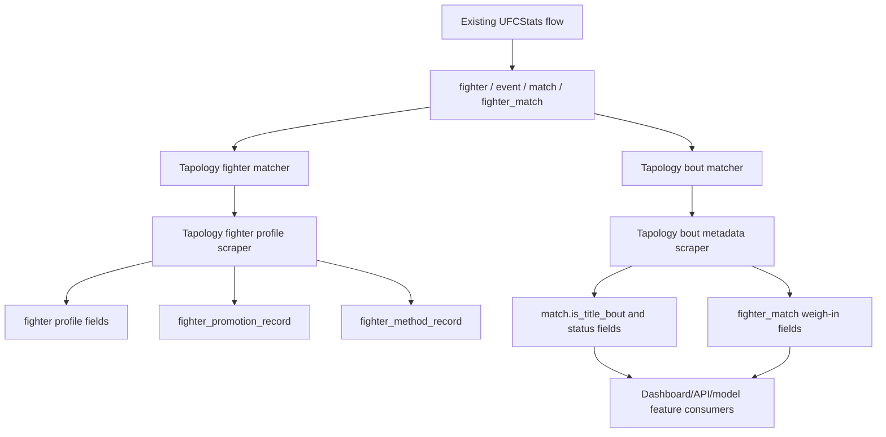
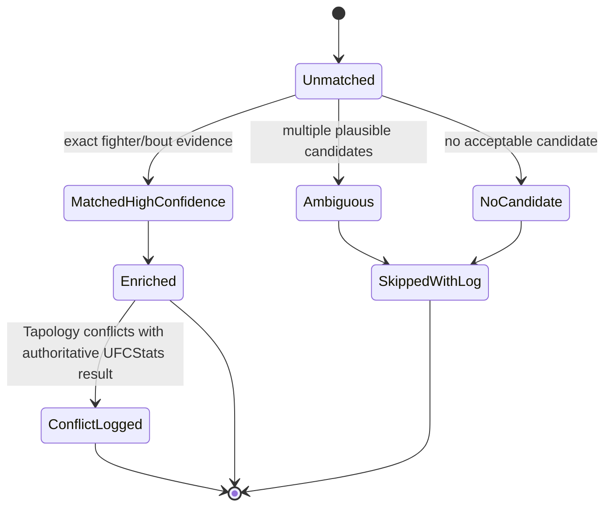

# feat: Add Tapology Enrichment Pipeline

## Goal Capsule

Add Tapology as an enrichment source for fighter profiles, non-UFC career context, bout-side weigh-in data, title-bout classification, and cancelled-bout tracking while preserving UFCStats as the source of truth for UFC fight results and round statistics.

---

## Problem Frame

The current collector pipeline in `src/data_collector/workflows/tasks.py` gathers UFCStats fighters, events, bouts, fight results, round-level fight statistics, UFC rankings, nationality enrichment, and event geocoding. That leaves useful Tapology-only context unused: fighter origin/team profile data, career records outside UFC, promotion/method distributions, weigh-in metadata, title-bout flags, and explicit cancellation status.

This plan adds Tapology data without replacing existing UFCStats collection. The implementation should enrich the existing domain model where the user has chosen a single-table shape, and only introduce separate tables for naturally repeated career distributions.

---

## Requirements

### R1. Preserve Existing UFCStats Authority

UFCStats remains authoritative for UFC fighter basics, events, completed bout results, and round-by-round statistics. Tapology data must not overwrite completed UFCStats results without an explicit conflict-handling decision.

### R2. Enrich Fighter Profiles in the Existing Fighter Table

Tapology fighter profile data must be stored on `fighter` rather than in a separate profile table because the user chose a single fighter table and the refresh cadence will match the existing collector cadence.

Profile fields in scope: `tapology_url`, `born`, `fighting_out_of`, `affiliation`, `gym`, `current_streak`, `last_fight_name`, `last_fight_date`, `last_fight_promotion`, `tapology_last_scraped_at`.

### R3. Capture Career Distribution Data Without Losing Queryability

Promotion-level records and method-level career win/loss distributions must support filtering and aggregation, including non-UFC fights. Store these as normalized repeated rows, not as opaque JSON on `fighter`.

### R4. Add Title-Bout Status to Match

`is_title_bout` must be a direct `match` field so consumers can identify title fights without joining Tapology-specific metadata.

### R5. Add Bout-Side Weigh-In Data to FighterMatch

`weigh_in_result`, `fight_night_weight`, and `weight_gain` must be stored on `fighter_match`, because each value belongs to one fighter's side of one bout.

### R6. Improve Cancelled-Bout Tracking

Tapology bout status and cancellation reason must improve weekly updates so cancelled/postponed bouts are not inferred only from missing UFCStats results.

### R7. Keep Risky Matching Conservative

Tapology fighter and bout matching must use confidence gates. Ambiguous fighter matches or low-confidence bout matches must be logged and skipped rather than written.

---

## Key Technical Decisions

### KTD1. Store Tapology Profile Fields on `fighter`

Use additional columns on `fighter` for one-to-one profile enrichment. This follows the user-directed decision to keep one fighter table and avoids unnecessary joins for profile display.

### KTD2. Store Repeated Career Distributions in Separate Tables

Create `fighter_promotion_record` and `fighter_method_record` for repeated career distributions. This keeps profile data simple while preserving queryability for non-UFC career analysis.

### KTD3. Add `is_title_bout` Directly to `match`

Use a first-class `match.is_title_bout` column rather than burying title status in Tapology metadata. Title status is a domain property of the bout and will likely be queried in dashboards, filters, and model features.

### KTD4. Store Weigh-In Data on `fighter_match`

Add weigh-in and fight-night weight fields directly to `fighter_match`, because the data is bout-side-specific and supports direct comparison between the two fighters in one match.

### KTD5. Use Tapology as an Enrichment Source, Not a Replacement Source

Tapology collection writes only enrichment fields, career distribution rows, title/cancellation metadata, and fighter-match physical metadata. It does not replace UFCStats scraping for fight results or round-level statistics.

---

## High-Level Technical Design

Tapology collection should run after UFCStats fighter/event/match data exists, because the enrichment pipeline depends on local fighters, events, and fighter pairs for matching.

---

## Scope Boundaries

### In Scope

- Extend existing SQLAlchemy/Pydantic models for fighter, match, and fighter_match enrichment fields.
- Add normalized tables for promotion-level and method-level career distributions.
- Refactor the existing Tapology nationality helper into a reusable Tapology client while preserving nationality enrichment behavior.
- Add Tapology fighter and bout parsers.
- Add conservative matching utilities for fighter and bout URL discovery.
- Add Prefect tasks and CLI task entries for Tapology profile and bout metadata enrichment.
- Add parser, matcher, and workflow persistence tests.

### Out of Scope

- Odds, referee, billing, career disclosed earnings, schedule strength, and Tapology ranking.
- Replacing UFCStats with Tapology for UFC fight results or round statistics.
- Building UI screens or dashboard charts for the new fields.
- Full manual review tooling for ambiguous Tapology matches.
- Broad Tapology crawling for non-UFC events that are not attached to existing fighters or matches.

### Deferred to Follow-Up Work

- Admin/manual curation UI for ambiguous fighter and bout matches.
- Dashboard or model-feature consumers for the new enrichment fields.
- Backfill orchestration for the complete historical dataset after the first small-batch validation.

---

## Implementation Units

### U1. Extend Domain Models and Persistence Schema

**Goal:** Add storage for Tapology profile fields, title status, bout status, fighter-match weigh-in values, and normalized career distributions.

**Requirements:** R2, R3, R4, R5, R6.

**Dependencies:** None.

**Files:**

- `src/fighter/models.py`
- `src/match/models.py`
- `src/database/__init__.py`
- `src/schema.json`
- `src/tests/fighter/test_fighter_model.py`
- `src/tests/match/test_match_models.py`

**Approach:**

1. Add Tapology one-to-one profile columns to `FighterSchema` and `FighterModel`: `tapology_url`, `born`, `fighting_out_of`, `affiliation`, `gym`, `current_streak`, `last_fight_name`, `last_fight_date`, `last_fight_promotion`, `tapology_last_scraped_at`.
2. Add `FighterPromotionRecordSchema` / `FighterPromotionRecordModel` for `fighter_id`, `promotion_name`, `wins`, `losses`, `draws`, `no_contests`, and timestamps.
3. Add `FighterMethodRecordSchema` / `FighterMethodRecordModel` for `fighter_id`, `scope`, `result`, `method_category`, `count`, and timestamps.
4. Add `is_title_bout`, `bout_status`, `cancellation_reason`, `tapology_bout_url`, and `tapology_last_scraped_at` to `MatchSchema` and `MatchModel`.
5. Add `weigh_in_result`, `fight_night_weight`, and `weight_gain` to `FighterMatchSchema` and `FighterMatchModel`.
6. Register new models in `src/database/__init__.py` so metadata creation and tests see the tables.
7. Confirm the repository's current migration or schema-initialization convention before adding DB DDL changes.
8. Update `src/schema.json` only if it is a maintained project artifact; otherwise document its generation path before changing it.

**Patterns to follow:** Existing model/schema pairing in `src/fighter/models.py`, `src/match/models.py`, and relationship registration in `src/database/__init__.py`.

**Test scenarios:**

- Creating a `FighterModel` with Tapology profile fields returns those fields through `to_schema()`.
- Creating a `MatchModel` with `is_title_bout=True`, `bout_status="cancelled"`, and `cancellation_reason` returns those fields through `to_schema()`.
- Creating a `FighterMatchModel` with weigh-in and fight-night weight values returns those fields through `to_schema()`.
- Creating multiple promotion records for one fighter supports more than one promotion without overwriting prior rows.
- Creating method records for `win` and `loss` in the same category stores distinct rows.

**Verification:** Model round-trip tests pass and the test database schema includes the new tables/columns.

### U2. Generalize the Tapology Client

**Goal:** Move Tapology HTTP/session behavior out of nationality-specific script code so all Tapology tasks share rate limiting, user-agent rotation, and circuit breaker behavior.

**Requirements:** R2, R3, R6, R7.

**Dependencies:** None.

**Files:**

- `src/data_collector/clients/__init__.py`
- `src/data_collector/clients/tapology.py`
- `src/data_collector/scripts/scrape_nationality.py`
- `src/data_collector/workflows/tasks.py`
- `src/data_collector/tests/test_tapology_client.py`

**Approach:**

1. Create `src/data_collector/clients/tapology.py` and move the reusable `TapologyClient` behavior from `src/data_collector/scripts/scrape_nationality.py`.
2. Keep request delay, user-agent rotation, timeout handling, and circuit breaker behavior.
3. Expose low-level methods for search pages, fighter detail pages, and bout/event detail pages without embedding parser decisions.
4. Update nationality enrichment imports to use the shared client while preserving current behavior.

**Patterns to follow:** Existing `TapologyClient` behavior in `src/data_collector/scripts/scrape_nationality.py` and existing async wrappers used by `enrich_fighter_nationality_task`.

**Test scenarios:**

- A 200 response resets the consecutive failure counter and returns response text.
- A non-200 response increments the failure counter and returns no content.
- A request exception increments the failure counter and does not raise to the caller.
- Nationality enrichment can still call the shared client through the existing async wrapper behavior.

**Verification:** Existing nationality tests or added client tests prove no behavior regression in Tapology nationality lookup.

### U3. Add Tapology Parsers

**Goal:** Parse Tapology fighter profile, career distribution, and bout metadata into structured collector schemas without touching the database.

**Requirements:** R2, R3, R4, R5, R6.

**Dependencies:** U1.

**Files:**

- `src/data_collector/scrapers/tapology_scraper.py`
- `src/data_collector/scrapers/__init__.py`
- `src/data_collector/tests/test_tapology_scraper.py`
- `src/data_collector/scrapers/test-by-html/`

**Approach:**

1. Add parser functions for fighter profile fields: born, fighting out of, affiliation, gym/team, current streak, last fight, and last fight promotion.
2. Add parser functions for `record_by_promotion` rows.
3. Add parser functions for method-level career win/loss distribution.
4. Add parser functions for bout metadata: title bout, bout status, cancellation reason, per-fighter weigh-in result, fight-night weight, and weight gain.
5. Keep parser output source-agnostic and database-free so fixtures can cover Tapology markup changes cheaply.

**Patterns to follow:** BeautifulSoup parser style in `src/data_collector/scrapers/fighters_scraper.py`, `src/data_collector/scrapers/event_detail_scraper.py`, and `src/data_collector/scrapers/match_detail_scraper.py`.

**Test scenarios:**

- A fighter profile fixture with all fields produces all profile fields.
- A fighter profile fixture missing affiliation or gym returns `None` for absent fields without failing the whole parse.
- A promotion record fixture with multiple promotions produces one structured row per promotion.
- A method-distribution fixture produces distinct win/loss rows by method category.
- A completed title bout fixture returns `is_title_bout=True` and `bout_status="completed"`.
- A cancelled bout fixture returns `bout_status="cancelled"` and a cancellation reason when present.
- A weigh-in fixture maps each fighter's weigh-in result, fight-night weight, and weight gain to the correct fighter name.

**Verification:** Parser tests pass using static HTML fixtures and no network access.

### U4. Add Conservative Tapology Matching

**Goal:** Match local fighters and bouts to Tapology URLs with confidence gates so enrichment writes only high-confidence data.

**Requirements:** R1, R7.

**Dependencies:** U2, U3.

**Files:**

- `src/data_collector/workflows/tapology_matcher.py`
- `src/data_collector/tests/test_tapology_matcher.py`

**Approach:**

1. Match fighters by existing `fighter.tapology_url` first.
2. For unmatched fighters, search Tapology by normalized name and accept exact display-name matches.
3. Use nickname only to disambiguate exact-name duplicates; do not accept fuzzy-only matches for writes.
4. Match bouts using fighter pair, event date, and UFC event naming evidence.
5. Return explicit match states such as `matched`, `ambiguous`, `not_found`, and `low_confidence`.
6. Ensure ambiguous or low-confidence matches are logged and skipped, not stored.

**Patterns to follow:** Existing name normalization usage in `src/data_collector/workflows/data_store.py` and `common.utils.normalize_name`.

**Test scenarios:**

- Existing `tapology_url` bypasses search and returns a matched fighter.
- Single exact-name candidate returns a matched fighter.
- Multiple exact-name candidates without nickname evidence return `ambiguous`.
- Nickname evidence selects one candidate when several exact-name candidates exist.
- Bout matching returns high confidence only when both fighter names and event date align.
- Bout matching returns low confidence when only fighter names align.
- No Tapology search result returns `not_found`.

**Verification:** Matcher tests demonstrate that writes happen only after high-confidence matches.

### U5. Persist Fighter-Level Tapology Enrichment

**Goal:** Add a workflow task that updates fighter profile fields and normalized career distribution tables from matched Tapology fighter pages.

**Requirements:** R2, R3, R7.

**Dependencies:** U1, U2, U3, U4.

**Files:**

- `src/data_collector/workflows/tapology_tasks.py`
- `src/data_collector/workflows/data_store.py`
- `src/data_collector/workflows/tasks.py`
- `src/data_collector/run_ufc_stats_flow.py`
- `src/data_collector/tests/test_tapology_tasks.py`

**Approach:**

1. Add `enrich_fighter_tapology_profile_task` that selects fighters missing `tapology_url` or stale Tapology profile fields.
2. Use the matcher to resolve the fighter URL.
3. Fetch and parse the profile page.
4. Update profile columns on `fighter` using non-null protection similar to `save_fighters`, but allow Tapology-specific fields to refresh when the current scrape provides values.
5. Upsert promotion and method records by fighter and natural key, replacing stale rows for that fighter/source in a transaction.
6. Track `tapology_last_scraped_at` after a successful profile update.

**Patterns to follow:** Existing Prefect task structure in `src/data_collector/workflows/tasks.py` and update/upsert style in `src/data_collector/workflows/data_store.py`.

**Test scenarios:**

- A matched fighter profile updates all Tapology profile fields on `fighter`.
- A profile scrape with absent optional fields preserves existing non-null profile values when appropriate.
- Promotion records are replaced for a fighter without duplicating rows on rerun.
- Method records are replaced for a fighter without duplicating rows on rerun.
- Ambiguous fighter match logs/skips without modifying the fighter.
- Parser failure for one fighter does not stop the whole batch.

**Verification:** Workflow tests prove idempotent enrichment and safe skip behavior.

### U6. Persist Bout-Level Tapology Enrichment

**Goal:** Add a workflow task that updates title-bout status, cancellation metadata, and fighter-match weigh-in data from matched Tapology bouts.

**Requirements:** R1, R4, R5, R6, R7.

**Dependencies:** U1, U2, U3, U4.

**Files:**

- `src/data_collector/workflows/tapology_tasks.py`
- `src/data_collector/workflows/data_store.py`
- `src/data_collector/workflows/tasks.py`
- `src/data_collector/run_ufc_stats_flow.py`
- `src/match/repositories.py`
- `src/tests/match/test_match_repositories.py`
- `src/data_collector/tests/test_tapology_tasks.py`

**Approach:**

1. Add `enrich_match_tapology_metadata_task` that selects matches with known fighter pairs and missing or stale `tapology_bout_url`.
2. Use the bout matcher to resolve high-confidence Tapology bout URLs.
3. Fetch and parse title status, bout status, cancellation reason, and fighter-side weight metadata.
4. Update `match.is_title_bout`, `match.bout_status`, `match.cancellation_reason`, `match.tapology_bout_url`, and `match.tapology_last_scraped_at`.
5. Update each matching `fighter_match` row with weigh-in result, fight-night weight, and weight gain.
6. Treat UFCStats completed results as authoritative. If UFCStats shows a result but Tapology says cancelled/postponed, log a conflict and do not rewrite the existing result.

**Patterns to follow:** Existing match detail enrichment flow in `process_detail_url` and existing `save_match` / `save_fighter_match` persistence style in `src/data_collector/workflows/data_store.py`.

**Test scenarios:**

- A high-confidence Tapology bout updates `is_title_bout=True` on the matched `match`.
- A cancelled Tapology bout updates `bout_status="cancelled"` and cancellation reason without inventing fighter results.
- A completed UFCStats match with a conflicting Tapology cancelled status logs/skips status overwrite.
- Fighter-side weigh-in values are written to the correct `fighter_match` rows by fighter name.
- Low-confidence bout matching skips without modifying match or fighter_match rows.
- Rerunning the task is idempotent and does not duplicate or degrade stored values.

**Verification:** Workflow and repository tests demonstrate safe metadata persistence and conflict protection.

### U7. Integrate With Collector Entry Points and Cache Invalidation

**Goal:** Expose Tapology enrichment as controlled collector tasks before adding it to the weekly scheduled flow.

**Requirements:** R1, R2, R3, R4, R5, R6, R7.

**Dependencies:** U5, U6.

**Files:**

- `src/data_collector/run_ufc_stats_flow.py`
- `src/data_collector/workflows/ufc_stats_flow.py`
- `src/data_collector/workflows/tasks.py`
- `src/data_collector/tests/test_tapology_tasks.py`

**Approach:**

1. Add CLI task entries for `tapology-profile` and `tapology-bout-metadata`.
2. Keep the first rollout manual-only through `run_ufc_stats_flow.py` so data quality can be inspected before the weekly schedule includes it.
3. After validation, wire tasks into `src/data_collector/workflows/ufc_stats_flow.py` after UFCStats fighters/events/matches are populated.
4. Ensure dashboard cache invalidation still runs after Tapology enrichment when scheduled flow includes it.

**Patterns to follow:** Existing `TASK_MAP` and `ALL_TASKS` conventions in `src/data_collector/run_ufc_stats_flow.py`, and existing Prefect task ordering in `src/data_collector/workflows/ufc_stats_flow.py`.

**Test scenarios:**

- `--list` includes Tapology tasks after they are registered.
- Running only `tapology-profile` dispatches the fighter profile enrichment task.
- Running only `tapology-bout-metadata` dispatches the bout metadata enrichment task.
- Scheduled-flow integration order keeps Tapology after prerequisite UFCStats data collection.

**Verification:** Entry-point tests or focused unit tests prove task registration and ordering.

---

## Verification Contract

Implementation is complete when:

- Static parser tests pass without network access.
- Matcher tests prove ambiguous matches are skipped.
- Model tests prove new fields round-trip through schemas.
- Persistence tests prove profile, career distribution, match, and fighter_match enrichments are idempotent.
- Existing nationality enrichment behavior remains compatible with the refactored Tapology client.
- Existing UFCStats scraper tests and model/service tests continue passing.
- A small manual dry run can enrich a limited fighter batch and a limited match batch without writing low-confidence matches.

---

## Operational and Rollout Notes

Start with manual CLI tasks rather than weekly scheduled execution. Run a small fighter sample first, inspect match quality and profile fields, then run a small bout sample. Only after ambiguity and conflict logs look acceptable should the Tapology tasks be added to the scheduled Prefect flow.

Tapology requests should remain slower and more conservative than UFCStats requests. Preserve random delay and circuit breaker behavior from the existing nationality client.

---

## Risks and Mitigations

| Risk | Mitigation |
| --- | --- |
| Tapology and UFCStats names differ enough to cause false matches | Exact-name plus nickname/date confidence gates; ambiguous cases skip. |
| Tapology markup changes break parsers | Static HTML fixture coverage and parser functions isolated from DB writes. |
| Completed UFCStats bouts conflict with Tapology cancellation data | UFCStats completed results remain authoritative; conflicts log instead of overwrite. |
| Career distributions duplicate on rerun | Replace or upsert rows by fighter/source/natural key inside one transaction. |
| Weekly job becomes too slow | Keep Tapology tasks manual-first, then add stale-field selection and batch limits. |
| Single `fighter` table gains too many nullable enrichment fields | This is accepted by user decision; repeated distributions still use separate tables to protect queryability. |

---

## Open Questions and Deferred Implementation Notes

- Confirm the repository's current migration convention before writing schema changes. `alembic` is installed in `src/pyproject.toml`, but no obvious migration directory was found during planning.
- Decide exact enum vocabulary for `match.bout_status` during implementation. Recommended values are `scheduled`, `completed`, `cancelled`, `postponed`, and `unknown`.
- Decide whether weight values should be stored as raw strings, parsed numeric pounds, or both. Recommended first pass is raw string plus parser helpers if Tapology formats vary.
- Decide whether `affiliation` and `gym` should be separate columns or whether one should alias the other after seeing real Tapology pages in implementation.

---

## Definition of Done

- Tapology profile enrichment can update existing fighters without a separate Tapology profile table.
- Promotion and method career distribution records support multiple rows per fighter.
- Match rows expose `is_title_bout` directly.
- Fighter-match rows expose weigh-in result, fight-night weight, and weight gain.
- Cancelled/postponed Tapology status improves bout tracking without overriding authoritative completed UFCStats results.
- Tapology enrichment tasks are available through the manual collector runner and are ready for scheduled-flow rollout after data quality validation.
