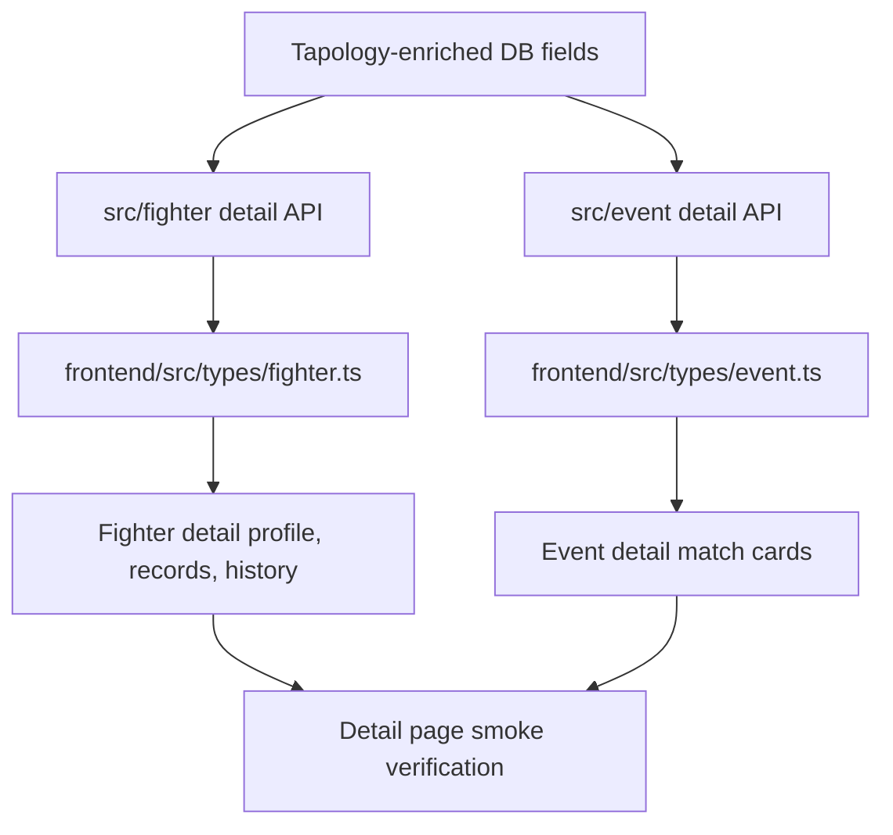
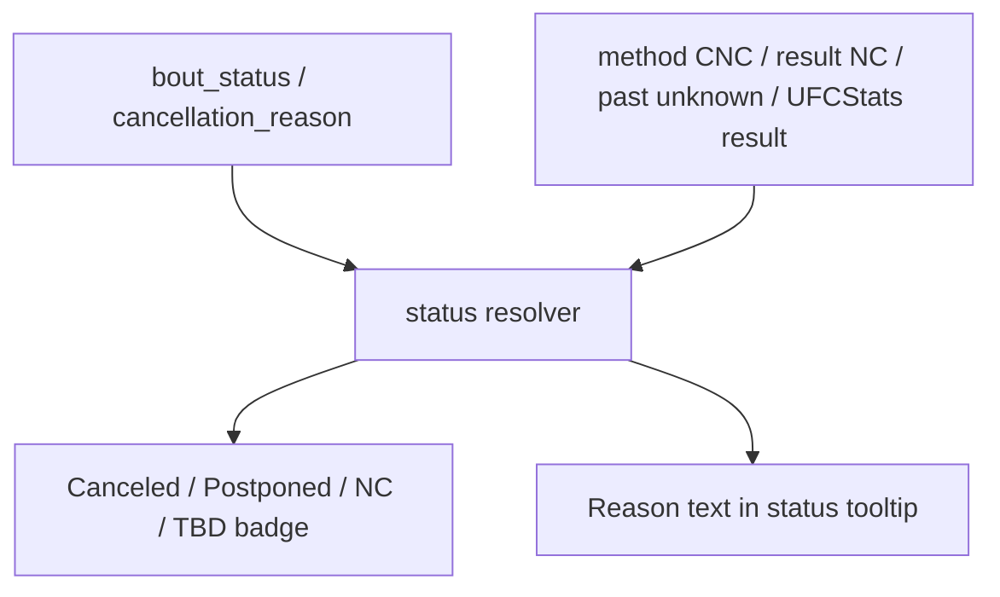

# Tapology UI Integration - Plan

## Goal Capsule

Tapology 수집으로 추가된 선수 프로필, 커리어 분포, 타이틀전, 취소 경기, 계체/파이트 나이트 체중 데이터를 API와 웹 화면에 노출한다.
UFCStats 기반 경기 결과와 라운드 통계는 그대로 유지하고, Tapology 데이터는 상세 화면의 맥락 보강 데이터로 사용한다.
이번 계획의 완료 기준은 선수 상세 화면과 이벤트 상세 화면에서 새 데이터가 깨지지 않는 형태로 표시되고, 기존 데이터만 있는 레코드도 정상 렌더링되는 것이다.

---

## Product Contract

### Summary

현재 백엔드 수집 파이프라인은 Tapology enrichment를 통해 DB에 새 컬럼과 테이블을 채운다.
하지만 `frontend` 화면은 기존 API 응답 타입만 사용하고 있어서 새 데이터가 사용자에게 보이지 않는다.
이 계획은 먼저 백엔드 상세 API 응답을 확장하고, 그 다음 프론트엔드 타입과 컴포넌트를 업데이트한다.

### Problem Frame

Tapology에서 얻는 데이터는 UFCStats가 제공하지 않는 선수 배경과 경기 전후 체중 맥락을 보강한다.
이 데이터는 대시보드 전체 지표보다 선수 상세와 이벤트 매치 비교 화면에서 즉시 가치가 크다.
반대로 리더보드나 집계 차트는 데이터가 충분히 쌓인 뒤 추가해도 늦지 않다.

### Requirements

**API Contract**

- R1. 선수 상세 API는 Tapology 프로필 필드와 커리어 분포 데이터를 반환해야 한다.
- R2. 이벤트 상세 API는 매치의 타이틀전 여부, Tapology bout 상태, 취소 사유, 선수별 계체 데이터를 반환해야 한다.
- R3. 기존 데이터에 Tapology 값이 없으면 API는 `null`, 빈 배열, 기본 boolean으로 응답하고 기존 화면을 깨지 않아야 한다.

**Fighter Detail UX**

- R4. 선수 상세 화면은 `born`, `fighting_out_of`, `affiliation`, `gym`, Tapology 기준 `current_streak`, 최근 경기 정보를 프로필 맥락으로 표시해야 한다.
- R5. 선수 상세 화면은 promotion별 전적과 method별 커리어 승/패 분포를 별도 카드로 표시해야 한다.
- R6. 선수 경기 이력은 타이틀전, 취소 상태, 취소 사유, 선수별 계체 데이터를 확인할 수 있어야 한다.

**Event Detail UX**

- R7. 이벤트 상세 매치 카드는 타이틀전을 즉시 식별할 수 있어야 한다.
- R8. 이벤트 상세 매치 카드는 Tapology의 취소성 `bout_status`와 `cancellation_reason`을 기존 취소 추론보다 우선 사용해야 한다. 단, UFCStats 완료 경기 결과와 `NC` 표시는 Tapology 상태로 덮어쓰지 않는다.
- R9. 이벤트 상세 매치 카드의 피지컬 비교 영역은 `weigh_in_result`, `fight_night_weight`, `weight_gain`을 양 선수 비교 데이터로 표시해야 한다.

**Scope Control**

- R10. 이번 작업은 기존 대시보드 차트 재설계나 신규 리더보드 추가를 포함하지 않는다.
- R11. Tapology 원문 URL은 내부 확인과 출처 표시를 돕되, 화면의 중심 정보가 되지 않아야 한다.

### Scope Boundaries

#### In Scope

- `src/fighter` 상세 DTO, repository, service 응답 확장.
- `src/event` 상세 DTO와 service 응답 확장.
- `frontend/src/types/fighter.ts`와 `frontend/src/types/event.ts` 타입 확장.
- 선수 상세 화면의 프로필, 커리어 분포, 경기 이력 표시 개선.
- 이벤트 상세 화면의 매치 배지, 취소 상태, 계체/체중 비교 표시 개선.
- 새 필드가 없을 때의 null-safe 렌더링.

#### Out of Scope

- 대시보드 전체 탭의 신규 Tapology 차트.
- Tapology ranking, odds, referee, billing, career disclosed earnings, schedule strength 표시.
- Tapology 데이터를 UFCStats 경기 결과의 대체 소스로 사용하는 변경.
- Tapology 크롤러, 매칭 로직, DB 스키마의 추가 변경.

#### Deferred to Follow-Up Work

- 타이틀전 승률, 체중 증가량과 결과 상관관계, promotion/method 분포를 사용하는 대시보드 차트.
- 관리자용 Tapology 매칭 검수 화면.
- Tapology 데이터 신선도와 누락률을 보여주는 운영 모니터링 UI.
- 실제 `weight_gain` 수집 데이터가 확인된 뒤의 numeric parsing, 양 선수 비교 강조, 체중 증가량 분석 UI.

---

## Planning Contract

### Key Technical Decisions

- KTD1. **API 응답을 먼저 확장한다.** 프론트엔드는 백엔드 DTO를 화면 계약으로 사용하므로, `src/fighter`와 `src/event` 응답 확장이 U1, U2의 선행 작업이다.
- KTD2. **선수 프로필 보강 정보는 `FighterProfileDTO`에 둔다.** `born`, `fighting_out_of`, `affiliation`, `gym`, 최근 경기 정보는 선수 1명에 대한 프로필 정보라서 선수 상세 헤더와 보조 프로필 카드가 같은 계약을 사용한다.
- KTD3. **반복 커리어 분포는 별도 배열 DTO로 둔다.** promotion별 전적과 method별 전적은 1:N 데이터라서 `FighterDetailResponseDTO`의 별도 배열로 반환한다.
- KTD4. **타이틀전과 취소 상태는 매치 레벨 메타데이터로 둔다.** `is_title_bout`, `bout_status`, `cancellation_reason`, `tapology_bout_url`은 `EventMatch`와 `FightHistoryItem`에서 같은 의미로 노출한다.
- KTD5. **계체 데이터는 fighter-side 데이터로 둔다.** `weigh_in_result`, `fight_night_weight`, `weight_gain`은 `fighter_match` 소유 데이터이므로 `EventFighterStat`과 선수 경기 이력의 해당 선수 row에 붙인다.
- KTD6. **Tapology 취소성 상태만 기존 취소 추론보다 우선한다.** `bout_status`가 `cancelled`, `canceled`, `postponed`이면 Tapology 상태와 `cancellation_reason`을 우선 표시한다. `completed`, `scheduled`, `unknown`, `null`, 알 수 없는 값은 기존 UFCStats `method`, `result`, `eventDate` 기반 표시로 fallback한다.
- KTD7. **UFCStats 완료 결과와 NC는 Tapology 상태로 덮어쓰지 않는다.** `result="NC"`는 취소가 아니라 별도 `NC` label로 표시하고, 완료 경기의 method/result가 있으면 stale Tapology 상태보다 UFCStats 결과 표시를 우선한다.
- KTD8. **선수 상세의 기본 정보 구조는 UFCStats 중심으로 유지한다.** Tapology는 전체 화면 데이터 소스 토글이 아니라 선수 상세의 career/context 영역에서만 제한된 segmented toggle로 노출한다.

### High-Level Technical Design

### Assumptions

- Tapology DB schema는 운영과 로컬에 이미 반영되어 있다.
- 프론트엔드에는 현재 별도 테스트 러너가 없고, `next build`와 `next lint`가 기본 검증 수단이다.
- 새 필드는 기존 API 소비자에게 breaking change가 되지 않도록 optional 또는 default-safe 형태로 추가한다.

### System-Wide Impact

이 작업은 수집 파이프라인을 바꾸지 않지만 API 응답 계약을 넓힌다.
프론트엔드 타입과 백엔드 DTO를 같은 순서로 업데이트해야 배포 중 일시적인 타입 불일치를 줄일 수 있다.
운영 배포는 백엔드를 먼저 배포하고, 그 다음 프론트엔드를 배포하는 순서가 적합하다.

### Risks & Dependencies

- Tapology 403 대응으로 일부 선수의 enrichment가 비어 있을 수 있다. 모든 UI는 누락 데이터를 자연스럽게 숨기거나 `-`로 표시해야 한다.
- `current_streak`는 기존 UFCStats 기반 `record.current_streak`와 Tapology 프로필 필드가 충돌할 수 있다. 화면 문구에서 Tapology 기준 값임을 구분해야 한다.
- `bout_status` 값의 enum이 시간이 지나며 늘어날 수 있다. UI resolver는 알 수 없는 값을 중립 배지로 처리해야 한다.

---

## Implementation Units

### U1. Extend Fighter Detail API

**Goal:** 선수 상세 API가 Tapology 프로필 필드, promotion별 전적, method별 커리어 분포, 경기별 Tapology 메타데이터를 반환하게 한다.

**Requirements:** R1, R3, R4, R5, R6.

**Dependencies:** None.

**Files:**

- `src/fighter/dto.py`
- `src/fighter/repositories.py`
- `src/fighter/services.py`
- `src/tests/fighter/test_fighter_detail.py`
- `src/tests/fighter/test_fighter_services.py`
- `src/tests/fighter/test_fighter_repositories.py`

**Approach:**

1. `FighterProfileDTO`에 `tapology_url`, `born`, `fighting_out_of`, `affiliation`, `gym`, `tapology_current_streak`, `last_fight_name`, `last_fight_date`, `last_fight_promotion`을 optional 필드로 추가한다.
2. `FighterPromotionRecordDTO`와 `FighterMethodRecordDTO`를 추가하고 `FighterDetailResponseDTO`에 배열로 포함한다.
3. `FightHistoryItemDTO`에 `is_title_bout`, `bout_status`, `cancellation_reason`, `tapology_bout_url`, `weigh_in_result`, `fight_night_weight`, `weight_gain`을 추가한다.
4. repository query에서 `fighter_promotion_record`, `fighter_method_record`, `match`, `fighter_match`의 새 필드를 조회한다.
5. service에서 누락 값은 `None`, 빈 배열, `False`로 변환해 기존 응답 안정성을 유지한다.

**Patterns to follow:** 현재 `get_fighter_detail`이 profile, record, stats, fight_history를 조립하는 방식과 `src/fighter/dto.py`의 Pydantic DTO 계층.

**Test scenarios:**

- Tapology 프로필 필드가 있는 선수를 조회하면 `profile`에 해당 값이 포함된다.
- promotion별 전적이 여러 row인 선수는 `promotion_records` 배열에 모든 row가 정렬된 형태로 포함된다.
- method별 win/loss 분포가 있는 선수는 `method_records` 배열에 result와 method category가 보존된다.
- Tapology 값이 없는 선수도 기존 `profile`, `record`, `fight_history` 응답이 기존처럼 생성된다.
- 경기 이력 row에 `is_title_bout=True`와 `bout_status="cancelled"`가 있으면 DTO에 같은 값이 포함된다.
- `fighter_match`의 `weigh_in_result`, `fight_night_weight`, `weight_gain`이 경기 이력 item에 포함된다.

**Verification:** `src/tests/fighter`의 상세 API, service, repository 테스트가 새 필드와 null-safe 케이스를 통과한다.

### U2. Extend Event Detail API

**Goal:** 이벤트 상세 API가 매치 레벨 Tapology 메타데이터와 선수별 계체 데이터를 반환하게 한다.

**Requirements:** R2, R3, R7, R8, R9.

**Dependencies:** U1은 직접 의존하지 않지만 같은 데이터 계약 명칭을 맞춰야 한다.

**Files:**

- `src/event/dto.py`
- `src/event/repositories.py`
- `src/event/services.py`
- `src/tests/event/test_event_services.py`
- `src/tests/event/test_event_repositories.py`

**Approach:**

1. `EventMatchDTO`에 `is_title_bout`, `bout_status`, `cancellation_reason`, `tapology_bout_url`을 추가한다.
2. `EventFighterStatDTO`에 `weigh_in_result`, `fight_night_weight`, `weight_gain`을 추가한다.
3. event detail repository가 이미 `match.fighter_matches`를 eager load한다면 service 조립만 확장한다.
4. eager load가 부족하면 `fighter_match` 새 컬럼과 `match` 새 컬럼을 함께 로드하도록 repository를 보강한다.
5. `is_title_bout`는 DB 값이 `None`이어도 `False`로 응답한다.

**Patterns to follow:** `EventService.get_event_detail`이 `EventMatchDTO`와 `EventFighterStatDTO`를 조립하는 현재 방식.

**Test scenarios:**

- 타이틀전 매치는 `EventMatchDTO.is_title_bout=True`로 반환된다.
- 취소 매치는 `bout_status`와 `cancellation_reason`을 포함한다.
- 선수별 계체 데이터가 있는 매치는 각 `fighters[]` item에 다른 `weigh_in_result`, `fight_night_weight`, `weight_gain` 값을 반환한다.
- Tapology 데이터가 없는 기존 이벤트도 `matches[].fighters[]` 구조를 유지한다.
- `is_title_bout`이 DB에서 `None`인 legacy row는 API에서 `False`로 반환된다.

**Verification:** `src/tests/event` 테스트가 매치 메타데이터와 fighter-side 계체 데이터 케이스를 통과한다.

### U3. Update Frontend API Types and Helpers

**Goal:** 백엔드 확장 응답을 프론트엔드 타입과 공통 표시 helper에 반영한다.

**Requirements:** R3, R6, R7, R8, R9.

**Dependencies:** U1, U2.

**Files:**

- `frontend/src/types/fighter.ts`
- `frontend/src/types/event.ts`
- `frontend/src/lib/fightMeta.ts`
- `frontend/src/components/event/FightCard.tsx`
- `frontend/src/components/fighter/FightHistoryTable.tsx`

**Approach:**

1. `FighterProfile`, `FighterDetailResponse`, `FightHistoryItem` 타입에 U1의 응답 필드를 추가한다.
2. `EventMatch`, `EventFighterStat` 타입에 U2의 응답 필드를 추가한다.
3. `bout_status`, `cancellation_reason`, 기존 `method/result/eventDate` 추론을 함께 처리하는 공통 resolver를 만든다.
4. resolver는 Tapology `bout_status` 중 `cancelled`, `canceled`, `postponed`만 취소성 override로 사용하고, `completed`, `scheduled`, `unknown`, `null`, 알 수 없는 값은 기존 UFCStats `method/result/eventDate` 표시로 fallback한다.
5. `result="NC"`는 취소와 구분되는 `NC` 상태로 반환하고, 완료 경기의 method/result가 있으면 Tapology 상태보다 UFCStats 결과 표시를 우선한다.
6. weight 값 formatter는 kg 문자열과 null fallback을 공통 처리한다. `weight_gain` numeric parsing과 비교 강조는 실제 수집 데이터 확인 전까지 구현하지 않는다.

**Patterns to follow:** `frontend/src/types/fighter.ts`, `frontend/src/types/event.ts`의 단순 interface 스타일과 `frontend/src/lib/utils.ts`의 표시 helper 패턴.

**Test scenarios:**

- `bout_status="cancelled"`는 canceled variant와 `Canceled` label로 해석된다.
- `bout_status`가 없고 `method="CNC"`이면 기존처럼 canceled로 해석된다.
- `bout_status="completed"`와 완료 경기 method/result가 함께 있으면 기존 method/result 표시가 유지된다.
- `result="NC"`는 취소와 구분되는 `NC` label로 해석된다.
- 알 수 없는 `bout_status`는 중립 label로 표시할 수 있는 값으로 해석된다.
- `null` weight 값은 화면에서 빈 문자열 또는 `-`로 처리 가능한 formatter 결과를 반환한다.

**Verification:** TypeScript build에서 새 타입 필드 접근이 통과하고, 기존 컴포넌트가 resolver로 동일한 상태를 표시한다.

### U4. Add Tapology Profile and Career Cards

**Goal:** 선수 상세 화면의 기본 UFCStats 흐름을 유지하면서 Tapology 프로필 보강 정보와 커리어 분포를 제한된 career/context 영역에서 볼 수 있게 한다.

**Requirements:** R4, R5, R11.

**Dependencies:** U1, U3.

**Files:**

- `frontend/src/components/fighter/FighterDetailPage.tsx`
- `frontend/src/components/fighter/ProfileHeader.tsx`
- `frontend/src/components/fighter/TapologyProfileCard.tsx`
- `frontend/src/components/fighter/PromotionRecordsCard.tsx`
- `frontend/src/components/fighter/MethodRecordsCard.tsx`
- `frontend/src/types/fighter.ts`

**Approach:**

1. `ProfileHeader`는 이름, 국적, 기본 피지컬, 랭킹 중심의 현재 역할을 유지한다.
2. `TapologyProfileCard`를 추가해 `born`, `fighting_out_of`, `affiliation`, `gym`, Tapology 기준 streak, 최근 경기 정보를 compact profile facts로 표시한다.
3. `PromotionRecordsCard`는 promotion별 승/패/무/NC를 작은 table로 표시한다.
4. `MethodRecordsCard`는 method category별 win/loss 분포를 비교 가능한 bar 형태로 표시한다.
5. `FighterDetailPage`는 `ProfileHeader`, `RecordCard`, `FinishBreakdownChart`, `CareerStatsCard`, `FightHistoryTable`의 UFCStats 중심 기본 배치를 유지한다.
6. Tapology 프로필/커리어 분포는 전체 페이지 모드 전환이 아니라 `CareerStatsCard` 인접 career/context 영역의 segmented toggle로 노출한다.
7. 기본 선택은 UFCStats view이며, Tapology view는 사용자가 전환했을 때만 promotion/method 분포와 Tapology profile facts를 보여준다.
8. 세 Tapology 카드 모두 데이터가 없으면 toggle/보조 섹션도 렌더링하지 않아 기존 선수 상세 화면의 밀도를 유지한다.

**Patterns to follow:** `RecordCard`, `CareerStatsCard`, `FinishBreakdownChart`의 어두운 카드 스타일과 `FighterDetailPage`의 grid 배치.

**Test scenarios:**

- Tapology 프로필 필드가 있는 선수는 Tapology view 전환 시 프로필 보강 카드가 표시된다.
- Tapology 프로필 필드가 모두 없으면 프로필 보강 카드가 표시되지 않는다.
- 선수 상세 화면의 기본 진입 상태는 UFCStats 중심 카드와 경기 이력을 먼저 표시한다.
- Tapology view로 전환하면 profile facts, promotion table, method bars가 career/context 영역에 표시된다.
- promotion record가 있는 선수는 promotion별 전적이 이름과 전적 숫자와 함께 표시된다.
- method record가 있는 선수는 win/loss 분포가 method category별로 구분된다.
- Tapology profile/record 데이터가 모두 없으면 career/context source toggle이 표시되지 않는다.
- `tapology_url`이 있으면 출처 링크가 보조 액션으로 표시되고, 없으면 링크 영역이 생기지 않는다.

**Verification:** 선수 상세 페이지에서 기본 UFCStats 정보 흐름과 Tapology career/context view가 겹치지 않고 모바일/데스크톱 레이아웃이 깨지지 않는다.

### U5. Improve Event Match Cards

**Goal:** 이벤트 상세 매치 카드에 타이틀전, 취소 상태, 선수별 계체/파이트 나이트 체중 비교를 추가한다.

**Requirements:** R7, R8, R9.

**Dependencies:** U2, U3.

**Files:**

- `frontend/src/components/event/FightCard.tsx`
- `frontend/src/types/event.ts`
- `frontend/src/lib/fightMeta.ts`

**Approach:**

1. 매치 상단 badge row에 `TITLE` badge를 추가한다.
2. 취소/연기/NC/TBD 상태는 U3의 resolver를 통해 표시하되, UFCStats 완료 결과와 `NC` label을 덮어쓰지 않는다.
3. `cancellation_reason`이 있으면 status tooltip에 표시한다.
4. `PhysicalComparison`의 비교 항목에 `WEIGH-IN`, `FIGHT NIGHT`, `GAIN`을 추가한다.
5. 새 체중 항목은 데이터가 있는 항목만 표시하고, 기존 `HEIGHT`, `REACH`, `STANCE`와 같은 grid rhythm을 유지한다.

**Patterns to follow:** 현재 `FightCard`의 badge row, `PhysicalComparison`, expanded `ComparisonView` 구조.

**Test scenarios:**

- `is_title_bout=True`인 매치는 상단에 `TITLE` badge가 표시된다.
- `bout_status="cancelled"`와 `cancellation_reason`이 있는 매치는 취소 badge와 사유가 표시된다.
- Tapology 상태가 없는 과거 미결과 매치는 기존 추론으로 canceled가 표시된다.
- `weight_gain`은 값이 있으면 raw string으로 표시하되, numeric 비교 강조는 이번 범위에서 구현하지 않는다.
- 한 선수만 `fight_night_weight`가 있어도 레이아웃이 비어 보이지 않고 fallback을 표시한다.

**Verification:** 이벤트 상세 페이지에서 완료 경기, 취소 경기, 예정 경기, 타이틀전이 각각 올바른 badge와 비교 정보를 표시한다.

### U6. Enhance Fighter Fight History

**Goal:** 선수 상세 경기 이력에서 타이틀전, 취소 추적, 선수별 계체 데이터를 확인할 수 있게 한다.

**Requirements:** R6, R8, R9.

**Dependencies:** U1, U3.

**Files:**

- `frontend/src/components/fighter/FightHistoryTable.tsx`
- `frontend/src/types/fighter.ts`
- `frontend/src/lib/fightMeta.ts`

**Approach:**

1. desktop row와 mobile row 모두에 `TITLE` badge를 추가한다.
2. `ResultBadge`는 U3의 resolver를 사용해 Tapology 취소성 상태를 우선 반영하되, UFCStats 완료 결과와 `NC` label을 덮어쓰지 않는다.
3. expanded detail에 `weigh_in_result`, `fight_night_weight`, `weight_gain`을 추가한다.
4. `cancellation_reason`은 취소 경기의 status tooltip에 표시한다.
5. 최근 5경기 result dots도 Tapology 취소성 상태를 반영하되, `NC`는 별도 상태로 유지한다.

**Patterns to follow:** `FightHistoryTable`의 row expansion, `ResultBadge`, 최근 5경기 tooltip 패턴.

**Test scenarios:**

- 타이틀전 경기 이력 row는 `TITLE` badge를 표시한다.
- Tapology 취소 경기 row는 기존 unknown-past 추론 없이도 canceled로 표시된다.
- 취소 사유가 있으면 status tooltip에서 확인할 수 있다.
- 계체 데이터가 있는 경기만 expanded detail에 체중 메타데이터 section이 표시된다.
- 통계가 없는 취소 경기 row도 클릭 가능한 상태와 비클릭 상태가 일관되게 동작한다.

**Verification:** 선수 상세 경기 이력에서 기존 completed fight, Tapology cancelled bout, title bout, no-stats fight가 모두 정상 렌더링된다.

### U7. Verify Build and Visual States

**Goal:** 새 데이터가 있는 케이스와 없는 케이스 모두에서 API, 타입, 화면이 안정적으로 동작하는지 확인한다.

**Requirements:** R3, R10.

**Dependencies:** U1, U2, U3, U4, U5, U6.

**Files:**

- `src/tests/fighter/test_fighter_detail.py`
- `src/tests/fighter/test_fighter_services.py`
- `src/tests/event/test_event_services.py`
- `frontend/package.json`
- `frontend/src/components/fighter/FighterDetailPage.tsx`
- `frontend/src/components/event/EventDetailPage.tsx`

**Approach:**

1. 백엔드 단위 테스트는 새 DTO 필드와 null-safe 응답을 중심으로 확장한다.
2. 프론트엔드는 `next build`와 `next lint`로 타입과 렌더링 오류를 확인한다.
3. 로컬 seeded 데이터 또는 실제 로컬 DB에서 Tapology 값이 있는 선수와 없는 선수를 각각 확인한다.
4. 이벤트 상세는 타이틀전, 취소 경기, 일반 완료 경기의 매치 카드를 각각 확인한다.
5. Tapology 데이터가 없는 기존 레코드에서 빈 카드가 남거나 레이아웃이 흔들리지 않는지 확인한다.

**Patterns to follow:** 현재 프로젝트의 pytest 기반 백엔드 테스트와 Next.js build/lint 검증 흐름.

**Test scenarios:**

- Tapology 데이터가 풍부한 선수 상세 화면은 기본 UFCStats view를 유지하고, career/context segmented toggle 전환 시 프로필 보강 카드와 promotion/method 카드를 표시한다.
- 선수 경기 이력의 title/cancel/weight metadata는 source toggle과 무관하게 기존 row 안의 보강 정보로 표시된다.
- Tapology 데이터가 없는 선수 상세 화면은 기존 화면과 같은 정보 밀도를 유지한다.
- 이벤트 상세의 title bout 매치는 title badge를 표시한다.
- 이벤트 상세의 cancelled bout 매치는 Tapology 상태와 사유를 표시한다.
- 모바일 폭에서 새 badge와 체중 비교 텍스트가 버튼, row, chart 영역을 침범하지 않는다.

**Verification:** 백엔드 관련 pytest, 프론트엔드 build/lint, 선수 상세와 이벤트 상세 smoke check가 모두 통과한다.

---

## Verification Contract

| Gate | Applies To | Done Signal |
|---|---|---|
| Backend fighter tests | U1 | `src/tests/fighter`의 상세 응답 테스트가 새 Tapology 필드와 null-safe 케이스를 검증한다. |
| Backend event tests | U2 | `src/tests/event`의 이벤트 상세 테스트가 title/cancel/weight metadata를 검증한다. |
| TypeScript build | U3-U6 | 프론트엔드 타입 확장 후 `next build`가 통과한다. |
| Frontend lint | U3-U6 | 새 helper와 컴포넌트 변경이 lint 규칙을 통과한다. |
| Manual smoke | U4-U6 | Tapology 값이 있는 선수/이벤트와 없는 선수/이벤트가 모두 정상 렌더링된다. |

---

## Definition of Done

- 선수 상세 API가 Tapology 프로필, promotion records, method records, 경기별 title/cancel/weight metadata를 반환한다.
- 이벤트 상세 API가 match-level title/cancel metadata와 fighter-side weight metadata를 반환한다.
- 선수 상세 화면이 기본 UFCStats 흐름을 유지하고, career/context segmented toggle 전환 시 Tapology 프로필 보강 카드와 커리어 분포 카드를 표시한다.
- 선수 경기 이력이 title bout, cancelled bout, cancellation reason, 계체 데이터를 표시한다.
- 이벤트 매치 카드가 title badge, Tapology cancellation state, weigh-in/fight-night/weight-gain 비교를 표시한다.
- Tapology 값이 없는 기존 데이터는 빈 카드나 런타임 오류 없이 기존 화면처럼 표시된다.
- 백엔드 테스트와 프론트엔드 build/lint 검증이 통과한다.
- 구현 중 실험적으로 만든 dead-end 코드나 임시 fallback은 최종 diff에 남기지 않는다.

---

## Appendix

### Sources and Current Code References

- Tapology 수집 스키마 계획: `docs/plan/2026-08-04-001-feat-tapology-enrichment-plan.md`
- 선수 상세 백엔드 계약: `src/fighter/dto.py`, `src/fighter/services.py`
- 이벤트 상세 백엔드 계약: `src/event/dto.py`, `src/event/services.py`
- 선수 상세 프론트엔드: `frontend/src/components/fighter/FighterDetailPage.tsx`, `frontend/src/components/fighter/ProfileHeader.tsx`, `frontend/src/components/fighter/FightHistoryTable.tsx`
- 이벤트 상세 프론트엔드: `frontend/src/components/event/EventDetailPage.tsx`, `frontend/src/components/event/FightCard.tsx`
- 프론트엔드 타입: `frontend/src/types/fighter.ts`, `frontend/src/types/event.ts`
