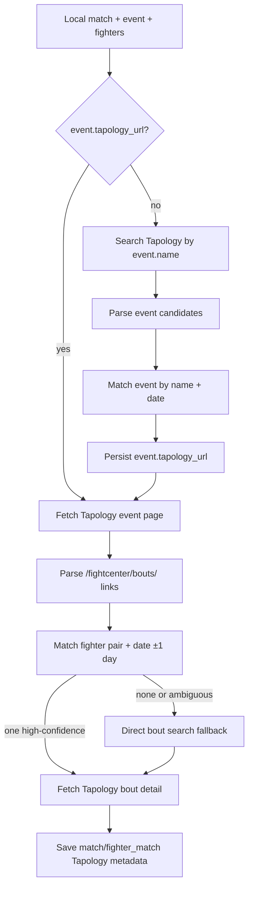

# Tapology Event Page Bout Matching - Plan

## Goal Capsule

Improve `tapology-bouts` collection by resolving Tapology event pages first, saving `event.tapology_url`, and matching local UFCStats bouts against bout links found on the resolved Tapology event page.
The plan keeps automatic writes conservative: a Tapology bout URL is saved only when the fighter pair matches and the candidate date matches the local event date within one day, with exactly one high-confidence candidate.
The existing direct bout search path remains as a fallback, not the primary strategy.

---

## Product Contract

### Summary

Tapology's internal search does not reliably return `/fightcenter/bouts/` results for fighter-pair queries.
In live checks, searching `Merab Dvalishvili Umar Nurmagomedov UFC 311` returned no bout links, while searching `UFC 311` returned the Tapology event page and that event page contained the relevant bout links.
This plan changes `tapology-bouts` from direct bout search to event-page-first discovery.

### Problem Frame

The current `tapology-bouts` task asks Tapology search for a specific fight using `fighter1 fighter2 event_name`.
That search path often produces no bout candidates, which leaves match-level Tapology fields empty even when Tapology has the data.
Tapology event pages are a better source because each event page contains the event's full fight card with `/fightcenter/bouts/` links.

### Requirements

**Event Resolution**

- R1. The collector must add and persist `event.tapology_url` for the Tapology event page matched to a local UFCStats event.
- R2. `tapology-bouts` must first use an existing `event.tapology_url` when present.
- R3. If `event.tapology_url` is missing, `tapology-bouts` must search Tapology by local `event.name`, parse event candidates, match the correct event, and save the chosen Tapology event URL.
- R4. Event matching must use event name plus event date evidence where available, and ambiguous event candidates must be skipped rather than saved.

**Bout Matching**

- R5. `tapology-bouts` must fetch the matched Tapology event page and parse `/fightcenter/bouts/` candidates from that page.
- R6. Bout automatic matching must require both local fighter names to match the candidate and the candidate date to equal local `event_date` or fall within ±1 day.
- R7. Event name evidence may increase confidence but must remain a supporting signal, not a required signal.
- R8. If exactly one high-confidence bout candidate exists, the collector may save `match.tapology_bout_url` and parse the Tapology bout detail page.
- R9. Multiple high-confidence candidates, pair-only candidates without date evidence, and no-pair candidates must be skipped with logs that include the event URL, search term, candidate count, and candidate previews.

**Operational Safety**

- R10. Direct bout search remains available as a fallback path after event-page matching fails, so the implementation does not regress non-event-page cases.
- R11. Batch-local caching must prevent repeated event search and event page fetches for multiple local matches from the same event in one task run.
- R12. The change must not overwrite UFCStats fight results; it may only enrich Tapology URL, title/status/cancellation fields, and fighter-side weigh-in metadata.

### Acceptance Examples

- AE1. Given a local event `UFC 311: Makhachev vs. Moicano` with no `event.tapology_url`, when `tapology-bouts` runs, then it searches Tapology for the event, saves the matched Tapology event URL, fetches that page, and finds bout candidates from the event page.
- AE2. Given a local match `Merab Dvalishvili` vs `Umar Nurmagomedov` dated `2025-01-18`, when the UFC 311 event page contains one candidate for those fighters dated `2025-01-18`, then the collector saves that candidate's Tapology bout URL and enriches the match.
- AE3. Given a candidate with both fighters but no parseable date, when the task runs, then the candidate is logged as low confidence and is not saved automatically.
- AE4. Given two candidates with the same fighter pair and date, when the task runs, then the match is skipped as ambiguous and no Tapology bout URL is saved.
- AE5. Given `event.tapology_url` is already present, when another match from the same event is processed, then the task fetches or reuses the event page without repeating event search.

### Scope Boundaries

#### In Scope

- Add `event.tapology_url` to schema/model and persistence paths.
- Add Tapology event candidate parsing and event matching.
- Change `tapology-bouts` to event-page-first candidate discovery.
- Add ±1 day date tolerance to bout matching.
- Add batch-local event URL/page cache and richer skipped logs.
- Preserve current direct bout search as fallback.
- Add unit tests for event parsing, event matching, tolerant bout matching, cache behavior, and fallback behavior.

#### Out of Scope

- Admin UI for manual ambiguous match review.
- Full Tapology event backfill as a separate standalone task.
- Using Tapology as the source of truth for UFCStats fight results.
- Scraping all non-UFC Tapology events or bouts unrelated to existing local matches.
- Numeric normalization of weigh-in or weight-gain values.

---

## Planning Contract

### Key Technical Decisions

- KTD1. **Persist `event.tapology_url` on `event`.** Event URL matching is reusable across every bout on the event, so it belongs at event level rather than being rediscovered for every match.
- KTD2. **Use event-page-first matching.** Live checks showed Tapology search returns event links reliably for event names, while fighter-pair search can return zero bout links.
- KTD3. **Keep direct bout search as fallback.** Event-page matching should improve the common UFC event path without removing the current strategy for cases where event resolution fails.
- KTD4. **Keep automatic writes conservative.** The collector saves a bout URL only for one high-confidence candidate with fighter-pair and ±1 day date evidence.
- KTD5. **Use batch-local cache before adding broader cache infrastructure.** A single `tapology-bouts` batch may contain many matches from the same event, and in-memory caching removes duplicated requests without adding new persistent cache tables.
- KTD6. **Do not reuse `event.url` for Tapology.** Existing `event.url` may represent the UFCStats event URL. Add `tapology_url` instead of overloading the existing column.

### High-Level Technical Design

### Data Model Impact

- Add `EventSchema.tapology_url: Optional[str]`.
- Add `EventModel.tapology_url = Column(String)`.
- Include `tapology_url` in `EventModel.from_schema()` and `EventModel.to_schema()`.
- Update `src/schema.json` if it is maintained as a checked-in schema artifact in this repo.
- Add database DDL for existing environments. This repo does not currently show Alembic migration files, so implementation must follow the repository's current schema-change practice.

### Matching Design

Event candidates should be parsed from links matching `/fightcenter/events/`.
The parser should capture absolute URL, display text, normalized name, and parseable date if the search result text contains one.
Event matching should prefer exact normalized event-name match, then contained-name match, with event date as a strong supporting signal when available.

Bout candidates can continue to use `parse_tapology_bout_candidates(html)` because event pages expose `/fightcenter/bouts/` links and the parser already deduplicates URLs.
`match_tapology_bout()` should change date matching from exact equality to a helper such as `_date_matches_with_tolerance(candidate_date, event_date, tolerance_days=1)`.

### Observability

Skipped logs should include enough evidence to distinguish search failure, event mismatch, event page fetch failure, candidate parsing failure, and conservative match rejection.
For event-page matching, include `match_id`, `event_name`, `event_date`, `event_url`, `fighter_names`, `candidate_count`, `reason`, and candidate preview.
For fallback, include the direct search term and whether fallback found candidates.

### Risks & Dependencies

- Tapology event pages are large and may timeout under `load` waiting. The existing Scrapling timeout/retry behavior may need follow-up tuning if event-page fetches are slow.
- Event pages can include duplicate bout links and repeated card widgets. Candidate deduplication by URL must remain in place.
- Some Tapology event search results may return regional or future events with similar names. Event matching must skip ambiguous candidates.
- If an event has no `event_date`, automatic event matching should be conservative.
- Existing production DBs need an `event.tapology_url` column before code using the new model is deployed.

---

## Implementation Units

### U1. Add Event Tapology URL Schema

**Goal:** Persist Tapology event URLs on local events without overloading the existing `event.url` field.

**Requirements:** R1, R2, R3, R11.

**Dependencies:** None.

**Files:**

- `src/event/models.py`
- `src/schema.json`
- `src/tests/event/test_event_models.py` or nearest existing event model/repository test
- DB schema migration or project-specific DDL artifact

**Approach:**

1. Add optional `tapology_url` to `EventSchema`.
2. Add `tapology_url` column to `EventModel`.
3. Add `tapology_url` to `from_schema()` and `to_schema()`.
4. Add or update schema DDL according to the repo's current migration practice.
5. Add a model round-trip test for `tapology_url`.

**Test Scenarios:**

- Event schema/model round-trips `tapology_url`.
- Existing events without `tapology_url` still serialize with `None`.

**Verification:** Event model/repository tests pass.

### U2. Add Tapology Event Candidate Parsing and Matching

**Goal:** Resolve a local UFCStats event to a Tapology event URL through Tapology search results.

**Requirements:** R3, R4, R9.

**Dependencies:** U1.

**Files:**

- `src/data_collector/workflows/tapology_matcher.py`
- `src/data_collector/tests/test_tapology_matcher.py`

**Approach:**

1. Add `TapologyEventCandidate` dataclass.
2. Add `TapologyEventMatchResult` dataclass or reuse a consistent match-result pattern.
3. Add `parse_tapology_event_candidates(search_html)` for `/fightcenter/events/` links.
4. Add `match_tapology_event_candidates(candidates, event_name, event_date)` with conservative ambiguity handling.
5. Keep normalization consistent with existing fighter/bout matching helpers.

**Test Scenarios:**

- Parses event candidate links from Tapology search HTML and deduplicates by URL.
- Matches a single exact event name candidate.
- Matches a contained-name candidate when the date matches.
- Returns ambiguous when multiple candidates have equivalent high confidence.
- Returns not found when candidates do not match event name/date sufficiently.

**Verification:** `src/data_collector/tests/test_tapology_matcher.py` passes.

### U3. Add Tolerant Bout Date Matching

**Goal:** Allow high-confidence bout matching when Tapology and UFCStats dates differ by at most one day.

**Requirements:** R6, R7, R8.

**Dependencies:** None.

**Files:**

- `src/data_collector/workflows/tapology_matcher.py`
- `src/data_collector/tests/test_tapology_matcher.py`

**Approach:**

1. Add a small date tolerance helper.
2. Replace exact `candidate.parsed_date == event_date` check with ±1 day matching.
3. Keep event name as score-only supporting evidence.
4. Preserve low-confidence behavior for fighter-pair candidates without date evidence.

**Test Scenarios:**

- Exact same date still matches.
- Candidate date one day before local event date matches.
- Candidate date one day after local event date matches.
- Candidate date two days away does not high-confidence match.
- Pair-only candidate with no parsed date remains low confidence.

**Verification:** Bout matcher tests pass.

### U4. Change Tapology Bout Task to Event-Page-First Discovery

**Goal:** Use resolved Tapology event pages as the primary source of bout candidates for `tapology-bouts`.

**Requirements:** R2, R3, R5, R8, R9, R10, R11, R12.

**Dependencies:** U1, U2, U3.

**Files:**

- `src/data_collector/workflows/tapology_tasks.py`
- `src/data_collector/workflows/data_store.py`
- `src/data_collector/tests/test_tapology_tasks.py`

**Approach:**

1. Extend `TapologyLocalBout` to carry local `event_id` and `event_tapology_url`.
2. Update `select_matches_for_tapology_bout_enrichment()` to read `EventModel.tapology_url`.
3. Add an event URL saver callback or persistence helper to update `event.tapology_url`.
4. Add batch-local caches keyed by event identity for resolved event URL and event page HTML.
5. For each bout without `tapology_bout_url`, resolve/fetch the Tapology event page, parse bout candidates from it, and match the local bout.
6. If event-page matching fails, run the existing direct bout search fallback.
7. Keep the existing detail-page fetch, metadata parse, and save flow after a bout URL is selected.

**Test Scenarios:**

- When event URL is missing, task searches event name, saves matched event URL, fetches event page, matches bout, and saves metadata.
- When event URL exists, task skips event search and fetches event page directly.
- Multiple bouts from the same event reuse cached event search/page results within one batch.
- Event-page candidate with fighter pair and date ±1 day is saved.
- Event-page candidate with fighter pair but no date is skipped and direct fallback is attempted.
- Ambiguous event candidates skip the bout without saving event or bout URL.
- Event-page failure falls back to direct bout search.
- Existing `tapology_bout_url` still bypasses event search/page matching and fetches the bout detail page directly.

**Verification:** `src/data_collector/tests/test_tapology_tasks.py` passes.

### U5. Add Operational Verification and Logging Coverage

**Goal:** Make the new matching path observable enough to tune collection after deployment.

**Requirements:** R9, R10, R11.

**Dependencies:** U4.

**Files:**

- `src/data_collector/workflows/tapology_tasks.py`
- `src/data_collector/tests/test_tapology_tasks.py`
- `src/data_collector/tests/test_run_ufc_stats_flow.py`

**Approach:**

1. Add logs for event search term, event candidate count, selected event URL, event-page bout candidate count, fallback search term, and final match reason.
2. Keep existing summary stats but make skipped reasons distinguish event resolution failures from bout candidate failures.
3. Ensure CLI default flow still runs `tapology-bouts` after `match-detail`.

**Test Scenarios:**

- Failed event match logs `reason=event_not_found` or equivalent.
- Ambiguous event match logs candidate previews.
- Event-page no-candidate logs candidate count and event URL.
- Fallback success logs that fallback was used.

**Verification:** Task tests assert core log markers for representative skipped paths.

---

## Verification Contract

| Gate | Command | Covers | Done Signal |
|---|---|---|---|
| Matcher tests | `cd src && uv run python -m pytest data_collector/tests/test_tapology_matcher.py` | U2, U3 | Event parser/matcher and tolerant bout matching tests pass. |
| Tapology task tests | `cd src && uv run python -m pytest data_collector/tests/test_tapology_tasks.py` | U4, U5 | Event-page-first task paths and fallback paths pass. |
| CLI flow tests | `cd src && uv run python -m pytest data_collector/tests/test_run_ufc_stats_flow.py data_collector/tests/test_ufc_stats_flow.py` | U4, U5 | Default CLI and scheduled flow still inject Scrapling Tapology crawler. |
| Event model tests | `cd src && uv run python -m pytest src/tests/event data_collector/tests/test_tapology_tasks.py` | U1, U4 | Event URL schema and persistence behavior pass. |
| Live smoke | Run one controlled `tapology-bouts` batch against a known UFC 311 match after DB schema update. | U1-U5 | Logs show event URL resolved, event page candidates parsed, one bout URL matched, and metadata saved. |

---

## Definition of Done

- `event.tapology_url` exists in the SQLAlchemy/Pydantic event model and in the operational DB schema.
- `tapology-bouts` primarily discovers bout candidates through Tapology event pages.
- Direct bout search remains as fallback and existing pre-populated `match.tapology_bout_url` still works.
- Bout matching accepts event date ±1 day only when fighter pair evidence is present.
- Ambiguous and low-confidence matches are skipped, not saved.
- Batch-local event caching prevents repeated event search/page fetches for the same event in one run.
- Tests cover event parsing, event matching, tolerant date matching, event-page task flow, fallback flow, and default task wiring.
- A live smoke run confirms at least one known UFC event match resolves through the event-page path.
