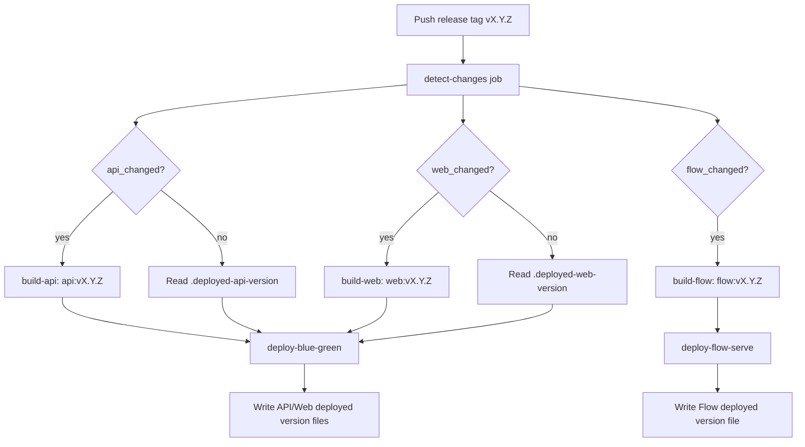

# Component-Scoped CD and Flow Image Split - Plan

## Goal Capsule

Refactor production CD so one semver release tag can deploy only the components affected by the release: API, Web, and Prefect `flow_serve`.
The user continues to start CD by pushing a normal tag such as `v0.18.0`, but `.github/workflows/cd.yml` detects changed paths, builds only necessary images, and deploys only affected runtime surfaces.
The target result is that frontend-only changes rebuild/deploy Web, API-only changes rebuild/deploy API, and data collector changes rebuild/deploy the Flow image and recreate only `flow_serve`.

---

## Product Contract

### Summary

Current CD always builds both API and Web images on every release tag, then runs the existing blue-green deploy for API/Web.
`flow_serve` currently uses the API image and is managed manually through the `manual` compose profile, so flow-only code changes require an API image rebuild and an extra operational step to recreate `flow_serve`.
This plan splits image/version ownership into `api`, `web`, and `flow`, keeps release tags unified, and makes flow-only changes trigger only flow image build plus `flow_serve` recreation.

### Problem Frame

The current release process is simple but over-coupled:

- `api-blue`, `api-green`, and `flow_serve` all use `${REGISTRY}/api:${IMAGE_VERSION}` in `docker-compose.prod.yml`.
- `web-blue` and `web-green` use `${REGISTRY}/web:${IMAGE_VERSION}`.
- `.github/workflows/cd.yml` builds and pushes both API and Web images in one job regardless of changed files.
- `scripts/deploy-blue-green.sh` expects one `VERSION` for both API and Web and pulls both images.
- `scripts/restart-flow-serve.sh` expects one `IMAGE_VERSION` and recreates `flow_serve` from the API image.

As a result, screen-only changes unnecessarily rebuild API, and flow-only changes either over-deploy API/Web or require manual operational coordination.

### Requirements

**Release Trigger**

- R1. CD must continue to start from one semver release tag such as `v0.18.0`.
- R2. The CD workflow must not require separate `api-v*`, `web-v*`, or `flow-v*` tags.
- R3. Because GitHub Actions path filters are not evaluated for tag pushes, the workflow must compute changed files inside the workflow rather than relying on `on.push.paths`.

**Image Ownership**

- R4. API, Web, and Flow must have separately addressable images: `${REGISTRY}/api:<version>`, `${REGISTRY}/web:<version>`, and `${REGISTRY}/flow:<version>`.
- R5. `flow_serve` must use the Flow image, not the API image.
- R6. API and Web blue-green services must accept independent image versions.
- R7. Flow serve restart must accept an independent flow image version.

**Conditional Build and Deploy**

- R8. Web-only changes must build/push only the Web image and run only the API/Web blue-green deploy using the previously deployed API version.
- R9. API-only changes must build/push only the API image and run only the API/Web blue-green deploy using the previously deployed Web version.
- R10. Flow-only changes must build/push only the Flow image and recreate only `flow_serve`; API/Web blue-green deploy must be skipped.
- R11. Mixed changes must build/deploy every affected component.
- R12. Shared code changes must conservatively mark every component that imports or depends on the changed code.

**Operational State**

- R13. The production server must persist deployed component versions separately as `.deployed-api-version`, `.deployed-web-version`, and `.deployed-flow-version`.
- R14. Existing `.deployed-version` may remain for backward compatibility during transition, but new deploy scripts must write component-specific version files.
- R15. If a component is unchanged in a release, deploy scripts must reuse the current deployed version for that component rather than assuming the new tag image exists.

**Safety and Compatibility**

- R16. The first implementation should keep the release operator experience close to the current process: tag main, wait for CD, inspect logs.
- R17. Blue-green deploy must continue to health-check API, Web, and Nginx before switching active traffic.
- R18. Flow deploy must verify DB/Redis health before recreating `flow_serve` and must report logs when the container fails to start.
- R19. The implementation must avoid `git push --tags` style behavior and keep release tag handling explicit.

### Acceptance Examples

- AE1. Given a tag `v0.18.0` whose diff only touches `frontend/**`, when CD runs, then it builds `web:v0.18.0`, skips API and Flow image builds, and blue-green deploys with `WEB_VERSION=v0.18.0` and the current deployed API version.
- AE2. Given a tag whose diff only touches `src/data_collector/**`, when CD runs, then it builds `flow:<tag>`, skips API/Web blue-green deploy, and runs the flow restart script with `FLOW_VERSION=<tag>`.
- AE3. Given a tag whose diff touches `src/api/**` or API runtime files, when CD runs, then it builds `api:<tag>` and blue-green deploys with the current deployed Web version if Web was unchanged.
- AE4. Given a tag whose diff touches `src/common/**`, `src/config.py`, `src/database/**`, or dependency files under `src/`, when CD runs, then both API and Flow are marked changed.
- AE5. Given no component-impacting files changed, when CD runs, then no image build or deploy job should run except a final no-op summary.
- AE6. Given the first release after this refactor and component-specific version files are absent, when deploy scripts run, then they fall back to `.deployed-version` or the requested tag according to the documented transition behavior.

### Scope Boundaries

#### In Scope

- Add a Flow image build path.
- Change production compose to use separate `API_IMAGE_VERSION`, `WEB_IMAGE_VERSION`, and `FLOW_IMAGE_VERSION`.
- Refactor CD into component-aware detection, build, and deploy jobs.
- Refactor `deploy-blue-green.sh` to accept independent API and Web versions.
- Refactor `restart-flow-serve.sh` to accept an independent Flow version and wait for infrastructure health.
- Add tests or script validation for version argument parsing and change detection logic.
- Add operational notes for release and rollback behavior.

#### Out of Scope

- Moving API and data collector code into separate Python packages.
- Replacing blue-green deployment with Kubernetes, Nomad, or another orchestrator.
- Changing Prefect Cloud schedules or flow logic.
- Changing database migration strategy beyond preserving current init SQL and runtime expectations.
- Reworking application health endpoints.

---

## Planning Contract

### Key Technical Decisions

- KTD1. **Keep a single release tag as the CD trigger.** One semver tag remains the release unit, while component image versions are derived inside CD. This preserves the current release habit and avoids separate tag families.
- KTD2. **Detect changed components inside the workflow.** GitHub Actions path filters are not evaluated for tag pushes, so `cd.yml` must fetch enough git history and compute `previous_tag..current_tag` changed files.
- KTD3. **Use component-specific image version variables.** `API_IMAGE_VERSION`, `WEB_IMAGE_VERSION`, and `FLOW_IMAGE_VERSION` make compose and scripts explicit about which runtime uses which image tag.
- KTD4. **Persist deployed component versions on the server.** If a release changes only Web, blue-green deploy still needs a known API image tag. Server-side version files are the source of truth for unchanged components.
- KTD5. **Create a dedicated Flow image.** `flow_serve` should no longer share the API image. This prevents API deployment decisions from being coupled to data collector runtime changes.
- KTD6. **Start with conservative shared-code classification.** Some source paths affect both API and Flow. It is safer to rebuild one extra component than to miss a runtime dependency.
- KTD7. **Keep deploy scripts executable outside GitHub Actions.** The scripts should work from SSH/manual invocation using explicit version arguments, not rely exclusively on Actions-specific environment variables.

### High-Level Technical Design

### Component Path Classification

The workflow should use one explicit path classifier, either implemented inline in `cd.yml` or as a small shell script such as `scripts/detect-component-changes.sh`.

Suggested initial classification:

| Component | Changed paths |
|---|---|
| Web | `frontend/**` |
| API | `Dockerfile_api`, `src/api/**`, `src/dashboard/**`, `src/user/**`, `src/auth/**`, `src/main_api.py`, `src/pyproject.toml`, `src/uv.lock`, `src/config.py`, `src/database/**`, `src/common/**`, `src/fighter/**`, `src/event/**`, `src/match/**` |
| Flow | `Dockerfile_flow`, `Dockerfile_api` until Flow Dockerfile exists, `src/data_collector/**`, `src/config.py`, `src/database/**`, `src/common/**`, `src/fighter/**`, `src/event/**`, `src/match/**`, `src/pyproject.toml`, `src/uv.lock`, `docker-compose.prod.yml`, `scripts/restart-flow-serve.sh` |
| Deployment scripts | `.github/workflows/cd.yml`, `docker-compose.prod.yml`, `scripts/deploy-blue-green.sh`, `scripts/restart-flow-serve.sh` |

Deployment script changes should conservatively mark API/Web/Flow as changed or force all deploy jobs to run, because the deployment mechanism itself changed.

### Version Resolution Rules

For a release tag `vX.Y.Z`:

- If `api_changed=true`, `API_IMAGE_VERSION=vX.Y.Z`; otherwise `API_IMAGE_VERSION` is read from `.deployed-api-version`, falling back to `.deployed-version` for the transition release.
- If `web_changed=true`, `WEB_IMAGE_VERSION=vX.Y.Z`; otherwise `WEB_IMAGE_VERSION` is read from `.deployed-web-version`, falling back to `.deployed-version`.
- If `flow_changed=true`, `FLOW_IMAGE_VERSION=vX.Y.Z`; otherwise the flow deploy job is skipped.

The deploy scripts should fail clearly when an unchanged component needs a previous version and no fallback version file exists.

### Rollback Model

API/Web rollback remains blue-green-oriented: rerun `scripts/rollback.sh` or deploy previous component versions explicitly.
Flow rollback becomes direct image recreation: run `scripts/restart-flow-serve.sh --flow-version <previous-flow-version> --registry <registry>`.
The plan does not require fully automated rollback in the first implementation, but it must not make manual rollback harder than today.

### Transition Strategy

The first release containing this refactor will likely run before `.deployed-api-version`, `.deployed-web-version`, and `.deployed-flow-version` exist on the production server.
During that release, scripts should use `.deployed-version` as a fallback for unchanged API/Web versions and write the new component-specific files after successful deploys.
After one successful component-aware release, `.deployed-version` becomes legacy compatibility only.

---

## Implementation Units

### U1. Add Flow Image Definition

**Goal:** Build a dedicated `flow` image that contains data collector runtime dependencies, Playwright, and Patchright browser assets without coupling `flow_serve` to the API image.

**Requirements:** R4, R5, R7, R10.

**Dependencies:** None.

**Files:**

- `Dockerfile_flow`
- `Dockerfile_api`
- `.dockerignore` if added later
- `.github/workflows/cd.yml`

**Approach:**

- Create `Dockerfile_flow` from the current `Dockerfile_api` runtime shape because data collector code uses the same Python project and currently needs Playwright/Patchright.
- Keep `WORKDIR`, `UV_PROJECT_ENVIRONMENT`, `PYTHONPATH`, and browser install behavior consistent with the current API image.
- Avoid changing application code in this unit.
- Consider a later follow-up to consolidate API/Flow Dockerfiles through a shared base stage if duplication becomes painful.

**Test Scenarios:**

- `docker build -f Dockerfile_flow -t mma-savant-flow-check .` succeeds.
- A container from the image can import `data_collector.main`.
- The image contains the Patchright/Playwright browser executables required by the crawler stack.

**Verification:** Local or CI Docker build for `Dockerfile_flow` passes.

### U2. Split Compose Image Version Variables

**Goal:** Let production compose start API, Web, and Flow services with independent image versions.

**Requirements:** R4, R5, R6, R7, R13, R15.

**Dependencies:** U1.

**Files:**

- `docker-compose.prod.yml`

**Approach:**

- Change `api-blue` and `api-green` image references to `${REGISTRY}/api:${API_IMAGE_VERSION:-${IMAGE_VERSION:-latest}}` if nested interpolation is supported by the compose provider, or choose a simpler supported fallback strategy in scripts.
- Change `web-blue` and `web-green` image references to `${REGISTRY}/web:${WEB_IMAGE_VERSION:-${IMAGE_VERSION:-latest}}`.
- Change `flow_serve` image reference to `${REGISTRY}/flow:${FLOW_IMAGE_VERSION:-${IMAGE_VERSION:-latest}}`.
- Keep existing `IMAGE_VERSION` compatibility if feasible, so older scripts continue to work during transition.

**Test Scenarios:**

- `docker compose -f docker-compose.prod.yml config` resolves API/Web/Flow images with explicit component variables.
- `flow_serve` no longer resolves to the API image when `FLOW_IMAGE_VERSION` is set.
- Existing `IMAGE_VERSION` fallback still resolves all services for transitional manual use, or scripts document the new required variables.

**Verification:** Compose config validation passes.

### U3. Refactor Blue-Green Deploy Script for API/Web Versions

**Goal:** Deploy API and Web with independent versions while preserving blue-green health checks.

**Requirements:** R6, R8, R9, R11, R13, R15, R16, R17.

**Dependencies:** U2.

**Files:**

- `scripts/deploy-blue-green.sh`
- `scripts/rollback.sh` if rollback assumes one version

**Approach:**

- Add argument parsing for `--api-version`, `--web-version`, and `--registry`.
- Preserve existing positional invocation as a compatibility path where one version is used for both API and Web.
- Pull `${REGISTRY}/api:${API_VERSION}` and `${REGISTRY}/web:${WEB_VERSION}`.
- Export `API_IMAGE_VERSION` and `WEB_IMAGE_VERSION` before `docker compose --profile $NEW up -d`.
- After successful health checks and Nginx switch, write `.deployed-api-version` and `.deployed-web-version`.
- Optionally continue writing `.deployed-version` as a legacy combined marker, using the release tag passed by CD when available.

**Test Scenarios:**

- Script accepts old form: `./scripts/deploy-blue-green.sh v0.18.0 ghcr.io/...`.
- Script accepts new form: `./scripts/deploy-blue-green.sh --api-version v0.17.3 --web-version v0.18.0 --registry ghcr.io/...`.
- The script exports the correct compose variables before starting the new environment.
- The script fails with a clear message if either required version is missing.

**Verification:** Shell syntax check and a dry-run-friendly argument parser test if script factoring allows it.

### U4. Refactor Flow Serve Restart Script

**Goal:** Recreate `flow_serve` from the Flow image only, with infra health checks and component-specific version persistence.

**Requirements:** R5, R7, R10, R13, R15, R18.

**Dependencies:** U1, U2.

**Files:**

- `scripts/restart-flow-serve.sh`
- `docker-compose.prod.yml`

**Approach:**

- Rename or extend arguments to accept `--flow-version` and `--registry`.
- Preserve current positional `VERSION [REGISTRY]` behavior for compatibility, but internally map it to `FLOW_VERSION`.
- Start `savant_db` and `redis` first.
- Wait for `savant_db` and `savant_redis` health statuses before pulling/recreating flow.
- Export `FLOW_IMAGE_VERSION` before `docker compose --profile manual pull flow_serve` and `up -d --force-recreate flow_serve`.
- Write `.deployed-flow-version` after `flow_serve` is running.
- Print logs when the recreate fails.

**Test Scenarios:**

- Script accepts `--flow-version v0.18.0 --registry ghcr.io/...`.
- Script still accepts `v0.18.0 ghcr.io/...`.
- Script waits for DB/Redis health before recreating flow.
- Script uses `${REGISTRY}/flow:${FLOW_IMAGE_VERSION}` through compose config.

**Verification:** Shell syntax check plus manual compose config validation.

### U5. Add Component Change Detection

**Goal:** Compute `api_changed`, `web_changed`, and `flow_changed` for tag-based CD.

**Requirements:** R1, R2, R3, R8, R9, R10, R11, R12.

**Dependencies:** None.

**Files:**

- `.github/workflows/cd.yml`
- `scripts/detect-component-changes.sh` if extracted from workflow
- Tests for the detection script if extracted

**Approach:**

- In `cd.yml`, checkout with full history or enough tags to compare releases.
- Determine current version from `github.ref_name` for tag runs or workflow input for manual dispatch.
- Determine previous semver tag using git tag sorting, excluding the current tag.
- Compute changed files from `previous_tag..current_tag`.
- Set job outputs: `api_changed`, `web_changed`, `flow_changed`, `version`, and `registry`.
- For workflow dispatch, require an input or conservative mode that can force selected components because manual runs may not have a meaningful tag diff.
- Treat deployment script changes conservatively as all components changed.

**Test Scenarios:**

- A diff containing only `frontend/src/app/page.tsx` marks only Web.
- A diff containing only `src/data_collector/workflows/tasks.py` marks only Flow.
- A diff containing `src/common/utils.py` marks API and Flow.
- A diff containing `.github/workflows/cd.yml` marks API, Web, and Flow.
- A diff containing both frontend and data collector files marks Web and Flow.

**Verification:** Detection script tests pass or workflow dry-run logic is reviewed with representative file lists.

### U6. Split CD Build Jobs

**Goal:** Build only images required by the current release.

**Requirements:** R4, R8, R9, R10, R11.

**Dependencies:** U1, U5.

**Files:**

- `.github/workflows/cd.yml`

**Approach:**

- Replace the single `build-and-push` job with `build-api`, `build-web`, and `build-flow`.
- Keep shared setup steps consistent: checkout, lowercase image name, Docker Buildx, GHCR login, metadata extraction.
- Set `if:` conditions from `needs.detect-changes.outputs.*_changed`.
- Build/push `api:<release-tag>`, `web:<release-tag>`, and `flow:<release-tag>` only when their components changed.
- Continue tagging `latest` only for changed components, or explicitly decide to stop updating `latest` to avoid cross-component ambiguity.

**Test Scenarios:**

- For web-only change outputs, only `build-web` is eligible.
- For flow-only change outputs, only `build-flow` is eligible.
- For shared source change outputs, `build-api` and `build-flow` are eligible.

**Verification:** GitHub Actions YAML validation and a test tag run on a non-production branch or carefully reviewed workflow run.

### U7. Split CD Deploy Jobs

**Goal:** Deploy API/Web and Flow independently according to changed components.

**Requirements:** R8, R9, R10, R11, R13, R14, R15, R16, R17, R18.

**Dependencies:** U3, U4, U5, U6.

**Files:**

- `.github/workflows/cd.yml`
- `scripts/deploy-blue-green.sh`
- `scripts/restart-flow-serve.sh`

**Approach:**

- `deploy-blue-green` runs only when `api_changed || web_changed`.
- The SSH script pulls current server version files before invoking `deploy-blue-green.sh`.
- If API changed, pass the release tag as `--api-version`; otherwise pass `.deployed-api-version` fallback.
- If Web changed, pass the release tag as `--web-version`; otherwise pass `.deployed-web-version` fallback.
- `deploy-flow-serve` runs only when `flow_changed`.
- Flow deploy passes the release tag as `--flow-version`.
- Keep the final health check job scoped to blue-green deploy; flow deploy uses script-level verification and logs.
- Add a final summary job that prints which components were built/deployed.

**Test Scenarios:**

- Web-only release runs `deploy-blue-green` with previous API version and new Web version.
- API-only release runs `deploy-blue-green` with new API version and previous Web version.
- Flow-only release skips `deploy-blue-green` and runs `deploy-flow-serve`.
- Mixed Web + Flow release runs Web blue-green and Flow restart, without API rebuild.
- Missing previous version files cause a clear failure before pulling nonexistent images.

**Verification:** Workflow syntax validation and one controlled release after merge.

### U8. Update Operational Documentation

**Goal:** Make the new release and rollback model understandable for future operation.

**Requirements:** R13, R14, R16, R18, R19.

**Dependencies:** U3, U4, U7.

**Files:**

- `README.md` or an operations document if one exists
- `scripts/restart-flow-serve.sh`
- `scripts/deploy-blue-green.sh`

**Approach:**

- Document that release starts from one semver tag.
- Document component-specific version files.
- Document manual API/Web deploy command with `--api-version` and `--web-version`.
- Document manual Flow deploy command with `--flow-version`.
- Document how to inspect current deployed component versions on the server.
- Document rollback examples for Web/API blue-green and Flow image recreation.

**Test Scenarios:**

- A reader can determine the current API/Web/Flow versions from the docs.
- A reader can manually recreate `flow_serve` with a previous flow image version.
- A reader understands that old runs in Prefect Cloud are unaffected by new task metadata until flow image deployment.

**Verification:** Documentation review against the final scripts.

---

## Verification Contract

| Scope | Command or check | Proves |
|---|---|---|
| Workflow syntax | `gh workflow view CD --yaml` or GitHub Actions UI validation after push | `cd.yml` remains parseable |
| Shell syntax | `bash -n scripts/deploy-blue-green.sh scripts/restart-flow-serve.sh` | Deploy scripts parse |
| Compose config | `API_IMAGE_VERSION=vA WEB_IMAGE_VERSION=vW FLOW_IMAGE_VERSION=vF REGISTRY=ghcr.io/hyun-jun-lee/mma-savant docker compose -f docker-compose.prod.yml --profile all --profile manual config` | Compose resolves component image versions |
| Flow image build | `docker build -f Dockerfile_flow -t mma-savant-flow-check .` | Flow runtime image builds |
| API image build | `docker build -f Dockerfile_api -t mma-savant-api-check .` | Existing API image still builds |
| Data collector tests | `cd src && uv run pytest data_collector/tests/test_run_ufc_stats_flow.py data_collector/tests/test_ufc_stats_flow.py data_collector/tests/test_crawler.py` | Flow-related runtime tests still pass |
| Detection tests | Script-specific tests or representative file-list checks | Component changed outputs match expectations |
| Production smoke | Controlled release tag with a small component-specific change | Correct build/deploy jobs run and unaffected components are skipped |

---

## Definition of Done

- API, Web, and Flow images can be built and tagged independently.
- `flow_serve` uses `${REGISTRY}/flow:${FLOW_IMAGE_VERSION}` in production compose.
- Blue-green deployment accepts independent API and Web versions.
- Flow restart accepts an independent Flow version and recreates only `flow_serve`.
- CD computes changed components for tag releases without relying on tag path filters.
- CD skips unrelated image builds and unrelated deploy jobs.
- Production server records `.deployed-api-version`, `.deployed-web-version`, and `.deployed-flow-version`.
- The first release after the refactor has a documented transition path from `.deployed-version`.
- Tests and validation commands in the Verification Contract pass or have documented environment-specific skips.
- Operational documentation explains release, component version inspection, and rollback.

---

## Appendix

### Current Files and Patterns to Preserve

- `.github/workflows/cd.yml` currently starts on `v*.*.*` tags and workflow dispatch.
- `docker-compose.prod.yml` currently uses blue/green profiles for API/Web and `manual` profile for `flow_serve`.
- `scripts/deploy-blue-green.sh` already performs DB/Redis health waits and blue-green health checks.
- `scripts/restart-flow-serve.sh` already centralizes manual flow restart and should become the automation target for flow deploy.
- `Dockerfile_api` already includes Playwright/Patchright browser installation required by data collector flows.

### External Guidance

GitHub Actions documentation states that path filters are not evaluated for tag pushes.
This is why the plan computes changed files inside the workflow instead of relying on `on.push.paths`.
