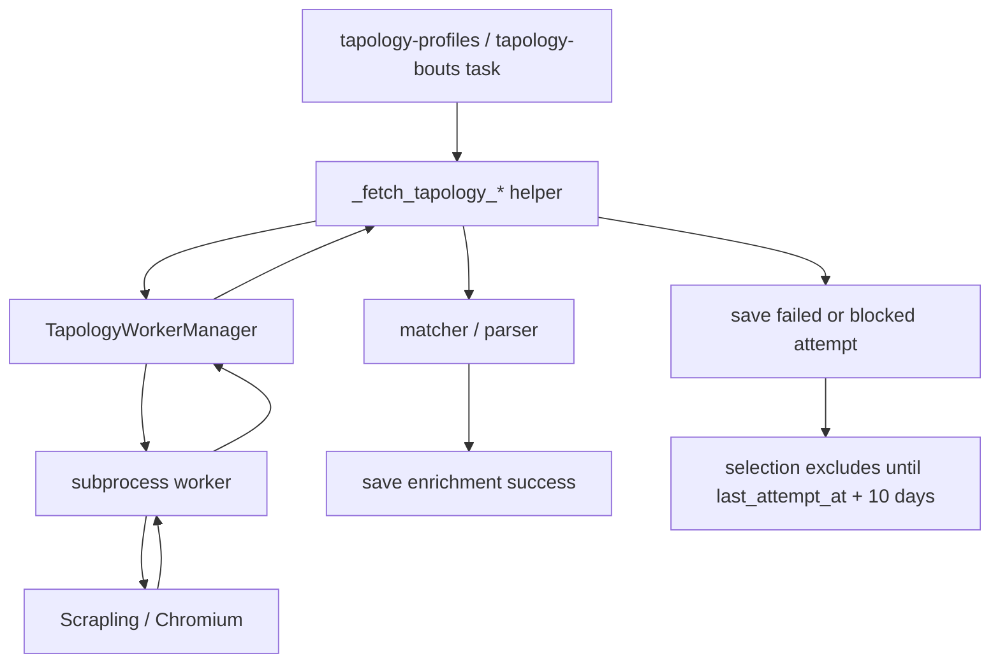
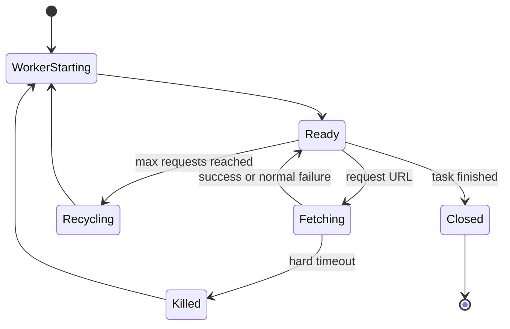

# Tapology Worker Stabilization - Plan

## Goal Capsule

Tapology 수집에서 Scrapling/Chromium 호출을 별도 worker process로 격리해 Chromium crash, pid 누적, 응답 정지 상태가 메인 Prefect task를 오염시키지 않게 한다.
worker에는 hard timeout kill과 N건 처리 후 재시작 정책을 적용한다.
실패 또는 차단된 fighter/match는 DB에 `last_attempt_at`, `failure_stage`, `failure_reason`을 저장하고, `last_attempt_at` 기준 10일 뒤 다시 수집 대상에 포함되게 한다.

완료 기준은 `tapology-profiles`와 `tapology-bouts`가 같은 수집 의미를 유지하면서도 멈춘 Scrapling 호출을 강제로 회수하고, 실패/차단 항목을 즉시 반복하지 않으며, 10일 이후 자동 재시도하는 것이다.

---

## Product Contract

### Summary

현재 1차 안정화는 Scrapling timeout/wait/retry를 줄이고 요청 단위 elapsed 로그를 추가했다.
하지만 Scrapling/Chromium이 Python thread 안에서 멈추거나 crashpad/pid 리소스를 누적하면 메인 collector process가 계속 영향을 받을 수 있다.
이 계획은 Scrapling 호출을 worker process 경계 밖으로 밀어내고, 실패 상태를 DB에 남겨 “영원히 멈추지 않는 수집”과 “실패 항목의 지연 재시도”를 함께 구현한다.

### Problem Frame

Tapology는 대부분의 페이지에서 Scrapling/Chromium fallback이 필요하고, 운영 환경에서는 `chrome_crashpad_handler: Resource temporarily unavailable`, `SIGTRAP`, `pids.current` 상승 같은 증상이 발생할 수 있다.
Scrapling 내부 timeout만으로는 Chromium native process 정지를 완전히 회수하기 어렵다.
따라서 수집 안정성은 Python thread timeout보다 OS process lifecycle 제어에 의존해야 한다.

### Requirements

**Worker Isolation**

- R1. Tapology Scrapling 호출은 메인 Prefect task process 안의 thread가 아니라 별도 subprocess worker에서 실행되어야 한다.
- R2. worker 호출은 search/detail/event/bout URL에 대해 기존 `_fetch_tapology_*` helper의 수집 의미를 유지해야 한다. 내부 fetch 경로는 `TapologyFetchResult`로 성공 HTML과 실패 상태를 구분하고, 기존 HTML 소비자는 호환 wrapper를 통해 HTML string 또는 `None`을 받을 수 있다.
- R3. worker process가 crash, hang, timeout되어도 메인 task process는 계속 다음 항목을 처리해야 한다.

**Timeout and Recycling**

- R4. Scrapling 내부 timeout과 별도로 worker hard timeout을 두고, 초과 시 worker process를 kill해야 한다.
- R5. worker는 설정된 최대 요청 수를 처리하면 정상 종료되고 새 worker로 교체되어야 한다.
- R6. worker kill, recycle, start, exit 이벤트는 task 로그에서 확인 가능해야 한다.

**Failure Persistence and Retry Delay**

- R7. Tapology profile 수집 실패 또는 challenge 차단은 fighter row에 `last_attempt_at`, `failure_stage`, `failure_reason`, attempt status로 저장되어야 한다.
- R8. Tapology bout 수집 실패 또는 challenge 차단은 match row에 `last_attempt_at`, `failure_stage`, `failure_reason`, attempt status로 저장되어야 한다.
- R9. 실패 또는 차단된 항목은 `last_attempt_at` 기준 10일이 지나기 전까지 기본 selection 대상에서 제외되어야 한다.
- R10. 10일이 지난 실패 또는 차단 항목은 아직 성공 enrichment가 없거나 stale 상태이면 다시 selection 대상에 포함되어야 한다.
- R11. 성공 저장 시 attempt status와 failure reason은 성공 상태로 정리되어야 한다.

**Operational Compatibility**

- R12. 기존 `tapology_last_scraped_at`는 성공 수집 신선도 판단에 계속 사용해야 한다.
- R13. 기본 수집 순서, batch progress log, Tapology matcher/parser의 보수적 skip 정책은 유지해야 한다.
- R14. 설정값은 운영에서 조정 가능해야 하며 기본값은 안정성을 우선한다.

### Scope Boundaries

#### In Scope

- Tapology Scrapling worker process 도입.
- worker hard timeout kill.
- N건 처리 후 worker restart.
- profile/bout 실패 상태 DB 저장.
- `last_attempt_at + 10일` 재시도 selection 조건.
- worker lifecycle, hard timeout, failure persistence 테스트.
- 운영 설정값과 로그 문구 정리.

#### Out of Scope

- Scrapling 외의 UFCStats, UFC.com, geocoding crawler 구조 변경.
- Tapology parser/matcher 정확도 개선.
- Playwright persistent browser reuse 최적화.
- 실패 항목을 검수하는 별도 관리자 UI.
- DB에 상세 request log/event log 테이블을 별도 구축하는 작업.

#### Deferred to Follow-Up Work

- 실패 유형별 backoff 기간 차등화.
- worker pool 병렬화.
- 실패/차단 항목 운영 대시보드.
- Tapology challenge 발생률을 여러 run에 걸쳐 추적하는 persistent/global circuit breaker.

---

## Planning Contract

### Key Technical Decisions

- KTD1. **Subprocess worker를 2차 안정화의 기본 경계로 둔다.** Python thread는 안전하게 강제 kill할 수 없으므로 hard timeout과 resource cleanup은 process boundary에서 처리한다.
- KTD2. **worker는 long-lived JSON-lines stdin/stdout process로 고정한다.** 기본 구현은 worker 하나가 여러 요청을 처리하고 `TAPOLOGY_WORKER_MAX_REQUESTS` 도달 시 재시작하는 방식이다. 단일 URL argument mode는 운영 경로가 아니라 debug/smoke 용도에만 허용한다.
- KTD3. **hard timeout은 worker process group을 kill한다.** Chromium child process가 남지 않게 단일 pid kill이 아니라 process group 단위 kill을 사용한다. Linux 운영 경로는 `start_new_session=True` 또는 동등한 process group 격리, timeout 시 `killpg`, kill 이후 descendant sweep, per-worker temp/user-data-dir cleanup을 포함해야 한다.
- KTD4. **성공 신선도와 실패 재시도 상태를 분리한다.** 기존 `tapology_last_scraped_at`는 성공 수집 기준이고, 신규 `last_attempt_at`/`failure_reason`/`attempt_status`는 실패 또는 차단 재시도 기준이다.
- KTD5. **실패와 차단은 기본 10일 backoff 대상이지만 run-level guard가 우선한다.** `failed`, `blocked` 상태는 기본적으로 `last_attempt_at + 10일` 전까지 selection에서 제외한다. 단, challenge/timeout/parse 오류가 batch 또는 run 기준 임계치를 넘으면 사이트 전체 차단이나 layout drift로 보고 task를 조기 중단하며, 남은 row에는 attempt 상태를 쓰지 않는다.
- KTD6. **business skip과 fetch failure를 구분한다.** 매칭 후보 없음, 애매한 후보, low confidence는 기존처럼 skipped로 남기되, 외부 fetch 실패/challenge/timeout은 DB attempt 상태에 기록한다.
- KTD7. **worker 결과 프로토콜은 작고 명시적으로 유지한다.** stdout에는 JSON envelope만 쓰고 HTML은 temp file 경로로만 전달해 로그와 payload를 섞지 않는다. manager는 `html_path`를 읽은 뒤 성공/실패 경로 모두에서 temp file 삭제를 책임진다.

### High-Level Technical Design





### Data Model

Add profile attempt state to `fighter`.

| Column | Type | Meaning |
|---|---|---|
| `tapology_attempt_status` | string nullable | `succeeded`, `failed`, `blocked`, or `null` for never attempted |
| `tapology_last_attempt_at` | datetime nullable | last profile enrichment attempt time, including failure and blocked responses |
| `tapology_failure_stage` | string nullable | failing collection stage, for example `profile_search`, `profile_detail`, `event_search`, `event_page`, `bout_search`, `bout_detail`, or `parse` |
| `tapology_failure_reason` | string nullable | short reason code plus compact context, for example `worker_timeout`, `challenge_page`, `empty_fetch_response`, `fetch_exception`, `parse_exception` |

Add bout attempt state to `match`.

| Column | Type | Meaning |
|---|---|---|
| `tapology_attempt_status` | string nullable | `succeeded`, `failed`, `blocked`, or `null` for never attempted |
| `tapology_last_attempt_at` | datetime nullable | last bout metadata enrichment attempt time, including failure and blocked responses |
| `tapology_failure_stage` | string nullable | failing collection stage, for example `event_search`, `event_page`, `bout_search`, `bout_detail`, or `parse` |
| `tapology_failure_reason` | string nullable | short reason code plus compact context |

The names intentionally mirror the existing `tapology_last_scraped_at`.
`tapology_last_scraped_at` means “last successful enrichment freshness”.
`tapology_last_attempt_at` means “last attempt, successful or not”.
`tapology_attempt_status="succeeded"` is intentionally redundant with `tapology_last_scraped_at` enough to make prior failure cleanup explicit for operators.

### DB Migration Procedure

The implementation must update the repository's bootstrap SQL and provide a production-safe existing-DB SQL patch.

Repository bootstrap SQL:

- Update `init_sqls/05_add_tapology_enrichment.sql` with the new columns and indexes so fresh local/test/prod database initialization creates the attempt-state columns.
- Update `init_sqls/01_init_table.sql` only if the base table definitions are kept as canonical full-schema definitions for fresh installs. If the project keeps Tapology additions in `05_add_tapology_enrichment.sql`, do not duplicate the columns in both files.
- Keep `src/schema.json` in sync with the new columns because LLM/schema prompt tests read that file.

Production existing-DB SQL to run manually before deploying code that reads these columns:

```sql
-- Tapology profile attempt state
ALTER TABLE fighter ADD COLUMN IF NOT EXISTS tapology_attempt_status VARCHAR;
ALTER TABLE fighter ADD COLUMN IF NOT EXISTS tapology_last_attempt_at TIMESTAMP;
ALTER TABLE fighter ADD COLUMN IF NOT EXISTS tapology_failure_stage VARCHAR;
ALTER TABLE fighter ADD COLUMN IF NOT EXISTS tapology_failure_reason VARCHAR;

-- Tapology bout attempt state
ALTER TABLE match ADD COLUMN IF NOT EXISTS tapology_attempt_status VARCHAR;
ALTER TABLE match ADD COLUMN IF NOT EXISTS tapology_last_attempt_at TIMESTAMP;
ALTER TABLE match ADD COLUMN IF NOT EXISTS tapology_failure_stage VARCHAR;
ALTER TABLE match ADD COLUMN IF NOT EXISTS tapology_failure_reason VARCHAR;

-- Retry-gate lookup indexes
CREATE INDEX IF NOT EXISTS idx_fighter_tapology_attempt_status ON fighter(tapology_attempt_status);
CREATE INDEX IF NOT EXISTS idx_fighter_tapology_last_attempt_at ON fighter(tapology_last_attempt_at);
CREATE INDEX IF NOT EXISTS idx_match_tapology_attempt_status ON match(tapology_attempt_status);
CREATE INDEX IF NOT EXISTS idx_match_tapology_last_attempt_at ON match(tapology_last_attempt_at);
```

Deployment order:

1. Apply the production SQL above to the existing DB.
2. Deploy the code that writes and reads the new attempt-state columns.
3. Run a small `tapology-profiles` canary batch and confirm attempt-state writes before running the weekly task.

### Selection Rule

The selection rule should include records that need enrichment and are not inside the failure backoff window.

Directionally:

```text
needs_success_refresh =
  tapology_url/bout_url is null
  OR tapology_last_scraped_at is null
  OR tapology_last_scraped_at < now - stale_days

attempt_retry_allowed =
  tapology_attempt_status is null
  OR tapology_attempt_status = 'succeeded'
  OR tapology_last_attempt_at is null
  OR tapology_last_attempt_at < now - retry_after_days_for_status

select when needs_success_refresh AND attempt_retry_allowed
```

Default retry delay is 10 days for both `failed` and `blocked`.
The implementation may expose separate `TAPOLOGY_FAILED_RETRY_AFTER_DAYS` and `TAPOLOGY_BLOCKED_RETRY_AFTER_DAYS` settings, but both default to `10` unless operations changes them.
`no_candidates`, ambiguous match, and low-confidence match remain business `skipped` states and do not write failed attempt state.

### Run-Level Guard

Row-level backoff must not hide site-wide Tapology blocking or layout drift.
During each batch and task run, track counts by `tapology_failure_reason`.

Abort the current Tapology task without writing attempt state for remaining rows when any of these conditions is met:

- `challenge_page` occurs at least `TAPOLOGY_RUN_GUARD_MIN_FAILURES` times and at least `TAPOLOGY_BLOCKED_RUN_ABORT_RATIO` of processed items in the current batch.
- `worker_timeout` occurs at least `TAPOLOGY_RUN_GUARD_MIN_FAILURES` times and at least `TAPOLOGY_TIMEOUT_RUN_ABORT_RATIO` of processed items in the current batch.
- `parse_exception` occurs at least `TAPOLOGY_PARSE_EXCEPTION_ABORT_THRESHOLD` times in one task run.

Default values:

- `TAPOLOGY_RUN_GUARD_MIN_FAILURES=5`
- `TAPOLOGY_BLOCKED_RUN_ABORT_RATIO=0.5`
- `TAPOLOGY_TIMEOUT_RUN_ABORT_RATIO=0.5`
- `TAPOLOGY_PARSE_EXCEPTION_ABORT_THRESHOLD=3`

When the guard aborts, log `site-wide block suspected` or `layout drift suspected` with reason counts and processed counts.

### Worker Result Contract

The manager-facing fetch API returns a typed result instead of `str | None`.

```python
@dataclass(frozen=True)
class TapologyFetchResult:
    stage: str
    url: str
    status: str
    html: str | None
    error: str | None
    elapsed_seconds: float
```

Allowed fetch `status` values:

- `succeeded`
- `empty_response`
- `worker_timeout`
- `worker_crash`
- `protocol_error`
- `fetch_exception`

`blocked` is not a worker status because challenge detection happens after HTML is returned and parsed by workflow helpers.
The workflow maps `TapologyFetchResult` and challenge detection into durable attempt state:

| Fetch/workflow condition | attempt status | failure reason |
|---|---|---|
| valid HTML and parser/save succeeds | `succeeded` | `null` |
| worker status `empty_response` | `failed` | `empty_fetch_response` |
| worker status `worker_timeout` | `failed` | `worker_timeout` |
| worker status `worker_crash` | `failed` | `worker_crash` |
| worker status `protocol_error` | `failed` | `protocol_error` |
| worker status `fetch_exception` | `failed` | `fetch_exception` |
| challenge page detected from HTML | `blocked` | `challenge_page` |
| parser raises | `failed` or run-level abort | `parse_exception` |

The worker writes one JSON-lines envelope per request to stdout.

```json
{
  "id": "request-123",
  "ok": true,
  "status": "succeeded",
  "url": "https://www.tapology.com/...",
  "elapsed_seconds": 12.34,
  "html_path": "/tmp/mma-savant-tapology-worker/request-123.html",
  "error": null
}
```

Failure cases use `ok=false` and a stable `status`.

```json
{
  "id": "request-123",
  "ok": false,
  "status": "fetch_exception",
  "url": "https://www.tapology.com/...",
  "elapsed_seconds": 45.01,
  "html_path": null,
  "error": "Scrapling fetch raised ..."
}
```

The worker process accepts JSON-lines requests on stdin:

```json
{"id":"request-123","url":"https://www.tapology.com/..."}
```

Single URL argument mode is permitted only for debug/smoke runs and must not be used by the collector workflow.
Challenge pages may still return HTML, but the workflow classifies them as `blocked` after challenge detection and persists that state unless a run-level guard aborts the task.

### Configuration

| Setting | Default | Purpose |
|---|---:|---|
| `TAPOLOGY_WORKER_ENABLED` | `true` | Use subprocess worker for Scrapling |
| `TAPOLOGY_WORKER_HARD_TIMEOUT_GRACE_SECONDS` | `15` | Additional process timeout grace |
| `TAPOLOGY_WORKER_HARD_TIMEOUT_SECONDS` | derived | Optional override; must be greater than or equal to the derived timeout budget |
| `TAPOLOGY_WORKER_MAX_REQUESTS` | `20` | Restart worker after N fetches |
| `TAPOLOGY_FAILED_RETRY_AFTER_DAYS` | `10` | Retry failed rows after this many days |
| `TAPOLOGY_BLOCKED_RETRY_AFTER_DAYS` | `10` | Retry blocked rows after this many days |
| `TAPOLOGY_SCRAPLING_TIMEOUT_MS` | `45000` | Existing Scrapling timeout |
| `TAPOLOGY_SCRAPLING_WAIT_MS` | `1500` | Existing Scrapling wait |
| `TAPOLOGY_SCRAPLING_RETRIES` | `1` | Existing Scrapling retry count |
| `TAPOLOGY_RUN_GUARD_MIN_FAILURES` | `5` | Minimum failures before run-level guard can abort |
| `TAPOLOGY_BLOCKED_RUN_ABORT_RATIO` | `0.5` | Abort ratio for challenge pages |
| `TAPOLOGY_TIMEOUT_RUN_ABORT_RATIO` | `0.5` | Abort ratio for worker timeouts |
| `TAPOLOGY_PARSE_EXCEPTION_ABORT_THRESHOLD` | `3` | Abort threshold for parser/layout errors |

Derived hard timeout:

```text
attempt_count = TAPOLOGY_SCRAPLING_RETRIES + 1
delay_max_seconds = TAPOLOGY_SCRAPLING_DELAY_RANGE upper bound
scrapling_timeout_seconds = TAPOLOGY_SCRAPLING_TIMEOUT_MS / 1000
grace_seconds = TAPOLOGY_WORKER_HARD_TIMEOUT_GRACE_SECONDS

derived_hard_timeout_seconds =
  delay_max_seconds + (scrapling_timeout_seconds * attempt_count) + grace_seconds
```

With the current defaults this is `8 + (45 * 2) + 15 = 113s`.
If `TAPOLOGY_WORKER_HARD_TIMEOUT_SECONDS` is set lower than the derived budget, startup should log a warning and use the derived budget.

### Default Acceptance

`TAPOLOGY_WORKER_ENABLED=true` remains the target default only after a small production canary passes.

Canary acceptance criteria:

- `tapology-profiles` small batch completes and continues after any simulated/fake hard timeout.
- No orphan Chromium/crashpad descendants remain for the killed worker process group.
- `pids.current` returns to baseline plus an operational tolerance within 2 minutes after the canary. Initial tolerance is `baseline + 20` until production data suggests a tighter value.
- Worker recycle appears after `TAPOLOGY_WORKER_MAX_REQUESTS`.
- Failed/blocked row count and retry-gated count are logged.
- Runtime increase is accepted explicitly if stability improves; if runtime more than doubles on a representative batch without reducing pid growth or hangs, set `TAPOLOGY_WORKER_ENABLED=false` and re-evaluate.

Rollback condition:

- If worker mode increases `failed`/`blocked` counts materially compared with direct Scrapling mode on the same small batch, or leaves orphan Chromium processes, disable worker mode and keep only the 1차 fail-fast settings while investigating.

### Sequencing

1. Add DB fields and DDL first so later worker failure persistence can be deployed safely.
2. Add worker process and manager behind an internal interface without changing task behavior yet.
3. Switch Tapology fetch helpers to use the worker manager when enabled.
4. Update workflow failure classification to persist `failed` and `blocked`.
5. Update selection conditions to enforce 10-day retry delay.
6. Add operational logs and tests.

### Risks & Dependencies

- Process group kill must be implemented differently on POSIX and non-POSIX systems. The production Linux path is load-bearing; local macOS tests should still validate behavior.
- Returning large HTML through stdout can deadlock or pollute logs. Use temp file payloads or carefully bounded stdout JSON.
- If worker reuse is implemented with stdin/stdout protocol, malformed worker output must trigger worker recycle rather than blocking the manager forever.
- Selection count logs will drop immediately after failures are recorded because failed/blocked rows are temporarily excluded. This is expected and should be named in logs.
- Parser/layout errors can indicate a system-wide Tapology markup change, not a row-specific failure. `parse_exception` must participate in the run-level guard rather than silently hiding rows for 10 days.
- Existing 1차 안정화 changes are committed in `78e54b7`, so worker implementation should reuse the elapsed logging shape from that commit.

---

## Implementation Units

### U1. Add Tapology Attempt State to Domain Models

**Goal:** Store failed/blocked attempt state separately from successful scrape freshness.

**Requirements:** R7, R8, R11, R12.

**Dependencies:** None.

**Files:**

- `src/fighter/models.py`
- `src/match/models.py`
- `src/database/__init__.py`
- `src/schema.json`
- `init_sqls/05_add_tapology_enrichment.sql`
- `init_sqls/01_init_table.sql`
- `src/tests/fighter/test_fighter_model.py`
- `src/tests/match/test_match_models.py`

**Approach:**

1. Add `tapology_attempt_status`, `tapology_last_attempt_at`, `tapology_failure_stage`, and `tapology_failure_reason` to `FighterSchema`/`FighterModel`.
2. Add the same four columns to `MatchSchema`/`MatchModel`.
3. Keep `tapology_last_scraped_at` unchanged for successful scrape freshness.
4. Update `init_sqls/05_add_tapology_enrichment.sql` with `ALTER TABLE ... ADD COLUMN IF NOT EXISTS` statements and retry-gate lookup indexes.
5. Update `init_sqls/01_init_table.sql` only if it is maintained as a canonical full-schema bootstrap file for these tables.
6. Update `src/schema.json` to expose the new attempt-state columns.
7. Do not wire workflow persistence in this unit; U5 owns persistence helpers and workflow callbacks.

**Test scenarios:**

- Fighter model round-trip preserves `tapology_attempt_status`, `tapology_last_attempt_at`, `tapology_failure_stage`, and `tapology_failure_reason`.
- Match model round-trip preserves the same fields.
- Bootstrap SQL is idempotent with `IF NOT EXISTS`.
- Existing-DB SQL can be applied before code deployment without dropping or rewriting data.

**Verification:** Model tests pass and SQL changes are idempotent against an existing database.

### U2. Build the Scrapling Worker Process

**Goal:** Provide a standalone worker entry point that performs Scrapling fetches outside the main task process.

**Requirements:** R1, R2, R3.

**Dependencies:** None.

**Files:**

- `src/data_collector/crawler.py`
- `src/data_collector/tapology_worker.py`
- `src/data_collector/tests/test_tapology_worker.py`
- `src/data_collector/tests/test_crawler.py`

**Approach:**

1. Create a module entry point such as `python -m data_collector.tapology_worker`.
2. The worker accepts JSON-lines requests over stdin and writes exactly one JSON-lines envelope per request to stdout.
3. The worker calls the existing `_fetch_tapology_with_scrapling` path so Scrapling options stay centralized.
4. The worker writes a JSON result envelope and stores large HTML in a temp file.
5. Single URL argument mode is allowed only for debug/smoke runs and must not be used by the collector workflow.
6. Worker stderr remains diagnostic only; the manager treats stdout protocol parsing failure as worker failure.

**Test scenarios:**

- Worker returns `ok=true` and an HTML path when Scrapling fetch succeeds.
- Worker returns `ok=false` and `status=fetch_exception` when the fetch function raises.
- Worker output never includes raw HTML in stdout.
- Worker core handler can be tested in process without live Tapology network access.
- Subprocess protocol tests use a fake worker script/module rather than relying on parent-process monkeypatch propagation.
- Existing Scrapling option tests still assert timeout, wait, and retries.

**Verification:** Worker core tests cover envelope creation, and subprocess protocol tests cover JSON-lines IO using a fake worker.

### U3. Add Worker Manager with Hard Timeout and Recycle

**Goal:** Manage worker lifecycle, hard timeout process kill, and N-request restart from the async task process.

**Requirements:** R3, R4, R5, R6, R14.

**Dependencies:** U2.

**Files:**

- `src/data_collector/crawler.py`
- `src/data_collector/tapology_worker_manager.py`
- `src/data_collector/tests/test_tapology_worker_manager.py`
- `src/data_collector/tests/test_crawler.py`

**Approach:**

1. Add `TapologyWorkerManager` with `fetch(stage, url) -> TapologyFetchResult`.
2. Start the worker process with a process group/session boundary.
3. Compute hard timeout from `delay_max + scrapling_timeout * attempt_count + grace`, unless an explicit setting is higher.
4. On timeout, kill the worker process group, wait for exit, log `worker_timeout`, and return a typed failure result.
5. Track successful or failed request count and recycle when count reaches `TAPOLOGY_WORKER_MAX_REQUESTS`.
6. On malformed output, broken pipe, unexpected exit, or protocol error, recycle the worker and return failure for the current request.
7. Read `html_path` into `TapologyFetchResult.html` and delete the temp file after reading, including error cleanup paths.
8. Ensure `close()` kills or gracefully closes any live worker when the task exits.
9. On Linux, use process group kill plus descendant sweep and per-worker temp/user-data-dir cleanup for timeout and close paths.

**Test scenarios:**

- Manager returns HTML when a fake worker returns success.
- Manager kills and restarts a fake worker that exceeds hard timeout.
- Manager restarts after `TAPOLOGY_WORKER_MAX_REQUESTS`.
- Manager recycles after malformed JSON output.
- Manager deletes temp HTML files after successful reads.
- Manager cleans temp HTML/user-data directories after timeout, crash, and close.
- Hard timeout test asserts the derived outer timeout budget is greater than the inner Scrapling retry budget.
- `close()` leaves no running child process in the test harness.

**Verification:** Worker manager tests prove typed results, timeout, process group kill, recycle, malformed output, temp cleanup, and close behavior.

### U4. Route Tapology Fetch Helpers Through the Worker

**Goal:** Make `tapology-profiles` and `tapology-bouts` use the worker-backed Scrapling path without changing parser/matcher semantics.

**Requirements:** R1, R2, R3, R6, R13.

**Dependencies:** U2, U3.

**Files:**

- `src/data_collector/crawler.py`
- `src/data_collector/run_ufc_stats_flow.py`
- `src/data_collector/workflows/ufc_stats_flow.py`
- `src/data_collector/workflows/tapology_tasks.py`
- `src/data_collector/tests/test_crawler.py`
- `src/data_collector/tests/test_tapology_tasks.py`
- `src/data_collector/tests/test_run_ufc_stats_flow.py`
- `src/data_collector/tests/test_ufc_stats_flow.py`

**Approach:**

1. Add a worker-backed crawler function, for example `crawl_tapology_with_scrapling_worker`.
2. Keep the current `crawl_tapology_with_scrapling` as a fallback or direct mode behind `TAPOLOGY_WORKER_ENABLED=false`.
3. Update CLI/task orchestration to pass the worker-backed crawler for Tapology tasks by default.
4. Update `_fetch_tapology_*` helpers to preserve current `str | None` compatibility where needed while also exposing `TapologyFetchResult` to U5 persistence paths.
5. Preserve request delay, elapsed logging, challenge detection, matching, parsing, and save behavior.
6. Make task teardown call worker manager `close()` even when Prefect task fails.

**Test scenarios:**

- `tapology-profiles` uses the worker-backed crawler when enabled.
- `tapology-bouts` uses the worker-backed crawler when enabled.
- Disabling the worker falls back to the direct Scrapling crawler.
- Existing elapsed logs still include `kind`, `target`, `elapsed`, and context fields.
- Worker timeout is logged as fetch failure and the batch continues.
- Fetch helpers expose failure reason and stage to attempt persistence without collapsing every failure to `None`.

**Verification:** Existing Tapology task tests plus new routing tests pass.

### U5. Persist Failed and Blocked Attempts in Workflow Paths

**Goal:** Convert fetch failures and challenge blocks into durable retry state.

**Requirements:** R7, R8, R11, R13.

**Dependencies:** U1, U4.

**Files:**

- `src/data_collector/workflows/data_store.py`
- `src/data_collector/workflows/tapology_tasks.py`
- `src/data_collector/tests/test_tapology_tasks.py`

**Approach:**

1. Add pure persistence helpers in `data_store.py` for profile attempt state and bout attempt state.
2. Add workflow saver callbacks that call those helpers from `tapology_tasks.py`.
3. In profile enrichment, persist failed attempts for empty fetch response, search exception, detail fetch failure, worker failure statuses, and parse exception when the run-level guard does not abort.
4. In profile enrichment, persist blocked attempts for challenge pages unless the run-level guard aborts.
5. In bout enrichment, persist failed attempts for event search fetch failure, event page fetch failure, direct bout search fetch failure, bout detail fetch failure, worker failure statuses, and parse exception when the run-level guard does not abort.
6. In bout enrichment, persist blocked attempts for challenge pages unless the run-level guard aborts.
7. Keep `no_candidates`, ambiguous match, and low-confidence match results as `skipped` without marking `failed`.
8. On successful enrichment, set status `succeeded`, set `tapology_last_attempt_at`, clear failure stage/reason, and keep `tapology_last_scraped_at` as the success freshness timestamp.
9. Track failure reason counts for the run-level guard.

**Test scenarios:**

- Empty profile fetch response persists `failed` with stage `profile_search` and reason `empty_fetch_response`.
- Search result with no candidates increments `skipped` and does not persist a failed attempt.
- Profile challenge page persists `blocked` with stage `profile_search` or `profile_detail` and reason `challenge_page`.
- Profile detail worker timeout persists `failed` with stage `profile_detail` and reason `worker_timeout`.
- Ambiguous fighter match increments `skipped` but does not persist a failed attempt.
- Bout event search challenge persists `blocked`.
- Bout detail empty response persists `failed`.
- `parse_exception` count above the guard threshold aborts the run instead of hiding the remaining rows for 10 days.
- `challenge_page` ratio above the guard threshold aborts the batch/run and does not write attempt state for remaining rows.
- Successful retry after a prior failure clears the failure reason.

**Verification:** Workflow tests assert both stats counters and persisted attempt state calls.

### U6. Apply 10-Day Retry Gate to Selection Queries

**Goal:** Exclude failed/blocked items until the retry window expires, then include them automatically.

**Requirements:** R9, R10, R12, R14.

**Dependencies:** U1.

**Files:**

- `src/data_collector/workflows/tapology_tasks.py`
- `src/data_collector/tests/test_tapology_tasks.py`

**Approach:**

1. Add failed and blocked retry day settings to profile and bout task selection/count functions, both defaulting to 10 days.
2. Update `_fighter_tapology_profile_conditions` to require both `needs_success_refresh` and `attempt_retry_allowed`.
3. Update `_match_tapology_bout_conditions` the same way.
4. Keep `stale_days` behavior based on `tapology_last_scraped_at`.
5. Include retry settings and retry-gated row count in task configuration/logging so operations can verify the gate.

**Test scenarios:**

- A fighter with `failed` status and `last_attempt_at` 9 days ago is excluded.
- A fighter with `failed` status and `last_attempt_at` 10 days plus 1 second ago is included when it still needs enrichment.
- A fighter with `blocked` status follows the same 10-day gate.
- A fighter with `no_candidates` skipped state is not excluded by the failed/blocked retry gate because no failed attempt state is written.
- A fighter with `succeeded` status still follows `tapology_last_scraped_at` stale logic.
- A match with failed/blocked attempt state follows the same rules.
- Count and select functions use the same conditions.

**Verification:** Selection/count tests prove retry gating and stale refresh behavior.

### U7. Add Operational Logging and Documentation

**Goal:** Make worker lifecycle and retry state visible enough to operate weekly collection without guessing.

**Requirements:** R6, R14.

**Dependencies:** U3, U5, U6.

**Files:**

- `src/data_collector/crawler.py`
- `src/data_collector/tapology_worker_manager.py`
- `src/data_collector/workflows/tapology_tasks.py`
- `src/config.py`
- `env.sample.txt`
- `docs/plan/2026-08-13-001-fix-tapology-worker-stabilization-plan.md`

**Approach:**

1. Log worker start, recycle, hard timeout kill, unexpected exit, and close.
2. Log retry gate configuration at task start.
3. Log persisted attempt state with target id, status, reason, and retry-after date.
4. Add worker and retry settings to `env.sample.txt`.
5. Read settings from `src/config.py` unless the existing collector pattern clearly favors direct `os.getenv`.
6. Add a short operational note explaining that failed/blocked rows intentionally disappear from default selection for 10 days and that run-level guards prevent mass challenge rows from being hidden.

**Test scenarios:**

- Hard timeout logs include worker pid and URL.
- Retry state logs include `fighter_id` or `match_id`, status, reason, and next retry date.
- Task start log includes worker enabled state and retry-after days.
- Run-level guard logs include reason counts, processed counts, and whether the task was aborted.

**Verification:** Caplog-based tests verify the important log messages.

---

## Verification Contract

| Area | Command | Proves |
|---|---|---|
| Syntax | `python -m py_compile src/data_collector/crawler.py src/data_collector/tapology_worker.py src/data_collector/tapology_worker_manager.py src/data_collector/workflows/tapology_tasks.py` | Modified and new collector modules compile |
| Tapology unit tests | `cd src && uv run pytest data_collector/tests/test_crawler.py data_collector/tests/test_tapology_tasks.py data_collector/tests/test_tapology_worker.py data_collector/tests/test_tapology_worker_manager.py -q` | Worker, timeout, retry state, selection, and existing Tapology workflow behavior |
| Flow wiring | `cd src && uv run pytest data_collector/tests/test_run_ufc_stats_flow.py data_collector/tests/test_ufc_stats_flow.py -q` | CLI/flow still wires Tapology tasks correctly |
| Model persistence | `cd src && uv run pytest tests/fighter/test_fighter_model.py tests/match/test_match_models.py -q` | New attempt fields round-trip through models |
| SQL idempotency | Apply the U1 production SQL twice against a disposable Postgres DB | Existing-DB DDL patch is safe to rerun |
| Diff hygiene | `git diff --check` | No whitespace errors |

Manual smoke after deploy:

1. Apply the production SQL in the DB Migration Procedure before deploying code that reads the new columns.
2. Run `tapology-profiles` for a small batch with `TAPOLOGY_WORKER_ENABLED=true`.
3. Record `pids.current` before, during, and 2 minutes after the task.
4. Confirm worker recycle logs appear after `TAPOLOGY_WORKER_MAX_REQUESTS`.
5. Force or simulate one hard timeout and confirm the next item is processed.
6. Confirm no orphan Chromium/crashpad descendants remain for the killed worker process group.
7. Confirm `pids.current` returns to baseline plus the operational tolerance within 2 minutes.
8. Confirm failed/blocked rows get `tapology_last_attempt_at`, `tapology_failure_stage`, and `tapology_failure_reason`.
9. Confirm retry-gated row counts are logged and the same failed/blocked rows are excluded until the 10-day retry window expires.
10. Confirm run-level guard aborts on repeated `challenge_page`, `worker_timeout`, or `parse_exception` instead of marking the rest of the batch as row failures.

---

## Definition of Done

- Scrapling/Chromium fetches used by Tapology tasks run through a subprocess worker by default.
- A hung worker is killed by hard timeout and does not stop the whole batch.
- Hard timeout uses the derived timeout budget: `delay_max + scrapling_timeout * attempt_count + grace`.
- Timeout kill removes worker descendants and cleans per-worker temp/user-data directories.
- Worker restarts after the configured request count.
- Worker lifecycle logs are visible in `tapology-profiles` and `tapology-bouts`.
- Fighter and match rows persist failed/blocked Tapology attempts with `last_attempt_at`, `failure_stage`, and `failure_reason`.
- Failed/blocked rows are retried only after the configured 10-day delay.
- Successful retries clear prior failure reason and mark status as `succeeded`.
- Run-level guards prevent site-wide challenge, repeated worker timeout, or parser/layout drift from being hidden as row-level 10-day failures.
- Existing parser/matcher behavior remains conservative and does not convert ambiguous matches into failures.
- Unit tests cover typed fetch results, worker success, worker timeout kill, worker recycle, temp cleanup, failure persistence, blocked persistence, run-level guard, and 10-day retry gating.
- Repository bootstrap SQL and manually runnable production SQL are documented and idempotent.
- No abandoned experimental worker code or temporary protocol paths remain in the final diff.
