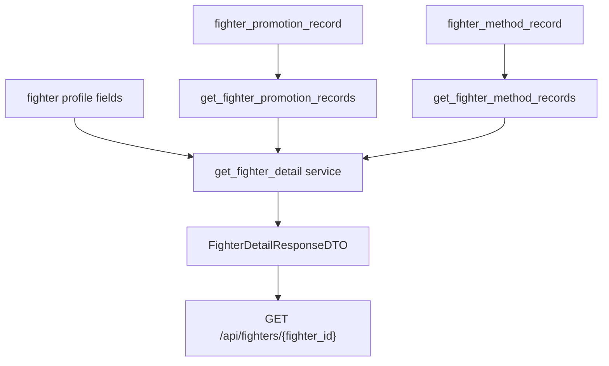

# Fighter Non-UFC Tapology API - Plan

## Goal Capsule

선수 상세 API가 Tapology enrichment로 이미 충분히 적재된 선수 프로필 보강 필드와 non-UFC 커리어 기록을 반환하게 한다.
이번 범위는 API 계약 확장과 백엔드 테스트 보강으로 한정한다.
경기 이력 메타데이터, 이벤트 상세 API, 프론트엔드 UI 반영은 이번 계획에서 제외한다.

---

## Product Contract

### Summary

`GET /api/fighters/{fighter_id}` 응답에 Tapology 선수 프로필 보강 정보와 non-UFC 커리어 기록 배열을 추가한다.
프로필 보강 정보는 `profile` 안에 둔다.
Tapology에서 수집했지만 UFCStats 기록과 겹치지 않도록 저장된 promotion/method 기록은 `non_ufc_promotion_records`와 `non_ufc_method_records`로 반환한다.

### Problem Frame

Tapology 선수 enrichment 데이터는 DB에 이미 상당량 적재되어 있지만, 선수 상세 API 응답에는 아직 노출되지 않는다.
특히 `fighter_promotion_record`와 `fighter_method_record`는 저장 로직상 UFC 기록을 제외한 non-UFC 커리어 맥락이다.
이 데이터를 일반 `promotion_records` 또는 `method_records`로 노출하면 기존 UFCStats 전적과 합산된 데이터로 오해될 수 있다.

### Requirements

**Profile enrichment**

- R1. 선수 상세 API는 `profile`에 `tapology_url`, `born`, `fighting_out_of`, `affiliation`, `gym`을 optional 값으로 반환해야 한다.
- R2. Tapology profile 값이 없는 선수는 기존 응답 구조를 유지하고 해당 필드를 `null`로 반환해야 한다.

**Non-UFC career records**

- R3. 선수 상세 API는 `non_ufc_promotion_records` 배열을 반환해야 한다.
- R4. 각 promotion record는 `promotion_name`, `wins`, `losses`, `draws`, `no_contests`를 포함해야 한다.
- R5. 선수 상세 API는 `non_ufc_method_records` 배열을 반환해야 한다.
- R6. 각 method record는 `scope`, `result`, `method_category`, `count`를 포함해야 한다.
- R7. non-UFC career record가 없는 선수는 빈 배열을 반환해야 한다.

**Scope control**

- R8. `tapology_current_streak`, `last_fight_name`, `last_fight_date`, `last_fight_promotion`은 이번 API 계약에 추가하지 않는다.
- R9. `FightHistoryItemDTO`와 `get_fight_history()`에는 Tapology match/fighter_match 메타데이터를 추가하지 않는다.
- R10. 이벤트 상세 API와 프론트엔드 UI는 이번 계획에서 수정하지 않는다.

### Scope Boundaries

#### In Scope

- `src/fighter/dto.py`의 선수 상세 DTO 확장.
- `src/fighter/repositories.py`의 non-UFC career record 조회 함수 추가.
- `src/fighter/services.py`의 `get_fighter_detail` 응답 조립 확장.
- `src/tests/fighter`의 API/service/repository 테스트 보강.

#### Out of Scope

- 선수 경기 이력 row의 title/cancel/weight metadata 노출.
- `match` 또는 `fighter_match` 기반 Tapology 필드 조회.
- 이벤트 상세 API 수정.
- 프론트엔드 타입과 UI 수정.
- Tapology crawler, matching, DB schema 수정.

#### Deferred to Follow-Up Work

- match/fighter_match Tapology 데이터가 충분히 쌓인 뒤 `FightHistoryItemDTO` 확장.
- 선수 상세 프론트엔드의 Tapology profile/context 카드 추가.
- 이벤트 상세 화면의 title/cancel/weight metadata 표시.

---

## Planning Contract

### Key Technical Decisions

- KTD1. **Use `non_ufc_*` response names.** (session-settled: user-directed — chosen over generic `promotion_records` / `method_records`: the stored records exclude UFC data and generic names would imply all-career or mixed-source totals.) The API returns `non_ufc_promotion_records` and `non_ufc_method_records` per R3 and R5.
- KTD2. **Keep Tapology profile fields inside `FighterProfileDTO`.** The selected profile fields describe the fighter, not a separate career distribution, so they belong next to existing identity and physical profile data per R1.
- KTD3. **Do not expose sparse fight-history metadata yet.** Local DB inspection showed `is_title_bout`, `fight_night_weight`, and `weight_gain` are effectively unavailable for UI verification, so R9 keeps history rows unchanged.
- KTD4. **Query non-UFC records with dedicated repository functions.** Dedicated functions keep `get_fight_history()` stable and make record ordering and tests explicit.

### High-Level Technical Design

### Assumptions

- `fighter_promotion_record` and `fighter_method_record` continue to store non-UFC data as implemented in `src/data_collector/workflows/data_store.py`.
- Existing response consumers tolerate additive fields on the fighter detail response.
- Pydantic defaults remain acceptable for empty arrays and optional profile fields.

### Risks & Dependencies

- The method record `scope` is currently expected to be `non_ufc`, but the API should not hardcode that value in DTO validation.
- Promotion and method record ordering must be deterministic so tests and UI rendering do not drift.
- The implementation should avoid widening `FightHistoryItemDTO` accidentally while touching nearby detail DTOs.

---

## Implementation Units

### U1. Extend Fighter Detail DTO Contract

**Goal:** Add the selected Tapology profile fields and non-UFC career record arrays to the fighter detail response contract.

**Requirements:** R1, R2, R3, R4, R5, R6, R7, R8, R9.

**Dependencies:** None.

**Files:**

- `src/fighter/dto.py`
- `src/tests/fighter/test_fighter_detail.py`

**Approach:**

1. Add optional `tapology_url`, `born`, `fighting_out_of`, `affiliation`, and `gym` fields to `FighterProfileDTO`.
2. Add `FighterPromotionRecordDTO` for non-UFC promotion records.
3. Add `FighterMethodRecordDTO` for non-UFC method records.
4. Add `non_ufc_promotion_records` and `non_ufc_method_records` arrays to `FighterDetailResponseDTO`.
5. Leave `FightHistoryItemDTO` unchanged per KTD3.

**Patterns to follow:** Existing Pydantic DTO style in `src/fighter/dto.py`, especially simple DTO classes with optional fields and default-safe list fields.

**Test scenarios:**

- Constructing a detail response with Tapology profile fields preserves the field values.
- Constructing a detail response without non-UFC records yields empty arrays.
- `FightHistoryItemDTO` remains unchanged and does not require Tapology match metadata.

**Verification:** DTO usage in existing fighter detail tests remains compatible after additive fields are introduced.

### U2. Add Non-UFC Record Repository Queries

**Goal:** Provide deterministic repository functions for reading non-UFC promotion and method records by fighter id.

**Requirements:** R3, R4, R5, R6, R7.

**Dependencies:** U1.

**Files:**

- `src/fighter/repositories.py`
- `src/tests/fighter/test_fighter_repositories.py`

**Approach:**

1. Import `FighterPromotionRecordModel`, `FighterMethodRecordModel`, and their schema types from `src/fighter/models.py`.
2. Add `get_fighter_promotion_records(session, fighter_id)` and return schema objects.
3. Add `get_fighter_method_records(session, fighter_id)` and return schema objects.
4. Order promotion records by `promotion_name`.
5. Order method records by `scope`, `result`, and `method_category`.
6. Do not modify `get_fight_history()`.

**Patterns to follow:** Existing repository functions return Pydantic schema objects from SQLAlchemy models, such as `get_ranking_by_fighter_id`.

**Test scenarios:**

- A fighter with two promotion records receives both records sorted by `promotion_name`.
- A fighter with method records receives records sorted by `scope`, `result`, and `method_category`.
- A fighter with no records receives empty lists from both functions.
- A nonexistent fighter id returns empty lists from both functions.

**Verification:** Repository tests prove the new functions without requiring service-layer assembly.

### U3. Assemble Non-UFC Data in Fighter Detail Service

**Goal:** Include profile enrichment and non-UFC career records in `get_fighter_detail`.

**Requirements:** R1, R2, R3, R4, R5, R6, R7.

**Dependencies:** U1, U2.

**Files:**

- `src/fighter/services.py`
- `src/tests/fighter/test_fighter_detail.py`
- `src/tests/fighter/test_fighter_services.py`

**Approach:**

1. Fetch non-UFC promotion and method records after the fighter is found.
2. Map selected Tapology fighter fields onto `FighterProfileDTO`.
3. Map repository schemas into `FighterPromotionRecordDTO` and `FighterMethodRecordDTO`.
4. Include both arrays in `FighterDetailResponseDTO`.
5. Keep `record.current_streak` as the existing UFCStats-derived calculation.
6. Leave `last_fight_*` and match-level Tapology metadata out of the response.

**Patterns to follow:** Existing `get_fighter_detail` assembly sections for profile, record, stats, and fight history.

**Test scenarios:**

- A fighter with Tapology profile fields receives those values under `profile`.
- A fighter with non-UFC promotion records receives `non_ufc_promotion_records` with the expected record numbers.
- A fighter with non-UFC method records receives `non_ufc_method_records` with the expected scope, result, method category, and count.
- A fighter with no Tapology records still receives a valid response with `None` profile fields and empty non-UFC arrays.
- Existing fight history assertions still pass without new Tapology match fields.

**Verification:** Service/detail tests prove the additive response contract and the null-safe legacy case.

---

## Verification Contract

| Gate | Applies To | Done Signal |
|---|---|---|
| DTO compatibility | U1 | Existing fighter detail DTO tests still construct and serialize responses with additive fields. |
| Repository tests | U2 | `src/tests/fighter/test_fighter_repositories.py` covers non-UFC promotion/method record lookup and empty results. |
| Service tests | U3 | `src/tests/fighter/test_fighter_detail.py` covers profile enrichment, non-UFC arrays, and missing-data fallback. |
| Regression guard | U1-U3 | Existing fighter detail tests for record, stats, and fight history remain unchanged in behavior. |

---

## Definition of Done

- `GET /api/fighters/{fighter_id}` returns selected Tapology profile fields under `profile`.
- The response returns `non_ufc_promotion_records` with promotion-level non-UFC records.
- The response returns `non_ufc_method_records` with method-level non-UFC records.
- Fighters without Tapology career records return empty non-UFC arrays.
- `FightHistoryItemDTO` and `get_fight_history()` remain unchanged.
- Event detail API and frontend UI remain untouched.
- Repository and service tests cover populated and missing-data cases.
- No dead-end implementation code or temporary API aliases remain in the final diff.

---

## Appendix

### Sources and Current Code References

- Original broad plan: `docs/plan/2026-08-08-001-feat-tapology-ui-integration-plan.md`
- Fighter DTOs: `src/fighter/dto.py`
- Fighter repositories: `src/fighter/repositories.py`
- Fighter service assembly: `src/fighter/services.py`
- Fighter Tapology models: `src/fighter/models.py`
- Non-UFC save behavior: `src/data_collector/workflows/data_store.py`
- Fighter detail tests: `src/tests/fighter/test_fighter_detail.py`
- Fighter repository tests: `src/tests/fighter/test_fighter_repositories.py`
