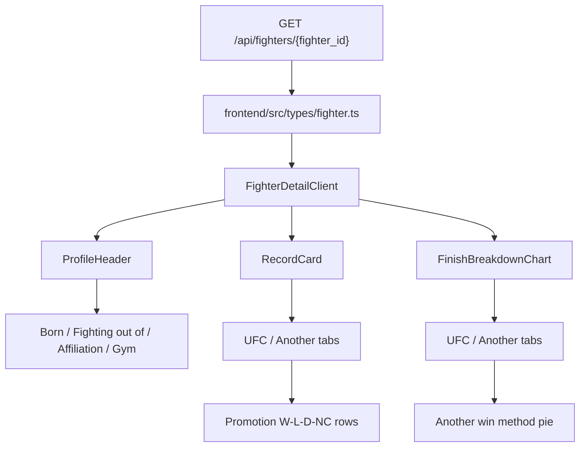

# Fighter Non-UFC Tapology Frontend - Plan

## Goal Capsule

선수 상세 화면에 백엔드가 추가한 Tapology 프로필 보강 필드와 non-UFC 기록을 반영한다.
프로필 보강 필드는 기존 `ProfileHeader`의 국적/스탠스 옆 메타데이터 흐름에 합류시킨다.
non-UFC promotion 기록은 `Record` 카드의 `UFC / Another` 탭으로, non-UFC method 기록은 `Finish Breakdown` 카드의 `UFC / Another` 탭으로 분리해서 표시한다.

---

## Product Contract

### Summary

`GET /api/fighters/{fighter_id}` 응답의 새 필드를 프론트엔드 타입에 반영하고, 선수 상세 UI에서 기존 UFCStats 기반 정보와 Tapology 기반 non-UFC 정보를 탭으로 구분해 보여준다.
`tapology_url`은 화면에 표시하지 않는다.

### Problem Frame

기존 선수 상세 화면은 상단 프로필, 전적 카드, 피니시 분포, 커리어 스탯, 경기 이력 순서로 구성되어 있다.
새로 추가된 Tapology 데이터는 기존 UFCStats 기반 기록과 출처 및 범위가 다르므로 같은 숫자로 합산하면 오해가 생긴다.
사용자는 선수 상세 화면 안에서 UFC 기록과 Another(non-UFC) 기록을 전환해 비교할 수 있어야 한다.

### Requirements

**Frontend API contract**

- R1. `FighterProfile` 타입은 `tapology_url`, `born`, `fighting_out_of`, `affiliation`, `gym` optional 필드를 포함해야 한다.
- R2. `FighterDetailResponse` 타입은 `non_ufc_promotion_records`와 `non_ufc_method_records` 배열을 포함해야 한다.
- R3. 새 배열 값이 없거나 빈 배열인 선수도 기존 상세 화면이 깨지지 않아야 한다.

**Profile header**

- R4. `tapology_url`은 화면에 표시하지 않는다.
- R5. `born`, `fighting_out_of`, `affiliation`, `gym`은 기존 국적, stance, age가 있는 메타데이터 줄에 함께 표시한다.
- R6. 값이 없는 프로필 필드는 표시하지 않는다.

**Record card**

- R7. 현재 `Record` 카드는 `UFC / Another` 탭을 제공해야 한다.
- R8. `UFC` 탭은 기존 `record` 값을 그대로 표시해야 한다.
- R9. `Another` 탭은 `non_ufc_promotion_records`를 기반으로 promotion별 기록을 표시해야 한다.
- R10. `Another` 탭은 promotion 기록을 합산한 W-L-D 및 no contest 값을 함께 표시해야 한다.
- R11. non-UFC promotion 기록이 없으면 `Another` 탭은 빈 상태를 안정적으로 표시해야 한다.

**Finish breakdown card**

- R12. 현재 `Finish Breakdown` 카드는 `UFC / Another` 탭을 제공해야 한다.
- R13. `UFC` 탭은 기존 `record.finish_breakdown` 값을 그대로 표시해야 한다.
- R14. `Another` 탭은 `non_ufc_method_records`의 `result === "win"` 행을 기반으로 승리 방식 분포를 표시해야 한다.
- R15. non-UFC method 기록이 없거나 Another 승리 방식 합계가 0이면 빈 상태를 안정적으로 표시해야 한다.
- R16. `result === "loss"` 행은 피니시 파이 그래프에 섞지 않는다.

### Scope Boundaries

#### In Scope

- 선수 상세 프론트엔드 타입 확장.
- `ProfileHeader`의 메타데이터 표시 확장.
- `RecordCard`에 `UFC / Another` 탭과 non-UFC promotion 표시 추가.
- `FinishBreakdownChart`에 `UFC / Another` 탭과 non-UFC method 승리 방식 표시 추가.
- 선수 상세 skeleton의 레이아웃 보정.

#### Out of Scope

- `tapology_url` 링크 표시.
- `FightHistoryTable` row 확장.
- 이벤트 상세 UI 수정.
- 백엔드 API, DB schema, collector 수정.
- UFC와 non-UFC 전적 합산 표시.

#### Deferred to Follow-Up Work

- non-UFC 경기 이력이 충분히 쌓인 뒤 Another 탭에서 상세 경기 목록 제공.
- Tapology source 표시 또는 외부 링크 제공 여부 재검토.
- loss method breakdown을 별도 분석 카드로 제공할지 검토.

---

## Planning Contract

### Key Technical Decisions

- KTD1. **Keep profile enrichment inline in `ProfileHeader`.** (session-settled: user-directed) 별도 Tapology profile 카드 대신 기존 국적/stance 근처의 compact metadata로 표시한다.
- KTD2. **Hide `tapology_url`.** (session-settled: user-directed) API 타입에는 남기되 UI에는 노출하지 않는다.
- KTD3. **Use tabs inside existing cards.** (session-settled: user-directed) non-UFC promotion records는 `Record` 카드의 `Another` 탭에, non-UFC method records는 `Finish Breakdown` 카드의 `Another` 탭에 넣는다.
- KTD4. **Do not merge UFC and Another totals.** 기존 `record`와 `record.finish_breakdown`은 UFCStats 기반으로 유지하고, Tapology 기반 non-UFC 값은 탭으로만 전환한다.
- KTD5. **Use wins only for Another finish pie.** `Finish Breakdown`의 의미가 승리 방식 분포이므로 `non_ufc_method_records` 중 `result === "win"`만 파이 그래프에 사용한다. `loss` 행은 이번 카드의 파이 그래프에 섞지 않는다.

### High-Level Technical Design

### Assumptions

- 기존 `record`와 `record.finish_breakdown`은 현재 UI 의미 그대로 UFCStats 기반 기록으로 취급한다.
- `non_ufc_promotion_records`는 UFC promotion을 제외한 데이터로 저장되어 있다.
- `non_ufc_method_records.scope`는 현재 `non_ufc`지만, 사용자 화면에는 노출하지 않는다.
- `Another` 라벨은 사용자가 지정한 탭명으로 사용한다.

### Settled Follow-Up Decisions

- SD1. `non_ufc_method_records`의 `loss` 행은 이번 구현에서 표시하지 않는다.
- SD2. 탭 라벨은 사용자 요청 그대로 `Another`를 사용한다.

### Risks & Dependencies

- `Another` 라벨은 비-UFC 의미가 즉시 전달되지 않을 수 있다.
- `Finish Breakdown`에 loss method를 섞으면 기존 카드 의미가 흐려지므로 wins-only 기준을 유지해야 한다.
- `ProfileHeader`의 첫 메타데이터 줄이 길어질 수 있으므로 모바일에서 wrapping 간격과 아이콘 밀도를 확인해야 한다.
- 기존 `RecordCard`와 `FinishBreakdownChart`에는 내부 상태가 없으므로 탭 도입 시 클라이언트 컴포넌트 상태와 애니메이션 재실행이 과하지 않게 조정해야 한다.

---

## Implementation Units

### U1. Extend Fighter Frontend Types

**Goal:** 백엔드 선수 상세 응답의 새 필드를 TypeScript 타입에 반영한다.

**Requirements:** R1, R2, R3.

**Dependencies:** Backend API plan implemented.

**Files:**

- `frontend/src/types/fighter.ts`

**Approach:**

1. `FighterProfile`에 `tapology_url`, `born`, `fighting_out_of`, `affiliation`, `gym`을 `string | null`로 추가한다.
2. `FighterPromotionRecord` 타입을 추가한다.
3. `FighterMethodRecord` 타입을 추가한다.
4. `FighterDetailResponse`에 `non_ufc_promotion_records`와 `non_ufc_method_records`를 추가한다.

**Test scenarios:**

- TypeScript build가 새 API 응답 타입을 인식한다.
- 기존 `useFighterDetail` 호출부는 타입 확장 후에도 변경 없이 컴파일된다.

### U2. Add Tapology Profile Metadata to ProfileHeader

**Goal:** 별도 카드 없이 Tapology 프로필 보강 필드를 기존 header 메타데이터 줄에 자연스럽게 표시한다.

**Requirements:** R4, R5, R6.

**Dependencies:** U1.

**Files:**

- `frontend/src/components/fighter/ProfileHeader.tsx`

**Approach:**

1. 기존 nationality, stance, age 줄에 `born`, `fighting_out_of`, `affiliation`, `gym` 항목을 추가한다.
2. 각 항목은 값이 있을 때만 렌더링한다.
3. `lucide-react`의 기존 아이콘 스타일을 유지해 작은 아이콘과 label/value를 함께 표시한다.
4. `tapology_url`은 타입에만 존재하고 렌더링하지 않는다.
5. 모바일 줄바꿈 시 과밀해지지 않도록 `flex-wrap`, `gap-x`, `gap-y`를 조정한다.

**Test scenarios:**

- 모든 Tapology profile 값이 있는 선수에서 header에 네 필드가 표시된다.
- 일부 값이 `null`인 선수에서 빈 label이나 placeholder가 보이지 않는다.
- 모바일 폭에서 긴 gym/affiliation 값이 다른 정보와 겹치지 않는다.

### U3. Add UFC / Another Tabs to RecordCard

**Goal:** 기존 UFC record와 non-UFC promotion records를 같은 카드 안에서 탭으로 전환한다.

**Requirements:** R7, R8, R9, R10, R11.

**Dependencies:** U1.

**Files:**

- `frontend/src/components/fighter/RecordCard.tsx`
- `frontend/src/components/fighter/FighterDetailPage.tsx`
- `frontend/src/components/fighter/FighterDetailSkeleton.tsx`

**Approach:**

1. `RecordCard` props에 `nonUfcPromotionRecords`를 추가한다.
2. 카드 header 우측 또는 제목 아래에 compact `Tabs`를 배치한다.
3. `UFC` 탭은 현재 W-L-D, win rate, streak UI를 그대로 사용한다.
4. `Another` 탭은 promotion records 합산 W-L-D-NC를 상단에 표시한다.
5. promotion별 row를 아래에 표시하되, row 높이와 컬럼 폭을 고정해 레이아웃 흔들림을 줄인다.
6. non-UFC promotion 기록이 없으면 "No non-UFC promotion records" 빈 상태를 표시한다.

**Test scenarios:**

- UFC 탭 기본 상태에서 기존 record UI가 동일하게 보인다.
- Another 탭에서 promotion별 기록과 합산값이 표시된다.
- no contest 값이 있는 promotion은 NC가 표시된다.
- non-UFC promotion 기록이 없는 선수도 탭 전환 시 깨지지 않는다.

### U4. Add UFC / Another Tabs to FinishBreakdownChart

**Goal:** 기존 UFC finish breakdown과 non-UFC method win breakdown을 같은 카드 안에서 탭으로 전환한다.

**Requirements:** R12, R13, R14, R15, R16.

**Dependencies:** U1.

**Files:**

- `frontend/src/components/fighter/FinishBreakdownChart.tsx`
- `frontend/src/components/fighter/FighterDetailPage.tsx`
- `frontend/src/components/fighter/FighterDetailSkeleton.tsx`

**Approach:**

1. `FinishBreakdownChart` props에 `nonUfcMethodRecords`를 추가한다.
2. 기존 `breakdown`은 `UFC` 탭의 pie data로 유지한다.
3. `Another` 탭에서는 `result === "win"`인 method records를 `FinishBreakdown` 유사 shape으로 변환한다.
4. `KO/TKO`, `SUB`, `DEC` 또는 `Decision` 계열은 기존 `FINISH_COLORS`를 재사용한다.
5. 카테고리가 기존 색상 map에 없으면 neutral 색상을 사용한다.
6. Another 승리 방식 합계가 0이면 기존 empty state 패턴과 같은 빈 상태를 표시한다.
7. `loss` method records는 이번 파이 그래프 데이터에서 제외한다.

**Test scenarios:**

- UFC 탭 기본 상태에서 기존 pie chart가 동일하게 렌더링된다.
- Another 탭에서 non-UFC win method records만 pie chart에 반영된다.
- loss method records만 있는 선수는 Another 탭에서 빈 상태가 표시된다.
- 알 수 없는 method category가 들어와도 색상/툴팁 렌더링이 깨지지 않는다.

### U5. Wire Detail Page and Verify Responsive UI

**Goal:** 상세 페이지에서 새 배열을 카드로 전달하고 실제 viewport에서 표시 품질을 확인한다.

**Requirements:** R3, R7, R12.

**Dependencies:** U2, U3, U4.

**Files:**

- `frontend/src/components/fighter/FighterDetailPage.tsx`
- `frontend/src/components/fighter/FighterDetailSkeleton.tsx`

**Approach:**

1. `FighterDetailClient`에서 `data.non_ufc_promotion_records ?? []`를 `RecordCard`에 전달한다.
2. `data.non_ufc_method_records ?? []`를 `FinishBreakdownChart`에 전달한다.
3. skeleton은 기존 two-card row 구조를 유지하되, 탭 header가 추가되어도 loading height가 크게 튀지 않게 조정한다.
4. 데스크톱과 모바일에서 header metadata wrapping, Record 탭, Finish 탭을 확인한다.

**Test scenarios:**

- 새 필드가 있는 선수 상세 페이지가 TypeScript 에러 없이 빌드된다.
- 새 배열이 빈 선수도 상세 페이지가 정상 렌더링된다.
- 모바일 폭에서 header metadata, Record tabs, Finish tabs가 겹치지 않는다.

---

## Verification Contract

- `frontend` TypeScript build 또는 lint를 실행한다.
- 가능하면 dev server에서 Tapology 데이터가 있는 선수 상세 페이지를 확인한다.
- 최소 확인 대상:
  - non-UFC promotion/method 기록이 있는 선수.
  - profile enrichment만 있거나 일부 필드가 비어 있는 선수.
  - non-UFC 기록 배열이 비어 있는 선수.

## Suggested Implementation Order

1. U1 타입 확장.
2. U2 `ProfileHeader` metadata 확장.
3. U3 `RecordCard` 탭 도입.
4. U4 `FinishBreakdownChart` 탭 도입.
5. U5 상세 페이지 wiring 및 responsive 확인.
