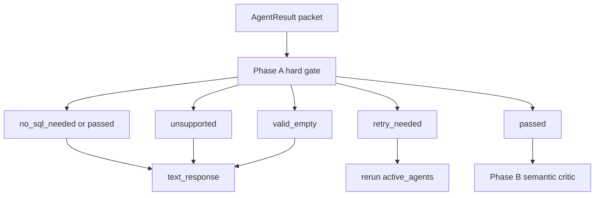

# Critic Phase A Hard Gate Reduction - Plan

## Goal Capsule

Critic Phase A를 도메인 의미 검증기가 아니라 결과 패킷 무결성 검증기로 축소한다.
Phase A는 확실한 실행 오류, 깨진 payload, 위험 SQL, downstream 처리가 불가능한 상태만 hard-fail하고, recent/completed scope, win-rate denominator, method bucket 같은 의미 검증은 Phase B로 넘긴다.

완료 기준은 SQL이 없다는 이유만으로 retry하지 않고, SQL이 필요 없는 정상 결과와 unsupported 결과를 명시적으로 통과/전달하며, 의미적으로 애매한 SQL은 Phase A에서 막히지 않고 Phase B가 판단하는 것이다.

---

## Product Contract

### Summary

현재 `src/llm/graph/nodes/critic.py`의 Phase A는 문자열 기반 intent guardrail로 recent/completed, upcoming, win-rate denominator, method bucket, participation 기준을 hard-fail한다.
이 방식은 정확한 SQL도 특정 문자열 신호가 없으면 실패시키며, canonical view가 늘어날수록 critic 하드코딩과 schema metadata가 어긋나는 문제가 생긴다.
이 계획은 Phase A를 고신뢰 오류 감지로 축소해 false negative를 줄이고, 의미 검증 책임을 Phase B로 이관하기 위한 구현 단위를 정의한다.

### Problem Frame

사용자 질문이 “찰스 올리베이라의 최근 5경기 상대와 경기 결과”처럼 `v_fighter_opponents`를 쓰는 것이 자연스러운 경우에도, Phase A가 completed scope 문자열을 좁게 판정하면 SQL 실행이 성공했는데 critic retry가 반복된다.
또한 SQL이 필요 없는 일반/설명형 질문은 query가 없을 수 있는데, 현재 `query` 없음은 기본적으로 SQL 문법 오류에 가깝게 처리된다.
Phase A가 “확실히 잘못됨”과 “내 문자열 규칙으로는 확인되지 않음”을 같은 retry로 취급하는 것이 핵심 문제다.

### Requirements

- R1. Phase A는 SQL/query 부재만으로 retry하지 않아야 한다.
- R2. Phase A는 unsupported 결과를 retry하지 않고 `unsupported`로 라우팅 가능하게 유지해야 한다.
- R3. Phase A는 SQL이 필요 없는 정상 결과를 통과 또는 별도 상태로 표현해야 한다.
- R4. Phase A는 SQL/tool 실행 실패, DB 오류, timeout, permission error처럼 명시적인 실행 오류는 retry해야 한다.
- R5. Phase A는 `data`, `columns`, `row_count` payload shape이 downstream 처리 불가능하게 깨진 경우 retry 또는 invalid 상태를 반환해야 한다.
- R6. Phase A는 위험하거나 read-only가 아닌 SQL이 query에 포함된 경우 retry해야 한다.
- R7. Phase A는 0행 결과를 기본적으로 `valid_empty`로 인정하되, 명백한 실행 오류와 구분해야 한다.
- R8. Phase A는 recent/completed, upcoming, win-rate denominator, method bucket, participation semantics를 hard-fail하지 않아야 한다.
- R9. 기존 retry_count, agent_results reset, 3회 소진 라우팅은 유지해야 한다.

### Scope Boundaries

#### In Scope

- Phase A status/classification 로직 축소.
- `ValidationStatus` 확장 여부 결정 및 적용.
- SQL 없음, no-SQL-needed, unsupported, execution error, malformed payload 처리.
- Phase A semantic guardrail 테스트 재작성.
- 관련 graph routing 테스트 조정.

#### Out of Scope

- Phase B prompt/checklist 강화는 별도 Phase B 계획에서 처리한다.
- SQL agent prompt 변경.
- DB view/schema 변경.
- 최종 text response 문체 변경.
- critic LLM 모델 교체 또는 retry 정책 자체 변경.

#### Deferred to Follow-Up Work

- SQL AST parser 도입.
- schema metadata를 critic runtime에서 자동 로딩하는 구조.
- warning/pass-with-warning 상태를 UI 또는 response metadata에 노출.

---

## Planning Contract

### Key Technical Decisions

- KTD1. **Phase A는 packet hard gate로 축소한다.** 도메인 의미 불일치는 Phase B가 판단하고, Phase A는 실행/형식/안전성 오류만 hard-fail한다.
- KTD2. **`not query`는 오류가 아니라 분류 대상이다.** unsupported, no-SQL-needed, execution error, ambiguous-no-query를 reasoning과 result shape로 나누어 처리한다.
- KTD3. **애매함은 retry가 아니라 Phase B로 보낸다.** Phase A가 확신하지 못하는 의미 문제는 실패가 아니라 LLM semantic critic 입력으로 남긴다.
- KTD4. **상태 확장은 디버깅 가능성을 우선한다.** 가능하면 `no_sql_needed` 또는 `invalid_result`를 `ValidationStatus`에 추가하고, 라우팅이 복잡해지면 최소 변경으로 `passed`/`retry_needed`에 흡수한다.

### High-Level Technical Design

---

## Implementation Units

### U1. Redefine Phase A Status Model

**Goal:** Make Phase A statuses represent execution and packet integrity outcomes rather than semantic policy failures.

**Requirements:** R1, R2, R3, R4, R5, R9; KTD2, KTD4

**Dependencies:** None

**Files:**

- `src/llm/graph/state.py`
- `src/llm/graph/nodes/critic.py`
- `src/tests/llm/test_graph_nodes.py`

**Approach:**

1. Decide whether to add explicit `ValidationStatus` values such as `no_sql_needed` and `invalid_result`.
2. Update `critic_node()` handling for any new statuses.
3. Keep `unsupported`, `valid_empty`, `retry_needed`, and `passed` behavior compatible with `critic_route()`.

**Patterns to follow:** Existing `ValidationStatus` literal and `_failure_return()` retry reset pattern in `src/llm/graph/nodes/critic.py`.

**Test scenarios:**

- A result with no query and unsupported reasoning returns `unsupported`, not retry.
- A result with no query and normal no-SQL-needed reasoning does not return `retry_needed`.
- A result with no query and execution-error reasoning returns `retry_needed`.
- Existing retry exhaustion behavior still sets `final_response` after 3 retries.

**Verification:** Phase A tests show query absence is no longer a universal failure and routing tests still pass.

### U2. Replace Semantic Guardrails With Hard Error Checks

**Goal:** Remove Phase A hard-fails for domain semantics and keep only high-confidence hard errors.

**Requirements:** R4, R5, R6, R7, R8; KTD1, KTD3

**Dependencies:** U1

**Files:**

- `src/llm/graph/nodes/critic.py`
- `src/tests/llm/test_graph_nodes.py`

**Approach:**

1. Remove or stop calling `_extract_intents()` and `_validate_intent_guardrails()` from Phase A.
2. Keep or replace `_validate_sql_syntax()` with a read-only/basic SQL shape check that only applies when `query` exists.
3. Add payload shape checks for `data`, row dictionaries, `columns`, and `row_count`.
4. Keep `_classify_empty_result()` only if it detects structural ambiguity; otherwise default empty result to `valid_empty`.

**Patterns to follow:** Current `_run_phase_a()` single-pass loop over `agent_results`.

**Test scenarios:**

- A recent-fights query without explicit completed scope passes Phase A and is left for Phase B.
- A win-rate query with denominator text that Phase A previously rejected passes Phase A.
- A KO/TKO wins query without `result = 'win'` passes Phase A.
- A non-SELECT/non-WITH query with dangerous mutation intent returns `retry_needed`.
- Malformed `data` such as a dict instead of list returns `retry_needed` or `invalid_result`.
- Empty data with `row_count=0` returns `valid_empty`.

**Verification:** Former semantic reject tests are rewritten to assert Phase A pass-through, while hard-error tests still fail deterministically.

### U3. Keep Graph Routing Stable For Reduced Phase A

**Goal:** Ensure new or changed Phase A statuses route to the correct downstream node without accidental retry loops.

**Requirements:** R2, R3, R7, R9

**Dependencies:** U1, U2

**Files:**

- `src/llm/graph/graph_builder.py`
- `src/tests/llm/test_graph_nodes.py`

**Approach:**

1. Review `critic_route()` for any new statuses from U1.
2. Route `unsupported`, `valid_empty`, and no-SQL-needed outcomes to `text_response` rather than active agent retry.
3. Preserve retry routing for `retry_needed` and END behavior for retry exhaustion.

**Patterns to follow:** Existing `critic_route()` branch structure in `src/llm/graph/graph_builder.py`.

**Test scenarios:**

- `unsupported` routes to `text_response`.
- `valid_empty` with `critic_passed=True` routes to `text_response`.
- no-SQL-needed status, if added, routes to `text_response`.
- `retry_count >= 3` still routes to `END`.

**Verification:** Graph routing tests pass for all validation statuses that Phase A can return.

### U4. Rewrite Phase A Regression Coverage

**Goal:** Align tests with Phase A's reduced responsibility so future changes do not reintroduce brittle semantic hard-fails.

**Requirements:** R1-R9

**Dependencies:** U1, U2, U3

**Files:**

- `src/tests/llm/test_graph_nodes.py`
- `src/tests/llm/test_prompt_policy.py`

**Approach:**

1. Rename or reorganize `TestCriticPhaseA` descriptions from semantic guardrail to hard gate validation.
2. Move semantic policy assertions out of Phase A tests.
3. Add prompt-policy expectations only when Phase B plan has landed; otherwise leave TODO/reference comments out of code and rely on the Phase B plan.

**Patterns to follow:** Existing compact unit tests around `_run_phase_a()` and `critic_route()`.

**Test scenarios:**

- SQL absence classifications cover unsupported, no-SQL-needed, and execution error.
- Payload shape validation covers malformed data, row_count mismatch tolerance, and missing columns.
- Dangerous SQL validation covers a write statement.
- Ordinary successful SELECT passes Phase A regardless of domain-specific metric shape.

**Verification:** Focused critic test suite passes and no Phase A test asserts domain semantic failure.

---

## Verification Contract

- `src/tests/llm/test_graph_nodes.py::TestCriticPhaseA` passes with updated reduced hard-gate expectations.
- `src/tests/llm/test_graph_nodes.py` graph routing tests pass.
- Existing SQL agent view and prompt policy tests continue to pass.
- Manual review confirms `_run_phase_a()` no longer calls semantic intent guardrails.

---

## Definition of Done

- Phase A no longer retries solely because SQL lacks completed scope, win-rate denominator strings, method bucket strings, or win-condition strings.
- Query absence is classified rather than automatically treated as SQL syntax failure.
- Unsupported and no-SQL-needed outcomes can reach text response without retry.
- Hard execution/payload/safety failures still trigger retry or explicit invalid handling.
- Tests encode the reduced Phase A responsibility.

---

## Risks & Mitigations

- **Risk:** Removing Phase A semantic guardrails may let bad SQL reach Phase B.
  **Mitigation:** Land Phase B semantic checklist plan immediately after this work or in the same implementation sequence.
- **Risk:** New validation statuses may require graph state changes across private/subgraph variants.
  **Mitigation:** Search all `ValidationStatus` consumers and keep status additions minimal.
- **Risk:** No-SQL-needed classification may be too heuristic.
  **Mitigation:** Start conservative: only explicit normal reasoning patterns pass; ambiguous no-query results go to Phase B or text response with clear reasoning.

---

## Related Plan

- `docs/plan/2026-08-19-002-fix-critic-phase-b-semantic-validation-plan.md`
