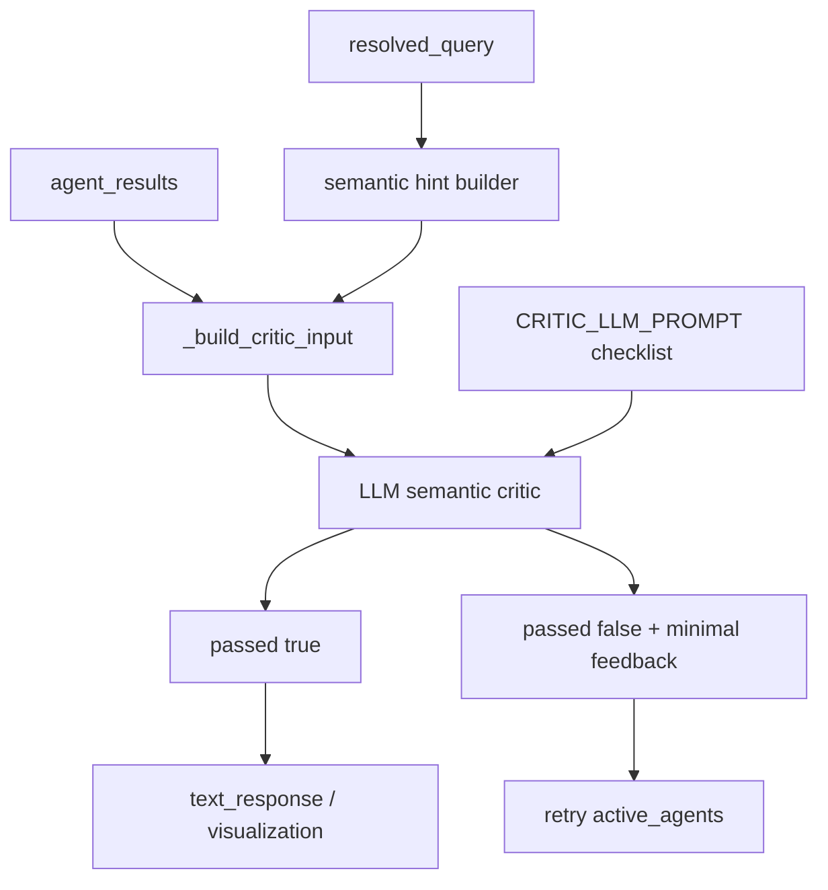

# Critic Phase B Semantic Validation - Plan

## Goal Capsule

Phase A에서 제거한 도메인 의미 검증을 Phase B LLM critic으로 이관한다.
Phase B는 사용자 질문, SQL, 결과 샘플, Phase A hint를 보고 metric/window/filter/comparison semantics를 판단하되, 불확실하거나 SQL 모양만 다른 경우에는 통과시킨다.

완료 기준은 recent/completed, upcoming, win-rate denominator, finish-rate, method bucket, participation-vs-win 기준 같은 품질 정책이 Phase B prompt와 입력 구조에 명시되고, Phase A를 통과한 SQL이 Phase B에서 의미적으로만 평가되는 것이다.

---

## Product Contract

### Summary

Phase A 축소 후에도 semantic SQL critic의 품질 보호 역할은 유지되어야 한다.
현재 `CRITIC_LLM_PROMPT`는 원칙 중심이며, Phase A가 맡던 세부 도메인 정책이 Phase B checklist로 충분히 옮겨져 있지 않다.
이 계획은 Phase B prompt와 critic input을 강화해 “확실한 의미 불일치만 실패”시키는 LLM 검증 계층을 만든다.

### Problem Frame

Phase A가 도메인 의미 규칙을 제거하면, 잘못된 denominator, wrong time scope, participation 질문의 win-only query 같은 오류가 그대로 text response까지 갈 수 있다.
하지만 이 검증을 다시 문자열 기반 hard-fail로 되돌리면 false negative 문제가 반복된다.
따라서 Phase B가 더 넓은 문맥에서 semantic mismatch를 판단하도록 prompt, input, tests를 보강해야 한다.

### Requirements

- R1. Phase B prompt는 metric, time scope, filter, denominator, comparison basis 검증 책임을 명시해야 한다.
- R2. Phase B prompt는 raw table SQL이나 canonical view 미사용만으로 실패시키지 말라는 원칙을 유지해야 한다.
- R3. Phase B prompt는 불확실하면 통과시키고, 확실한 의미 불일치만 실패시키도록 명시해야 한다.
- R4. Phase B는 recent fight 질문에서 completed fight scope가 의미적으로 반영되었는지 검토해야 한다.
- R5. Phase B는 upcoming/next 질문에서 future/scheduled scope가 반영되었는지 검토해야 한다.
- R6. Phase B는 win-rate, clean win/loss rate, finish-rate denominator 정책을 검토해야 한다.
- R7. Phase B는 KO/TKO, submission, decision method bucket 의미를 검토해야 한다.
- R8. Phase B는 participation 질문과 wins-only query가 섞이지 않았는지 검토해야 한다.
- R9. Phase B input은 Phase A가 감지한 intent/hint를 포함하되, 그 hint를 실패 판정으로 강제하지 않아야 한다.
- R10. Phase B LLM failure fallback은 Phase A 축소 이후에도 의도한 위험 수준인지 재검토해야 한다.

### Scope Boundaries

#### In Scope

- `CRITIC_LLM_PROMPT` semantic checklist 강화.
- `_build_critic_input()`에 Phase A hints 또는 semantic review focus 추가.
- Phase B 관련 tests 추가/수정.
- Phase B fallback 정책 검토 및 필요한 최소 조정.

#### Out of Scope

- Phase A hard-gate 축소 자체는 Phase A 계획에서 처리한다.
- SQL agent query 생성 프롬프트 변경.
- schema.json view metadata 구조 변경.
- 외부 evaluator 또는 LangSmith eval 추가.
- 모델 provider 변경.

#### Deferred to Follow-Up Work

- schema.json을 읽어 Phase B hint를 자동 생성하는 metadata-driven critic.
- LLM critic output에 category/confidence 필드 추가.
- failed semantic cases를 eval dataset으로 축적하는 운영 피드백 루프.

---

## Planning Contract

### Key Technical Decisions

- KTD1. **Phase B가 도메인 의미 검증의 주 소유자가 된다.** Phase A에서 제거한 semantic checks는 Phase B checklist와 input hints로 옮긴다.
- KTD2. **Phase B는 SQL 모양이 아니라 질문-쿼리 의미 정합성을 평가한다.** raw table, CTE, canonical view, derived view 차이는 의미가 맞으면 실패 사유가 아니다.
- KTD3. **불확실성은 pass bias로 처리한다.** Critic이 확실히 틀렸다고 말할 수 없는 경우는 통과시키고, final response가 SQL 결과에 근거하도록 한다.
- KTD4. **Hints are guidance, not rules.** Phase A hint는 LLM이 볼 체크포인트이지 deterministic failure condition이 아니다.
- KTD5. **Phase B fallback은 재검토한다.** LLM 실패 시 Phase A만 믿고 통과시키는 현행 fallback은 Phase A 축소 이후 위험해질 수 있으므로, timeout/error fallback 정책을 명시적으로 선택한다.

### High-Level Technical Design

---

## Implementation Units

### U1. Strengthen Phase B Prompt Checklist

**Goal:** Move domain semantic policies from Phase A hard-fails into explicit Phase B review criteria.

**Requirements:** R1-R8; KTD1, KTD2, KTD3

**Dependencies:** Phase A reduction plan should be implemented first or in the same branch.

**Files:**

- `src/llm/graph/prompts.py`
- `src/tests/llm/test_prompt_policy.py`

**Approach:**

1. Add a semantic validation checklist to `CRITIC_LLM_PROMPT`.
2. Include time scope checks for recent/completed and upcoming/future.
3. Include metric denominator checks for win rate, clean win/loss rate, and finish rate.
4. Include method bucket and participation-vs-wins checks.
5. Preserve existing prompt principles: do not judge DB truth from model knowledge, do not fail raw SQL solely for being raw, pass when uncertain.

**Patterns to follow:** Existing `CRITIC_LLM_PROMPT` style in `src/llm/graph/prompts.py`.

**Test scenarios:**

- Prompt policy test asserts the prompt contains recent/completed semantic review language.
- Prompt policy test asserts win-rate and finish-rate denominator policies are present.
- Prompt policy test asserts raw table SQL alone must not fail.
- Prompt policy test asserts uncertain cases should pass.

**Verification:** Prompt policy tests pass and prompt remains concise enough for repeated critic calls.

### U2. Add Phase B Semantic Hints

**Goal:** Provide Phase B with lightweight review focus derived from the question and result packet without turning hints into hard rules.

**Requirements:** R4-R9; KTD4

**Dependencies:** U1

**Files:**

- `src/llm/graph/nodes/critic.py`
- `src/tests/llm/test_graph_nodes.py`

**Approach:**

1. Keep or adapt `_extract_intents()` for hint generation rather than Phase A failure.
2. Add a helper that maps detected intents to review hints such as “verify completed fight scope” or “verify win-rate denominator”.
3. Include hints in `_build_critic_input()` under a dedicated section.
4. Ensure hints are omitted or marked “none” when no semantic focus is detected.

**Patterns to follow:** Existing `_build_critic_input()` construction and `_extract_intents()` keyword detection.

**Test scenarios:**

- A recent-fights question produces a Phase B hint to verify completed fight scope.
- A win-rate question produces a denominator hint.
- A general/no-SQL-needed question does not produce misleading SQL metric hints.
- `_build_critic_input()` includes hints, SQL, row count, columns, and data sample.

**Verification:** Unit tests validate critic input text without requiring a live LLM.

### U3. Reevaluate Phase B Failure Fallback

**Goal:** Decide and implement how critic should behave when Phase B LLM call fails after Phase A has been reduced.

**Requirements:** R10; KTD5

**Dependencies:** U1, U2

**Files:**

- `src/llm/graph/nodes/critic.py`
- `src/tests/llm/test_graph_nodes.py`

**Approach:**

1. Review current fallback: Phase B exception logs warning and returns `critic_passed=True`.
2. Choose a conservative behavior:
   - Option A: keep pass fallback to preserve availability.
   - Option B: retry once for Phase B failure before pass fallback.
   - Option C: pass fallback only for no semantic hints, retry when hints exist.
3. Prefer Option C if it can be implemented without creating frequent retry loops.
4. Add tests for LLM timeout/error behavior using a fake LLM.

**Patterns to follow:** Existing `asyncio.wait_for()` timeout wrapper and `_failure_return()`.

**Test scenarios:**

- Phase B exception with no semantic hints passes with Phase A only.
- Phase B exception with semantic hints follows the selected fallback policy.
- Retry exhaustion still returns the user-facing quality failure message.

**Verification:** Async critic node tests pass with fake structured LLM behavior.

### U4. Move Semantic Regression Tests To Phase B Layer

**Goal:** Preserve coverage for semantic policy mistakes after removing Phase A hard-fails.

**Requirements:** R1-R8

**Dependencies:** U1, U2, U3

**Files:**

- `src/tests/llm/test_graph_nodes.py`
- `src/tests/llm/test_prompt_policy.py`

**Approach:**

1. Convert old Phase A semantic reject tests into Phase B prompt/input tests or critic-node tests with fake LLM output.
2. Keep Phase A tests focused on hard gate behavior only.
3. Add examples for recent completed scope, win-rate denominator, KO/TKO wins, and decision participation.

**Patterns to follow:** Existing lightweight tests around `_run_phase_a()` and graph routing.

**Test scenarios:**

- A recent-fights query without completed scope reaches Phase B input with a completed-scope hint.
- A win-rate denominator mismatch reaches Phase B input with denominator policy visible.
- A fake LLM returning `passed=False` triggers retry feedback.
- A fake LLM returning `passed=True` routes to text response and optional visualization.

**Verification:** Critic tests cover both pass and fail Phase B paths without external model calls.

---

## Verification Contract

- Phase B prompt policy tests pass.
- Critic input builder tests show semantic hints are present when relevant.
- Fake LLM critic-node tests cover pass, fail, and exception fallback behavior.
- Phase A tests no longer assert semantic hard-fail responsibilities.
- Existing SQL prompt/schema/view tests continue to pass.

---

## Definition of Done

- `CRITIC_LLM_PROMPT` contains explicit semantic validation checklist for time scope, metric definitions, method buckets, and comparison basis.
- `_build_critic_input()` includes semantic hints derived from the question/result context.
- Phase B, not Phase A, is responsible for deciding recent/completed, denominator, method bucket, and participation semantic mismatch.
- Phase B failure fallback has an explicit tested policy after Phase A reduction.
- Tests prevent semantic guardrails from drifting back into Phase A.

---

## Risks & Mitigations

- **Risk:** LLM critic may be inconsistent on domain policies.
  **Mitigation:** Keep checklist explicit, include compact hints, and use fake LLM tests for routing while adding prompt-policy assertions for required rules.
- **Risk:** Phase B latency or timeout becomes more consequential.
  **Mitigation:** Keep existing timeout and define a tested fallback policy in U3.
- **Risk:** Hints become hidden hard rules over time.
  **Mitigation:** Name the section as review focus and keep Phase A tests asserting semantic pass-through.

---

## Related Plan

- `docs/plan/2026-08-19-001-fix-critic-phase-a-hard-gate-reduction-plan.md`
