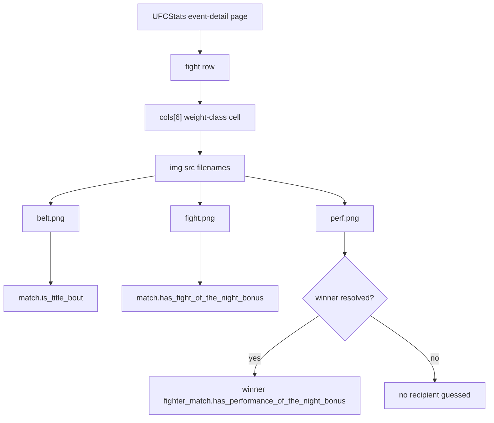

# UFCStats Event Bonus Metadata - Plan

## Goal Capsule

Capture UFCStats event-row icon metadata as first-class bout data without disturbing existing match records.
`belt.png` continues into the existing `match.is_title_bout` field, while `fight.png` and `perf.png` are added as explicit bonus fields at the level where their meaning belongs.
The rollout must update SQLAlchemy/Pydantic models, initial schema SQL, an idempotent operating-DB DDL script, the event-detail collector, and tests that prove existing data remains safe.

---

## Product Contract

### Summary

UFCStats event-detail pages expose fight-row icon metadata inside the weight-class cell.
Live checks against `http://www.ufcstats.com/event-details/9eedac48b497de5a` found three icon files: `belt.png`, `fight.png`, and `perf.png`.
The collector should treat those icons as structured data instead of relying on Tapology backfill for title status or dropping bonus information.

### Problem Frame

`event-detail` already creates and updates local `match` and `fighter_match` rows.
The page has enough metadata to identify title bouts, Fight of the Night, and Performance of the Night candidates, but the current parser only reads `cols[6].get_text(strip=True)` for weight class and ignores images in the same cell.
Because `match.is_title_bout` already exists and bonus questions are likely to be asked through SQL views, the data should be added as explicit columns rather than hidden in opaque JSON.

### Requirements

**Icon Semantics**

- R1. The collector must map `belt.png` to `match.is_title_bout=True`.
- R2. The collector must map `fight.png` to a match-level Fight of the Night boolean.
- R3. The collector must map `perf.png` to a fighter-match-level Performance of the Night boolean for the winning fighter when a winner is available.
- R4. Unknown icon files must not break collection; they should be ignored or logged for follow-up without changing match results.

**Schema and Data Safety**

- R5. The new schema fields must be additive and default to false so existing rows remain valid.
- R6. `init_sqls/01_init_table.sql` must define the new columns for fresh database creation.
- R7. A new idempotent operating-DB SQL script must be added so the current production database can be altered safely.
- R8. Existing `match.is_title_bout=True` values must not be overwritten to false by a later `event-detail` run.
- R9. Existing `fighter_match` rows must keep their current result and weight metadata while gaining nullable/default-false bonus columns.

**Collector Behavior**

- R10. `event-detail` must continue to save the same match core fields: event, order, weight class, detail URL, method, result round, time, and main-event flag.
- R11. `event-detail` must save bonus metadata during the same pass that creates `match` and `fighter_match` rows.
- R12. A Performance of the Night icon must be attached to the winner's `fighter_match` only; if no winner is available, do not guess a recipient.
- R13. The implementation must remain compatible with future/upcoming events where fighter results are `None`.

**Query Surface**

- R14. SQL-agent views that expose fight result rows should include the new bonus fields if they are likely to answer user questions.
- R15. Existing SQL-agent view behavior for completed-fight filtering must remain unchanged.

### Acceptance Examples

- AE1. Given a UFCStats event row with `belt.png`, when `event-detail` parses the row, then the created or updated `MatchSchema` has `is_title_bout=True`.
- AE2. Given a UFCStats event row with `fight.png`, when `event-detail` parses the row, then the local `match` row has `has_fight_of_the_night_bonus=True`.
- AE3. Given a completed fight row with `perf.png` and fighter 1 marked as the winner, when `event-detail` saves fighter matches, then only fighter 1's `fighter_match.has_performance_of_the_night_bonus` is true.
- AE4. Given a row with both `belt.png` and `fight.png`, when parsed, then both match-level booleans are true.
- AE5. Given a row with `perf.png` but no resolved winner, when parsed, then no fighter-match performance bonus is set.
- AE6. Given an existing production database, when the new operating SQL script runs twice, then the second run succeeds without changing existing data.

### Scope Boundaries

#### In Scope

- Add `has_fight_of_the_night_bonus` to `MatchSchema`, `MatchModel`, `from_schema()`, and `to_schema()`.
- Add `has_performance_of_the_night_bonus` to `FighterMatchSchema`, `FighterMatchModel`, and `to_schema()`.
- Update `save_match()` and `save_fighter_match()` to preserve true bonus values and avoid accidental false downgrades where appropriate.
- Parse UFCStats event-detail icon files from the weight-class cell.
- Update `init_sqls/01_init_table.sql`.
- Add a new idempotent SQL script, recommended as `init_sqls/07_add_ufcstats_bonus_metadata.sql`, for existing operating databases.
- Add or update targeted unit tests.
- Consider adding the new fields to `init_sqls/06_create_sql_agent_views.sql`.

#### Out of Scope

- UI display of bonus badges.
- API DTO changes outside model/schema surfaces needed by existing repository/service paths.
- Historical backfill beyond rerunning `event-detail` or running a separate future backfill task.
- Storing raw icon filenames as a JSON/list column.
- Inferring bonus recipients from fight-detail pages or external sources.

#### Deferred to Follow-Up Work

- A dedicated backfill command for only bonus metadata if rerunning full `event-detail` is too expensive.
- Public API and frontend presentation for bonus fields.
- Reporting unknown icon files into a durable audit table.

---

## Planning Contract

### Key Technical Decisions

- KTD1. **Use explicit boolean columns, not JSON.** The project already exposes queryable bout facts like `match.is_title_bout` as columns, and bonus data is likely to be filtered or aggregated in SQL.
- KTD2. **Keep bonus ownership aligned to domain meaning.** `fight.png` describes the bout, so it belongs on `match`; `perf.png` describes a fighter's performance, so it belongs on `fighter_match`; `belt.png` reuses `match.is_title_bout`.
- KTD3. **Use additive false-default DDL.** Existing records should remain valid without data migration and without unexpected null-handling in SQL views.
- KTD4. **Preserve true values on repeated collection.** Existing `save_match()` already avoids downgrading `is_title_bout=True` to false; new bonus fields should follow the same conservative pattern for event-detail updates.
- KTD5. **Do not guess Performance of the Night on unresolved or future rows.** A `perf.png` row with no winner should remain unassigned until a reliable result exists.
- KTD6. **Create a separate operating-DB SQL script.** `01_init_table.sql` is for fresh DB creation; current deployments need a repeatable `ALTER TABLE ... ADD COLUMN IF NOT EXISTS` script.

### High-Level Technical Design



### Data Model Impact

- `src/match/models.py`
  - Add `MatchSchema.has_fight_of_the_night_bonus: bool = False`.
  - Add `MatchModel.has_fight_of_the_night_bonus = Column(Boolean, default=False)`.
  - Include the field in `MatchModel.from_schema()` and `MatchModel.to_schema()`.
  - Add `FighterMatchSchema.has_performance_of_the_night_bonus: bool = False`.
  - Add `FighterMatchModel.has_performance_of_the_night_bonus = Column(Boolean, default=False)`.
  - Include the field in `FighterMatchModel.to_schema()`.
- `init_sqls/01_init_table.sql`
  - Add `has_fight_of_the_night_bonus BOOLEAN DEFAULT FALSE` to `match`.
  - Add `has_performance_of_the_night_bonus BOOLEAN DEFAULT FALSE` to `fighter_match`.
- `init_sqls/07_add_ufcstats_bonus_metadata.sql`
  - Add both columns with `ALTER TABLE ... ADD COLUMN IF NOT EXISTS`.
  - Backfill nulls to false if the database allows nulls from a partial/manual schema state.
  - Add optional indexes only if query plans require them; default recommendation is no index until there is a concrete query need.

### Collector Design

Add a small parser helper in `src/data_collector/scrapers/event_detail_scraper.py` that inspects only the weight-class cell's image filenames.
The helper should return a structured value such as:

```text
is_title_bout
has_fight_of_the_night_bonus
has_performance_of_the_night_bonus
unknown_icon_files
```

`scrap_event_detail()` should pass match-level booleans into `MatchSchema`.
For performance bonuses, the parser can attach a flag to the same fighter info dictionaries already used by `process_event_detail()`:

```text
{"fighter_id": ..., "result": "win", "has_performance_of_the_night_bonus": true}
```

`process_event_detail()` should then pass that flag to `save_fighter_match()`.

### Existing Data Safety

Existing data safety depends on three layers:

- Database DDL uses additive columns with `DEFAULT FALSE`.
- Model defaults keep Python-created schemas backward-compatible.
- Save functions avoid overwriting existing true values with false during repeated collection.

This mirrors the existing guard in `save_match()` for `is_title_bout`.
For `fighter_match.has_performance_of_the_night_bonus`, the update should set true when the new scrape has true and leave an existing true value intact when a later scrape does not carry the icon.

### Risks & Dependencies

- UFCStats icon filenames are inferred from observed HTML. If a new icon file appears, it should not fail parsing.
- `perf.png` may appear on the event row but UFCStats does not encode the recipient in the image itself. The plan assumes it belongs to the winner, which matches UFC bonus semantics; no recipient should be guessed for upcoming/no-result rows.
- Existing tests and factories that instantiate SQLAlchemy models without explicit boolean values should continue to work because columns have Python defaults.
- SQL-agent views currently expose `is_title_bout`; exposing the new fields is useful but must not change completed-fight filtering semantics.

---

## Implementation Units

### U1. Extend Match and FighterMatch Schemas

**Goal:** Add first-class storage fields for Fight of the Night and Performance of the Night while preserving existing defaults.

**Requirements:** R2, R3, R5, R8, R9.

**Dependencies:** None.

**Files:**

- `src/match/models.py`
- `src/tests/match/test_match_models.py`

**Approach:**

1. Add `has_fight_of_the_night_bonus` to `MatchSchema` and `MatchModel`.
2. Add `has_performance_of_the_night_bonus` to `FighterMatchSchema` and `FighterMatchModel`.
3. Include both fields in model/schema conversion methods.
4. Add model round-trip tests for default false and true values.

**Test Scenarios:**

- `MatchSchema` defaults `has_fight_of_the_night_bonus` to false.
- `MatchModel.to_schema()` returns true when the DB model has a fight bonus.
- `FighterMatchSchema` defaults `has_performance_of_the_night_bonus` to false.
- `FighterMatchModel.to_schema()` returns true when the DB model has a performance bonus.

**Verification:** `uv run pytest tests/match/test_match_models.py`.

### U2. Add Fresh and Operating Database DDL

**Goal:** Make the new columns available in both fresh databases and the current operating database.

**Requirements:** R5, R6, R7, R9.

**Dependencies:** U1.

**Files:**

- `init_sqls/01_init_table.sql`
- `init_sqls/07_add_ufcstats_bonus_metadata.sql`

**Approach:**

1. Add `has_fight_of_the_night_bonus BOOLEAN DEFAULT FALSE` to the `match` table definition in `01_init_table.sql`.
2. Add `has_performance_of_the_night_bonus BOOLEAN DEFAULT FALSE` to the `fighter_match` table definition in `01_init_table.sql`.
3. Create an idempotent operating script with:
   - `ALTER TABLE match ADD COLUMN IF NOT EXISTS has_fight_of_the_night_bonus BOOLEAN DEFAULT FALSE;`
   - `ALTER TABLE fighter_match ADD COLUMN IF NOT EXISTS has_performance_of_the_night_bonus BOOLEAN DEFAULT FALSE;`
   - `UPDATE ... SET ... = FALSE WHERE ... IS NULL;`
4. Keep the script safe to run more than once.

**Test Scenarios:**

- Fresh schema file contains both columns in the correct tables.
- Operating script is idempotent by inspection and, if a local test DB is available, can run twice successfully.
- Existing rows with null values are normalized to false by the script.

**Verification:** Run the SQL script against a disposable local database when available; otherwise review with `psql` syntax expectations.

### U3. Parse UFCStats Event Row Icons

**Goal:** Extract `belt.png`, `fight.png`, and `perf.png` from event-detail weight-class cells.

**Requirements:** R1, R2, R3, R4, R10, R13.

**Dependencies:** U1.

**Files:**

- `src/data_collector/scrapers/event_detail_scraper.py`
- `src/data_collector/tests/test_event_detail_scraper.py`

**Approach:**

1. Add a helper that returns icon-derived metadata from `cols[6]`.
2. Detect by filename from `img[src]`, not by `alt` or visible text, because observed `alt` values were empty.
3. Map `belt.png` to `is_title_bout`.
4. Map `fight.png` to `has_fight_of_the_night_bonus`.
5. Map `perf.png` to a row-level performance flag that can later be assigned to the winner.
6. Ignore unknown icons without failing the scrape.

**Test Scenarios:**

- A row with `belt.png` produces `is_title_bout=True`.
- A row with `fight.png` produces `has_fight_of_the_night_bonus=True`.
- A row with `perf.png` produces a performance bonus flag.
- A row with both `belt.png` and `fight.png` preserves both true values.
- A row with `perf.png` and no result does not assign a fighter bonus.
- A row with an unknown icon still parses the match.

**Verification:** `uv run pytest data_collector/tests/test_event_detail_scraper.py`.

### U4. Persist Bonus Metadata from Event Detail

**Goal:** Save parsed icon metadata without disrupting existing match and fighter-match update behavior.

**Requirements:** R1, R2, R3, R8, R9, R11, R12, R13.

**Dependencies:** U1, U3.

**Files:**

- `src/data_collector/workflows/tasks.py`
- `src/data_collector/workflows/data_store.py`
- `src/data_collector/tests/test_workflow_tasks.py`
- `src/data_collector/tests/test_tapology_tasks.py` if shared save behavior needs coverage near existing match enrichment tests

**Approach:**

1. Include match-level booleans in `MatchSchema` created by `scrap_event_detail()`.
2. Add an optional `has_performance_of_the_night_bonus` argument to `save_fighter_match()` or pass a richer fighter-match schema if the implementation chooses that route.
3. When updating an existing `MatchModel`, never downgrade `is_title_bout=True` or `has_fight_of_the_night_bonus=True` to false.
4. When updating an existing `FighterMatchModel`, set `has_performance_of_the_night_bonus=True` when observed and do not downgrade an existing true to false.
5. Assign `perf.png` only to the fighter whose result is `win`.

**Test Scenarios:**

- Saving a match with fight bonus true persists the field.
- Re-saving the same match with no fight icon does not turn a true value false.
- Saving a fighter match with performance bonus true persists the field.
- Re-saving the same fighter match with no performance icon does not turn a true value false.
- A no-result fighter match does not receive a performance bonus even if the row has `perf.png`.

**Verification:** Targeted data-store/workflow tests pass.

### U5. Update SQL-Agent Query Surfaces

**Goal:** Make new bonus fields available to SQL-agent views without changing existing completed-fight semantics.

**Requirements:** R14, R15.

**Dependencies:** U1, U2.

**Files:**

- `init_sqls/06_create_sql_agent_views.sql`
- `src/tests/llm/test_sql_agent_views.py`

**Approach:**

1. Add `COALESCE(m.has_fight_of_the_night_bonus, false) AS has_fight_of_the_night_bonus` to `v_fighter_fight_results`.
2. Add `COALESCE(fm.has_performance_of_the_night_bonus, false) AS has_performance_of_the_night_bonus` to `v_fighter_fight_results`.
3. Pass the fields through dependent views only where useful, especially `v_completed_fighter_fights` and `v_fighter_opponents` if tests or query behavior expects direct access there.
4. Keep the existing `WHERE` clause for completed fights unchanged.

**Test Scenarios:**

- SQL-agent view test can select both bonus fields from `v_fighter_fight_results`.
- Completed-fight view still excludes scheduled/cancelled/postponed bouts exactly as before.
- Opponent view includes title and bonus context if the implementation passes bonus fields through.

**Verification:** `uv run pytest tests/llm/test_sql_agent_views.py`.

---

## Verification Contract

| Check | Scope | Expected signal |
|---|---|---|
| `uv run pytest data_collector/tests/test_event_detail_scraper.py` | U3 | Event row icon parsing and winner assignment behavior pass |
| `uv run pytest tests/match/test_match_models.py` | U1 | Schema/model defaults and round-trips pass |
| `uv run pytest data_collector/tests/test_workflow_tasks.py` | U4 | Workflow persistence behavior remains valid |
| `uv run pytest tests/llm/test_sql_agent_views.py` | U5 | SQL-agent views expose bonus fields without semantic regressions |
| Manual SQL review or disposable DB run of `init_sqls/07_add_ufcstats_bonus_metadata.sql` | U2 | Script runs idempotently and leaves existing rows valid |

---

## Definition of Done

- `match.is_title_bout` is populated from UFCStats `belt.png` during `event-detail`.
- `match.has_fight_of_the_night_bonus` exists in schema/model/DDL and is populated from `fight.png`.
- `fighter_match.has_performance_of_the_night_bonus` exists in schema/model/DDL and is populated from `perf.png` for the winner only.
- `init_sqls/01_init_table.sql` includes both new fields for fresh DB creation.
- A new operating DB SQL script exists and is safe to run repeatedly.
- Tests cover default false values, true round-trips, icon parsing, safe repeated saves, and no-result performance bonus behavior.
- SQL-agent views are updated or a documented decision explains why they are intentionally left unchanged.
- No unrelated Tapology enrichment behavior is changed.
